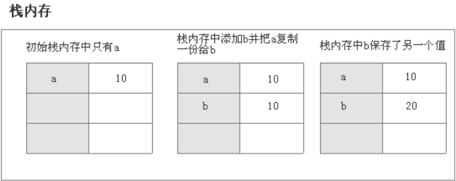
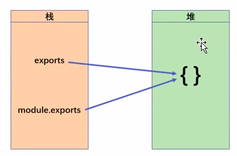
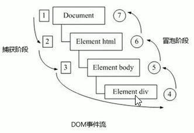

- [一、ECMAScript](#一 ecmascript)
  - [1. 基本语法](#1 基本语法)
    - [变量](#变量)
    - [数据类型](#数据类型)
      - [基本数据类型](#基本数据类型)
      - [引用数据类型](#引用数据类型)
      - [数据类型的判断](#数据类型的判断)
      - [栈和堆空间](#栈和堆空间)
    - [操作符](#操作符)
  - [2. 作用域与内存](#2 作用域与内存)
    - [作用域](#作用域)
    - [垃圾回收](#垃圾回收)
  - [3. 面向对象](#3 面向对象)
    - [创建对象](#创建对象)
    - [类](#类)
  - [4. 函数](#4 函数)
    - [函数的 arguments 参数](#函数的-arguments-参数)
    - [this 指向](#this 指向)
    - [函数上下文的创建](#函数上下文的创建)
    - [闭包](#闭包)
  - [5. 异步编程](#5 异步编程)
    - [Promise](#promise)
    - [async/await](#asyncawait)
  - [6. 网络请求](#6 网络请求)
  - [7. 模块化](#7 模块化)
- [二、DOM](#二 dom)
  - [1. 简介](#1 简介)
  - [2. 获取元素](#2 获取元素)
  - [3. 事件基础](#3 事件基础)
  - [4. 操作元素](#4 操作元素)
  - [5. 节点操作](#5 节点操作)
  - [6.DOM 重点核心](#6dom 重点核心)
- [三、BOM](#三 bom)
  - [1.BOM 简介](#1bom 简介)
  - [2.window 对象的](#2window 对象的)
    - [常用属性](#常用属性)
    - [常用事件](#常用事件)
  - [3. 定时器](#3 定时器)
  - [4.JS 执行机制](#4js-执行机制)
  - [5.location 对象](#5location 对象)
  - [6.navigator 对象](#6navigator 对象)
  - [7.history 对象](#7history 对象)

一个完整的 JavaScript 实现应该由下列三个不同的部分组成：

- 核心（**ECMAScript**）
- 文档对象模型（**DOM**）
- 浏览器对象模型（**BOM**）

# 一、ECMAScript

提供核心语言功能。ECMA-262 标准规定了：

1. 语法

2. 类型

3. 语句

4. 关键字

5. 保留字

6. 操作符

7. 对象

## 1. 基本语法

### 变量

**var、let、const 之间的区别：**

var 和 let 之间最明显的区别在于作用域不同。

let 和 const 的行为基本相同，唯一一个重要的区别在于 const 声明变量时必须同时初始化变量，且尝试修改 const 声明的变量时会导致运行时错误。

| | var | let | const |
| - | - | - | - |
| 作用域 | 函数 | 块 | 块 |
| 兼容性 | 适用于 ECMAScript 的所有版本 | 适用于 ES6 及之后的所有版本 | 适用于 ES6 及之后的所有版本 |
| 变量提升 | var 命令会发生“变量提升”现象，<br />即变量可以在声明之前使用，值为 undefined 。<br />示例：<br />`console.log(foo);`<br />`var foo = 2;`<br />// undefined | 不存在<br />示例：<br />`console.log(bar);`<br />`let bar = 2;`<br />// 报错 ReferenceError | 不存在 |
| 暂时性死区 | 不存在 | 在块作用域内，使用let命令声明变量之前，该变量都是不可用的，在声明之前使用这些变量会报错。这在语法上，称为“暂时性死区”（temporal dead zone，简称 TDZ）。 | 存在 |
| 全局变量 | 在全局作用域中声明的变量会成为 window 对象的属性，<br />例如：<br />var name = 'Matt';<br />console.log(window.name);<br />// 'Matt'<br />let age = 26;<br />console.log(window.age);<br />// undefined | 不会 | 不会  |
| 声明变量时初始化变量 | 否 | 否 | 声明变量时必须同时初始化变量 |
| 重复声明变量 | 可以重复声明变量，后声明的同名变量会覆盖之前声明的变量 | 不能 | 不能 |
| 顶层变量的属性 | 命令声明的全局变量属于顶层对象的属性 | 不属于 | 不属于 |

### 数据类型

#### 基本数据类型

**Null**

null 表示“没有对象”，即该处不应该有值。

```js
console.log(Number(null)); // => 0

console.log(typeof null); // => object
```

**Undefined**

undefined 表示“缺值”，就是此处应该有一个值，但是还没有定义。

```js
console.log(Number(undefined)); // => NaN
```

**Boolean 类型**

- `Boolean()` 函数可以在任意类型的数据上调用，而且始终返回一个布尔值。不同类型与布尔值之间的转换规则：
  
    | 数据类型 | 转换为 true 的值 | 转换为 false 的值 |
    | --- | --- | --- |
    | Boolean | true | false |
    | String | 非空字符串 | ‘’（空字符串） |
    | Number | 非零数值（包括无穷值） | 0、NaN |
    | Object | 任意对象 | null |
    | Undefined | N/A（不存在） | undefined |
    | Null | N/A（不存在） | null |
    | Symbol | 任意 Symbol 值 | N/A（不存在）|

**Number 类型**

- 使用字面量（literal）直接表示一个数值时，JavaScript 对整数提供四种进制的表示方法：十进制、十六进制、八进制、二进制。
  - 十进制：没有前导 0 的数值。
  - 八进制：有前缀`0o`或`0O`的数值，或者有前导 0、且只用到 0-7 的八个阿拉伯数字的数值。
  - 十六进制：有前缀`0x`或`0X`的数值。
  - 二进制：有前缀`0b`或`0B`的数值。
  
  默认情况下，JavaScript 内部会自动将八进制、十六进制、二进制转为十进制。
  
- JavaScript 的 Number 类型为 `双精度 IEEE 754 64 位浮点类型`。 在 JavaScript 中最大的值为 `2^53`。

  > IEEE754 对于浮点数表示方式给出了一种定义 -- (-1)^S *M* 2^E。
  >
  > 各符号的意思，S，是符号位，决定正负，0 时为正数，1 时为负数。M，是指有效位数，大于 1 小于 2。E，是指数位。
  >
  > Javascript 是 64 位的双精度浮点数，最高的 1 位是符号位 S，接着的 11 位是指数 E，剩下的 52 位为有效数字 M。
  >
  > 如 0.1 用 64 位的双精度浮点数表示，为`1.100110011001100110011001100110011001100110011001101 × 2 ^ (01111111011-1111111111)`。

- `NaN` 指“不是一个数字”（not a number），`NaN` 是一个“警戒值”（sentinel value，有特殊用途的常规值），用于指出数字类型中的错误情况，即“执行数学运算没有成功，这是失败后返回的结果”。

- `NaN`不等于任何值，包括其本身。`NaN`与任何数（包括它自己）的运算，得到的都是`NaN`。

- `isNaN()`函数：接收一个参数，可以是任意数据类型，函数 isNaN 接收参数后，会尝试将这个参数转换为数值，然后判断这个参数是否“不是数值”，任何不能被转换为数值的的值都会返回 true。
  
    `console.log(isNaN(NaN));    // true
    console.log(isNaN(10));       // false，10 是数值`

- `Number.isNaN()`函数：首先判断传入参数是否为数字，如果是数字再继续判断是否为 NaN ，不会进行数据类型的转换，这种方法对于 NaN 的判断更为准确。

  ```js
  console.log(Number.isNaN(NaN)); // true
  console.log(Number.isNaN(Number.NaN)); // true

  // 下面几个如果使用全局的 isNaN() 方法，会返回 true
  console.log(Number.isNaN("NaN")); // false
  console.log(Number.isNaN(undefined)); // false
  console.log(Number.isNaN({})); // false
  console.log(Number.isNaN("123")); // false
  ```

- 数值转换：
  - Number() 函数基于如下规则执行转换。
    - 布尔值， true 转换为 1， false 转换为 0。
    - 数值，直接返回。
    - null ，返回 0。
    - undefined ，返回 NaN 。
    - 字符串，应用以下规则。
      - 如果字符串包含数值字符，包括数值字符前面带加、减号的情况，则转换为一个十进制数值。
            因此， Number("1") 返回 1， Number("123") 返回 123， Number("011") 返回 11（忽略前面的零）。
      - 如果字符串包含有效的浮点值格式如 "1.1" ，则会转换为相应的浮点值（同样，忽略前面的零）。
      - 如果字符串包含有效的十六进制格式如 "0xf" ，则会转换为与该十六进制值对应的十进制整数值。
      - 如果是空字符串（不包含字符），则返回 0。
      - 如果字符串包含除上述情况之外的其他字符，则返回 NaN 。
    - 对象，调用 valueOf() 方法，并按照上述规则转换返回的值。如果转换结果是 NaN ，则调用 toString() 方法，再按照转换字符串的规则转换。
        > 数组转换成数字：空数组为 0，存在一个元素且为数字转数字，其他情况 NaN。
        >
        > 除了数组的引用类型转数字：得到的结果是 NaN。
        >
        > Symbol 转数字会错误。
  - 考虑到用 Number() 函数转换字符串时相对复杂且有点反常规，通常**在需要得到整数时**可以优先使用 `parseInt()` 函数。
    字符串最前面的空格会被忽略，从第一个非空格字符开始转换。**如果第一个字符不是**数值字符、加号或减号，`parseInt()`立即返回 NaN 。这意味着空字符串也会返回 NaN （这一点跟 Number() 不一样，它返回 0）。**如果第一个字符是**数值字符、加号或减号，则继续依次检测每个字符，直到字符串末尾，或碰到非数值字符。比如，"1234blue" 会被转换为 1234，因为 "blue" 会被完全忽略。类似地， "22.5" 会被转换为 22，因为小数点不是有效的整数字符。
    **假设字符串中的第一个字符是数值字符**， `parseInt()` 函数也能识别不同的整数格式（十进制、八进制、十六进制），如：`let num = parseInt(”0xf”);  //  15，解释为十六进制整数`。或者可以接受第二个参数（2 到 36 之间），表示被解析的值的进制，返回该值对应的十进制数，如：`parseInt('1000', 2) // 8`。
  - `parseFloat()` 函数的工作方式跟 `parseInt()`函数类似，都是从位置 0 开始检测每个字符。同样，它也是解析到字符串末尾或者解析到一个无效的浮点数值字符为止。如：`parseFloat(”22.34.5”);  //  22.34`。
    `parseFloat()`函数的另一个不同之处在于，它始终忽略字符串开头的零。如：`parseFloat(”0xA”);  //  0`。
  - 隐式转换：利用 - 、\*、/【变量 - 0、变量 * 1 、变量 / 1】。

**String 类型**

- 特殊字符：
  
    | 特殊字符 | 含义 |
    | --- | --- |
    | \n | 换行符（\u000A） |
    | \t | 制表符（\u0009） |
    | \b | 后退键（\u0008） |
    | \r | 回车键（\u000D） |
    | \f | 换页符（\u000C） |
    | \v | 垂直制表符（\u000B） |
    | \nnn | 以八进制编码 nnn 表示的 Unicode 字符（其中 n 是八进制数字 0~7），例如 \41 等于 "!” |
    | \xnn | 以十六进制编码 nn 表示的 Unicode 字符（其中 n 是十六进制数字 0~F），例如 \x41 等于 "A” |
    | \unnnn | 以十六进制编码 nnnn 表示的 Unicode 字符（其中 n 是十六进制数字 0~F），例如 \u03a3 等于希腊字符 "Σ” |
    | \0 | null（\u0000） |
- **每个字符**在 JavaScript 内部都是以 **16 位**（即 2 个字节）的 **UTF-16 格式储存**。也就是说，JavaScript 的单位字符长度固定为 16 位长度，即 2 个字节。
但是，UTF-16 有两种长度：对于码点在`U+0000`到`U+FFFF`之间的字符，长度为 16 位（即 2 个字节）；对于码点在`U+10000`到`U+10FFFF`之间的字符，长度为 32 位（即 4 个字节），而且前两个字节在`0xD800`到`0xDBFF`之间，后两个字节在`0xDC00`到`0xDFFF`之间。举例来说，码点`U+1D306`对应的字符为`𝌆，`它写成 UTF-16 就是`0xD834 0xDF06`。
JavaScript 对 UTF-16 的支持是不完整的，由于历史原因，只支持两字节的字符，不支持四字节的字符。这是因为 JavaScript 第一版发布的时候，Unicode 的码点只编到`U+FFFF`
，因此两字节足够表示了。后来，Unicode 纳入的字符越来越多，出现了四字节的编码。但是，JavaScript 的标准此时已经定型了，统一将字符长度限制在两字节，导致无法识别四字节的字符。上一节的那个四字节字符`𝌆`，浏览器会正确识别这是一个字符，但是 JavaScript 无法识别，会认为这是两个字符，`'𝌆'.length // 2`。
- **Base64 转码**。使用 Base64 编码，将一些不可打印的字符（比如 ASCII 码 0 到 31 的符号）转成可以打印的字符。Base64 可以将任意值转成 0～9、A～Z、a-z、`+`和`/`这 64 个字符组成的可打印字符。
  JavaScript 原生提供两个 Base64 相关的方法：
  
  - `btoa()`：任意值转为 Base64 编码
  - `atob()`：Base64 编码转为原来的值
  
    ```js
    var string = 'Hello World!';
    btoa(string) // "SGVsbG8gV29ybGQh"
    atob('SGVsbG8gV29ybGQh') // "Hello World!"
    ```
  
    对于非 ASCII 码字符转为 Base64 编码，必须中间插入一个转码环节，再使用这两个方法。
  
    ```js
    function b64Encode(str) {
      return btoa(encodeURIComponent(str));
    }
    
    function b64Decode(str) {
      return decodeURIComponent(atob(str));
    }
    
    b64Encode('你好') // "JUU0JUJEJUEwJUU1JUE1JUJE"
    b64Decode('JUU0JUJEJUEwJUU1JUE1JUJE') // "你好"
    ```
  
- 转换为字符串的三种方式：
  - **toString()**。toString() 方法可见于数值、布尔值、对象和字符串值。（没错，字符串值也有 toString() 方法，该方法只是简单地返回自身的一个副本。） 如：`“123”.toString();  //  123`。null 和 undefined 值没有 toString() 方法。
    多数情况下， toString() 不接收任何参数。不过，在对数值调用这个方法时， toString() 可以接受一个参数，即以几进制来输出数值的字符串表示。如：`let num = 10; console.log(num.toString(2));  //  “1010”`。
      > | 原始值 | 转换目标 | 结果 |
      > | ----- | ----- | ----- |
      > | number | 字符串 | 5 => '5'|
      > | Boolean、函数、Symbol | 字符串 | 'true' |
      > | 数组 | 字符串 | [1, 2] => '1,2' |
      > | 对象 | 字符串 | '[object Object]' |
  - **String() 转型函数**。String() 函数遵循如下规则：
    - 如果值有 toString() 方法，则调用该方法（不传参数）并返回结果。
    - 如果值是 null ，返回 "null" 。
    - 如果值是 undefined ，返回 "undefined" 。
  - 用加号操作符给一个值加上一个空字符串 "" 也可以将其转换为字符串。

      ```js
      console.log(123 + '');         // '123'
      console.log(null + '');        // 'null'
      console.log(undefined + '');   // 'undefined'
      ```

**Symbol 类型**

`Symbol`表示独一无二的值。

- 常用场景

  - 定义一组常量，保证这组常量都是不相等的。

  - 对象中保证不同的属性名。

    ```js
    let obj = {
      key1: 1,
      [Symbol('key2')]: 2
    }
    Object.getOwnPropertyNames(obj); // ['key1']
    Object.keys(obj); // ['key1']
    for (let i in obj) {
       console.log(i); // key1
    }
    Object.getOwnPropertySymbols(obj) // [Symbol(key2)]
    ```

    > 当使用 Symbol 作为对象属性时，可以保证对象不会出现重名属性，调用 for...in 不能将其枚举出来，另外调用 Object.getOwnPropertyNames、Object.keys() 也不能获取 Symbol 属性。
    >
    > 可以调用 Object.getOwnPropertySymbols() 用于专门获取 Symbol 属性。

#### 引用数据类型

- Object（对象）

  - 创建对象的方法

    - `new Object([value])`

      Object 构造函数为给定的参数创建一个包装类对象（object wrapper），具体有以下情况：

      - 如果给定值是 null 或 undefined，将会创建并返回一个空对象

      - 如果传进去的是一个基本类型的值，则会构造其包装类型的对象

      - 如果传进去的是引用类型的值，仍然会返回这个值，经他们复制的变量保有和源对象相同的引用地址

    - `Object([value])`，其行为等同于`new Object(value)`

    - `Object.create(proto)`，创建一个新对象，使用 `proto` 对象来作为新创建对象的原型。

      `proto` 需为 null 或除基本类型包装对象以外的对象，否则会抛出一个 TypeError 异常。

    - 利用字面量创建

  - Object 常用方法

    - `Object.assign(target, ...sources)`：Object.assign() 方法将所有可枚举（`Object.propertyIsEnumerable()` 返回 true）的自有（`Object.hasOwnProperty()` 返回 true）属性从一个或多个源对象复制到目标对象，返回修改后的对象。
       （第一层为深拷贝，第二层为浅拷贝。）

       ```js
       const target = { a: 1, b: 2 };
       const source = { b: 4, c: 5 };
       
       const returnedTarget = Object.assign(target, source);
       
       console.log(target);
       // Expected output: Object { a: 1, b: 4, c: 5 }
       
       console.log(returnedTarget === target);
       // Expected output: true
       ```

- Array（数组）

  - 创建数组的方法

    - `new Array([number])`

      ```js
      let arr1 = new Array();
      let arr2 = new Array(2);
      let arr3 = new Array(1,2);
      console.log(arr1); // []
      console.log(arr2); // [ <2 empty items> ]
      console.log(arr3); // [ 1, 2 ]
      ```

    - 利用字面量创建

  - 检测数组的方法

    - Object.prototype.toString.call（数组名）
  
    - 通过 ES6 的 Array.isArray（数组名）
  
    - 通过 数组名 instanceof Array

    - 通过原型链

    - Array.prototype.isPrototypeOf（数组名）
  
    ```javascript
    const arr1 = new Array(1,2,3);
    console.log(Object.prototype.toString.call(arr1)); // [object Array]
    console.log(Array.isArray(arr1)); // true
    console.log(arr1 instanceof Array); // true
    console.log(arr1.__proto__ === Array.prototype); // true
    console.log(Array.prototype.isPrototypeOf(arr1)); // true
    ```

  - 数组元素的增删改查、排序
    - 增

      - 数组末尾添加：`arr.push(value)` ， **改变原数组并返回新的长度。**

        ```js
        const arr = new Array(0,1);
        console.log(arr.push(2)); // 3
        console.log(arr); // [ 0, 1, 2]               
        console.log(arr.push([3])); // 4
        console.log(arr); // [ 0, 1, 2, 3]               
        ```

      - 数组开头添加：`arr.unshift(value)` ，**改变原数组并返回新的长度。**

        ```js
        const arr = new Array(0,1);
        console.log(arr.unshift(2)); // 3
        console.log(arr); // [ 2, 0, 1]
        console.log(arr.unshift([3])); // 4
        console.log(arr); // [ 0, 1, 2, 3]               
        ```

    - 删

      - 删除最后一个元素：`arr.pop()` ，**改变原数组并返回删除的值。**

        ```js
        const arr = new Array(1,2);
        console.log(arr.pop()); // 2
        console.log(arr); // [ 1 ]
        ```

      - 删除第一个元素：`arr.shift()` ，**改变原数组并返回删除的值。**

        ```js
        const arr = new Array(1,2);
        console.log(arr.shift()); // 1
        console.log(arr); // [ 2 ]
        ```

    - 改

      - 添加或删除数组中指定位置的元素：`arr.splice(index,howmany,item1,.....,itemX)` ，**会改变原数组的值。**

        ```js
        const arr = new Array('A','B','C','D');
        console.log(arr.splice(2,1)); // [ 'C' ]
        console.log(arr); // [ 'A', 'B', 'D' ]
        console.log(arr.splice(2,1,2,'E')); // [ 'D' ] // 删除数组的第三个元素，并在数组的第三个位置添加新元素
        console.log(arr); // [ 'A', 'B', 2, 'E' ]
        ```

    - 查

      - `arr.indexOf(searchElement，[fromIndex])` ，从前往后找的第一个。若找不到返回-1，找到了返回索引值。

        **fromIndex** 为开始查找的位置。如果该索引值大于或等于数组长度，意味着不会在数组里查找，返回 -1。如果参数中提供的索引值是一个负值，则将其作为数组末尾的一个抵消，即 -1 表示从最后一个元素开始查找，-2 表示从倒数第二个元素开始查找，以此类推。注意：如果参数中提供的索引值是一个负值，并不改变其查找顺序，查找顺序仍然是从前向后查询数组。如果抵消后的索引值仍小于 0，则整个数组都将会被查询。其默认值为 0。

        > `indexOf` 使用全等运算（即 ===）判断 searchElement 与数组中包含的元素之间的关系。

        ```js
        const arr = new Array(1,6,3,4);
        console.log(arr.indexOf(1, 0)); // 0
        console.log(arr.indexOf(4, -2)); // 3
        console.log(arr); // [ 1, 6, 3, 4 ]
        ```

      - `arr.lastIndexOf（元素）` ， 从后往前找的第一个。若找不到返回-1，找到了返回索引值

        ```js
        const arr = new Array(1,6,3,4);
        console.log(arr.lastIndexOf(1)); // 0
        console.log(arr); // [ 1, 6, 3, 4 ]
        ```

    - 排序

      - 颠倒源数组：`arr.reverse()` ， **无参数，改变原数组并返回新数组**

        ```js
        const arr = new Array(1,6,3,4);
        console.log(arr.reverse()); // [ 4, 3, 6, 1 ]
        console.log(arr); // [ 4, 3, 6, 1 ]
        ```

      - `arr.sort([callback])` 默认排序顺序为按字母升序。
        - 升序排序：`arr.sort((a,b)=>(a-b))` **改变原数组并返回新数组**。
          其中回调函数的返回值>0 则 b 会被排列到 a 之前，返回值=0 则 a 与 b 的相对位置不变，返回值<0，则 a 会排列到 b 之前。

          ```js
          const arr = new Array(1,6,3,4);
          console.log(arr.sort(function(a,b){return (a-b);})); // [ 1, 2, 4, 6 ]
          console.log(arr); // [ 1, 2, 4, 6 ]
          ```

        - 降序排序：`arr.sort((a,b)=>(b-a))` ， **改变原数组并返回新数组**
          其中回调函数的返回值>0 则 b 会被排列到 a 之前，返回值=0 则 a 与 b 的相对位置不变，返回值<0，则 a 会排列到 b 之前。

          ```js
          const arr = new Array(1,6,3,4);
          console.log(arr.sort(function(a,b){return (b-a);})); // [ 6, 4, 3, 1 ]
          console.log(arr); // [ 6, 4, 3, 1 ]
          ```

  - 数组的片段浅拷贝、转换成字符串、拼接（不改变原数组）
    - 数组元素片段浅拷贝

      `arr.slice([begin[, end]])`
      slice() 方法返回一个新的数组对象，这一对象是一个由 begin 和 end 决定的原数组的浅拷贝（**包括 begin，不包括 end**）。**原始数组不会被改变。**
  
      ```js
      let arr = new Array(1,2);
      console.log(arr.slice(0,1)); // [ 1 ]
      ```

    - 转换成字符串

      - `arr.toString()`

        ```js
        let arr = new Array(1,2);
        console.log(arr.toString()); // 1,2
        ```

      - `arr.join(`分隔符`)`

        ```js
        let arr = new Array(1,2);
        console.log(arr.join('-')); // 1-2
        ```
  
    - 拼接

      - `arr.concat(arr1, arr2, ...)`

        ```js
        let arr = new Array(1,2);
        let arr1 = [ 3 ];
        let arr2 = [ 4 ];
        console.log(arr.concat(arr1,arr2)); // [ 1, 2, 3, 4 ]
        console.log(arr); // [ 1, 2 ]
        ```

      - es6 新增：`[...arr1, arr2]`

        ```js
        let arr = new Array(1,2);
        let arr1 = [ 3 ];
        console.log([...arr,arr1]); // [ 1, 2, [ 3 ] ]
        console.log(arr); // [ 1, 2 ]
        ```

  - 数组的其他方法

    - `forEach()` ，对数组的每个元素执行一次给定的函数。

      `arr.forEach(function(currentValue [, index [, array]])[, thisArg])`

      currentValue：当前元素

      index：当前元素的索引值

      array：forEach() 方法正在操作的数组。

      thisArg：当执行回调函数时，用作 this 的值

      ```js
      let arr = new Array(1,2);
      arr.forEach(function(value, index, array) {
        console.log(value + ' ' + index + ' ' + array);
        // 1 0 1,2
        // 2 1 1,2
      });
      ```

    - `filter()` ， 方法创建一个新数组，其包含通过所提供函数实现的测试的所有元素。

      `let newArray = arr.filter(function(element[, index[, array]])[, thisArg])`

      element：数组中当前正在处理的元素。

      index：正在处理的元素在数组中的索引。

      array：调用了 filter 的数组本身。

      thisArg：执行回调函数时，用于 this 的值。

      filter() 为数组中的每个元素调用一次 callback 函数，并**利用**所有使得 callback 返回 true 或等价于 true 的值的**元素创建一个新数组**。callback 只会在已经赋值的索引上被调用，对于那些已经被删除或者从未被赋值的索引不会被调用。那些没有通过 callback 测试的元素会被跳过，不会被包含在新数组中。

      **filter 不会改变原数组，它返回过滤后的新数组。**

      ```js
      let arr = new Array(1,2,3);
      let arr1 = arr.filter(function(e) {
        return e > 1;
      });
      console.log(arr1); // [ 2, 3 ]
      ```

    - `reduce()` 方法对数组中的每个元素按序执行回调函数，每一次运行回调函数会将先前元素的计算结果作为参数传入，最后将其结果汇总为单个返回值。

      第一次执行回调函数时，不存在“上一次的计算结果”。如果需要回调函数从数组索引为 0 的元素开始执行，则需要传递初始值。否则，数组索引为 0 的元素将被作为初始值 initialValue，迭代器将从第二个元素开始执行（索引为 1 而不是 0）。

      `arr.reduce(function(total, currentValue[, currentIndex[, array]])[, initialValue)]`

      total：初始值，或者计算结束后的返回值。

      currentValue：当前元素。

      currentIndex：当前元素的索引。

      array：当前元素所属的数组对象。

      initialValue：传递给函数的初始值。

      ```js
      let arr = new Array(1,2,5);
      let getSum = function(total,num) {
       console.log(total + ' ' + num);
       return total + Math.round(num); 
      };
      console.log(arr.reduce(getSum));
      // 1 2
      // 3 5
      // 8 
      // 未给定初始值，回调的迭代从第二个元素开始执行
      console.log(arr.reduce(getSum,0));
      // 0 1
      // 1 2
      // 3 5
      // 8
      // 回调函数从第一个元素开始执行
      console.log(arr.reduce(getSum,5)); // 12
      console.log(arr); // [ 1, 2, 5 ]
      ```

    - `map()` 方法创建一个新数组，这个新数组由原数组中的每个元素都调用一次提供的函数后的返回值组成。

      `var new_array = arr.map(function     (currentValue[, index[, array]]) {
        // Return element for new_array
      }[, thisArg])`

      currentValue：当前元素

      index：当前元素的索引值

      array：map 方法调用的数组。

      thisArg：当执行回调函数时，用作 this 的值

      ```js
      let arr = new Array(1,2);
      let arr1 = arr.map(function(val, index, array){
        console.log(val + ' ' + index + ' ' + array);
        // 1 0 1,2
        // 2 1 1,2
        return val+1;
      });
      console.log(arr1); // [ 2, 3 ]
      ```

    - `every()` 方法测试一个数组内的所有元素是否都能通过某个指定函数的测试。它返回一个布尔值。

      如果回调函数的每一次返回都为 truthy 值，返回 true，否则返回 false。

      `arr.every(function(element[, index[, array]])[, thisArg])`

      element：当前元素

      index：当前元素的索引值

      array：当前元素所属的数组对象

      thisArg：当执行回调函数时，用作 this 的值

      ```js
      console.log([].every(e => e > 0)); // true
      console.log([1,-1,2].every(e => e > 0)); // false
      console.log([1,1,2].every(e => e > 0)); // true
      ```

    - `some()` 方法测试数组中是不是至少有 1 个元素通过了被提供的函数测试。它返回的是一个 Boolean 类型的值。

      数组中有至少一个元素通过回调函数的测试就会返回 true；所有元素都没有通过回调函数的测试返回值才会为 false。

      `arr.some(function(element[, index[, array]])[, thisArg])`

      element：当前元素

      index：当前元素的索引值

      array：当前元素所属的数组对象

      thisArg：当执行回调函数时，用作 this 的值

      ```js
      console.log([].some(e => e > 0)); // false
      console.log([1,-1,2].some(e => e > 0)); // true
      console.log([1,1,2].some(e => e > 0)); // true
      ```

- Function（函数）

- String（字符串对象）

  ```js
  // 拼接字符串：字符串名称。concat（字符串名称，...）
  // concat() 方法用于连接两个或多个字符串，拼接字符串，等效于+，+更常用
  console.log('000'.concat('123','456')); // 000123456 // 截取字符串：字符串名称。substr（start,length）
  // 从 start 位置开始（索引号），length 取的个数
  console.log('123'.substr(0,2)); // 12
  
  // 替换字符串：字符串名称。replace（‘被替换的字符’，‘替换为的字符’）
  // 若被替换的有多个，只会替换最前面的一个
  console.log('122'.replace('2', '3')); // 132
  
  // 字符串转换为数组：字符串名称。split（‘分隔符’）
  // 此分割符需与字符串里面的字符与字符之间的一致才能分割成几个数组元素
  console.log('1 2 3'.split(' ')); // [ '1', '2', '3' ]
  
  // 根据字符返回位置
  //   字符串。indexOf('字符'，开始的位置）
  //  从开始位置往后找，若没有返回-1，若有返回第一个匹配的字符的索引号 
  const str1 = '1213';
  console.log(str1.indexOf('1', 0)); // 0
  console.log(str1.indexOf('1')); // 0
  
  // 根据位置返回字符
  // 1，字符串名字。charAt(index)
  //    返回指定位置的字符（index 字符串的索引号）
  const str2 = '1213';
  console.log(str2.charAt(0)); // 1
  // 2，字符串名字。charCodeAt(index)
  //    获取指定位置处字符的 ASCII 码（index 字符串的索引号）
  console.log(str2.charCodeAt(0)); // 49
  // 3，字符串名字 [index]
  //    获取指定位置处字符（index 字符串的索引号）
  console.log(str2[0]); // 1
  ```

- Date（日期对象）

  ```js
  // 获取总的毫秒数
  // 1, 常规写法
  const date = new Date();
  console.log(date.valueOf());
  console.log(date.getTime());
  // 2, 简易写法
  console.log(+new Date());
  // 3,H5 新增写法
  console.log(Date.now());
  
  // 把总的秒数折算成天/小时/分钟/秒
  console.log(parseInt(date/1000/60/60/24));
  console.log(parseInt(date/1000/60/60%24));
  console.log(parseInt(date/1000/60%60));
  console.log(parseInt(date/1000%60));
  ```

- RegExp（正则）

- Math

  ```javascript
  console.log(Math.PI); // 3.141592653589793 圆周率
  console.log(Math.ceil(2.1)); // 3 向上取整
  console.log(Math.floor(2.8)); // 2 向下取整
  console.log(Math.round(3.5)); // 4 四舍五入 
  console.log(Math.max(2,1,56)); // 56 最大值
  console.log(Math.min(2,1,56)); // 1 最小值
  console.log(Math.abs(-2.1)); // 2.1 绝对值
  console.log(Math.random()); // 生成 [0,1) 之间的浮点数
  ```

- Set

- Map

  Map 本质上就是键值对的集合，但是普通的 Object 中的键值对中的键只能是字符串。而 ES6 提供的 Map 数据结构类似于对象，但是它的键不限制范围，可以是任意类型，是一种更加完善的 Hash 结构。如果 Map 的键是一个原始数据类型，只要两个键严格相同，就视为是同一个键。

  - 常用方法

    - `map.size`： 返回 Map 结构的成员总数

    - `map.set(key, value)`：设置键名 key 对应的键值 value，然后返回整个 Map 结构，如果 key 是简单数据类型且已经有值，则键值会被更新，否则就新生成该键，若键为引用数据类型，则不会被更改。

    - `map.delete(key)`：该方法删除某个键，返回 true，如果删除失败，返回 false

    - `map.clear()`：清除所有成员，没有返回值

    - `map.get(key)`：该方法读取 key 对应的键值，如果找不到 key，返回 undefined

    - `map.has(key)`：该方法返回一个布尔值，表示某个键是否在当前 Map 对象中

    - Map 结构原生提供三个遍历器生成函数和一个遍历方法

      ```js
      let m = new Map([
       [ "foo", 1 ],
       [ "bar", 2 ],
      ]);

      for(let key of m.keys()) {
       console.log(key);
       // foo
       // bar
      }
      for(let key of m.values()) {
       console.log(key);
       // 1
       // 2
      }
      for(let key of m.entries()) {
       console.log(key);
       // [ 'foo', 1 ]
       // [ 'bar', 2 ]
      }
      m.forEach((value, key, map) => {
       console.log(value, key);
       // 1 foo
       // 2 bar
      });
      ```

- weakMap

  WeakMap 对象也是一组键值对的集合，其中的键是弱引用的。其键必须是对象，原始数据类型不能作为 key 值，而值可以是任意的。

  >WeakMap 的设计目的在于，有时想在某个对象上面存放一些数据，但是这会形成对于这个对象的引用。一旦不再需要这两个对象，就必须手动删除这个引用，否则垃圾回收机制就不会释放对象占用的内存。而 WeakMap 的键名所引用的对象都是弱引用，即垃圾回收机制不将该引用考虑在内。因此，只要所引用的对象的其他引用都被清除，垃圾回收机制就会释放该对象所占用的内存。也就是说，一旦不再需要，WeakMap 里面的键名对象和所对应的键值对会自动消失，不用手动删除引用

  - 常用方法

    - `m.set(key, value)`：设置键名 key 对应的键值 value，然后返回整个 Map 结构

    - `m.delete(key)`：该方法删除某个键，返回 true，如果删除失败，返回 false

    - `m.get(key)`：该方法读取 key 对应的键值，如果找不到 key，返回 undefined

    - `m.has(key)`：该方法返回一个布尔值，表示某个键是否在当前 Map 对象中

#### 数据类型的判断

- `typeof xxx`：可以判断基本数据类型（null 除外）；但是引用数据类型中，除了 function 类型以外，其他的也无法判断。

  ```javascript
  console.log(typeof 1); // number
  console.log(typeof true); // boolean
  console.log(typeof '1'); // string
  console.log(typeof Symbol()); // symbol
  console.log(typeof undefined); // undefined
  // 除 function 以外的对象都会被识别成 object
  // 另外，null 也会被识别成对象
  console.log(typeof []); // object
  console.log(typeof {}); // object
  console.log(typeof function(){}); // function
  console.log(typeof null); // object
  ```

- `xxx instanceof constructor`：用来判断 xxx 是否为 constructor 的实例。

  ```javascript
  console.log(2 instanceof Number); // false
  console.log('2' instanceof String); // false
  console.log(true instanceof Boolean); // false
  console.log([] instanceof Array); // true
  console.log({} instanceof Object); // true
  console.log(function(){} instanceof Function); // true

  // 直接使用 instanceof 并不能判断基本数据类型，
  //    但可以通过自定义 instanceof 行为的方式来实现 instanceof 对基本数据类型的判断。
  class PrimitiveNumber {
    // Symbol.hasInstance 用于判断某对象是否为某构造器的实例。
    //    因此可以用它自定义 instanceof 操作符在某个类上的行为。
    static [Symbol.hasInstance](x) {
      return typeof x === 'number';
    }
  }
  console.log(123 instanceof PrimitiveNumber); // 123
  ```

- `Object.prototype.toString.call()`

  不同数据类型的 Object.prototype.toString.call() 方法返回值如下：

  - 数值：返回 [object Number]。
  - 字符串：返回 [object String]。
  - 布尔值：返回 [object Boolean]。
  - undefined：返回 [object Undefined]。
  - null：返回 [object Null]。
  - 数组：返回 [object Array]。
  - arguments 对象：返回 [object Arguments]。
  - 函数：返回 [object Function]。
  - Error 对象：返回 [object Error]。
  - Date 对象：返回 [object Date]。
  - RegExp 对象：返回 [object RegExp]。
  - 其他对象：返回 [object Object]。

  ```javascript
  console.log(Object.prototype.toString.call(1)); // '[object Number]'
  console.log(Object.prototype.toString.call('1')); // '[object String]'
  console.log(Object.prototype.toString.call(true)); // '[object Boolean]'
  console.log(Object.prototype.toString.call(NaN)); // '[object Number]'
  console.log(Object.prototype.toString.call(undefined)); // '[object Undefined]'
  console.log(Object.prototype.toString.call(null)); // '[object Null]'
  console.log(Object.prototype.toString.call(Symbol())); // '[object Symbol]'
  console.log(Object.prototype.toString.call(function(){}));  // '[object Function]'
  console.log(Object.prototype.toString.call([1,2,3])); // '[object Array]'
  console.log(Object.prototype.toString.call({})); // '[object Object]'
  console.log(Object.prototype.toString.call(new Date())); // '[object Date]'
  ```

#### 栈和堆空间

- 栈空间

  基本数据类型直接存储在栈（stack）中的简单数据段，占据空间小、大小固定、可以直接操作其保存的变量、运行效率高、由系统自动分配存储空间，属于被频繁使用数据，所以放入栈中存储。

  

- 堆空间

  引用数据类型存储在堆（heap）中的对象，占据空间大、运行效率低、大小不固定、通过代码进行分配空间。如果存储在栈中，将会影响程序运行的性能；引用数据类型在栈中存储了指针，该指针指向堆中该实体的起始地址。当解释器寻找引用值时，会首先检索其在栈中的地址，取得地址后从堆中获得实体。

  

### 操作符

**加法操作符**

相加运算符（+）为两种不同的运算重载：数字加法和字符串连接。在求值时，首先，按顺序调用对象的 [@@toPrimitive](https://developer.mozilla.org/zh-CN/docs/Web/JavaScript/Reference/Global_Objects/Symbol/toPrimitive)（以 "default" 为 hint）、valueOf 和 toString 方法，将两个操作数强制转换为原始值。然后，检查两个操作数的类型：

- 如果一方是字符串，另一方会被转换为字符串，两个字符串连接。
- 如果双方都是 BigInt，则执行 BigInt 加法。如果一方是 BigInt 而另一方不是，会抛出 TypeError
- 否则，双方都会被转换为数字，执行数字加法。

> 字符串连接经常被认为等价于模板字符串或者 String.prototype.concat()，但并非如此。**加法**强制将表达式转为原始值，它**优先调用 valueOf()**；另一方面，**模板字符串和 concat()** 则强制将表达式转为字符串，它们优先调用 **toString()**。如果表达式有 **@@toPrimitive** 方法，字符串连接时会用 **["default"](https://zh.javascript.info/object-toprimitive#symboltoprimitive)** （"default"表示会先调用 valueOf() 后调用 toString()）作为 hint 调用它，然而模板字符串则用 **"string"**（"string"表示会先调用 toString() 后调用 valueOf()）。这对于具有不同的字符串和原始值表现的对象来说很重要——例如 [Temporal](https://github.com/tc39/proposal-temporal)，它的 valueOf() 方法会抛出错误。

  ```js
  let result1 = 5 + 5;    // 两个数值
  console.log(result1);   // 10
  let result2 = 5 + "5";  // 一个数值和一个字符串
  console.log(result2);   // '55'

  const t = Temporal.Now.instant();
  "" + t; // 抛出 TypeError
  `${t}`; // '2022-07-31T04:48:56.113918308Z'
  "".concat(t); // '2022-07-31T04:48:56.113918308Z'
  ```

**减法操作符**

- 减法操作符用于处理 ECMAScript 中不同类型之间转换的规则：

  - 如果有任一操作数是字符串、布尔值、 null 或 undefined ，则先在后台使用 Number() 将其转换为数值，然后再根据前面的规则执行数学运算。如果转换结果是 NaN ，则减法计算的结果是 NaN 。
  - 如果有任一操作数是对象，则调用其 valueOf() 方法取得表示它的数值。如果该值是 NaN ，则减法计算的结果是 NaN 。如果对象没有 valueOf() 方法，则调用其 toString() 方法，然后再将得到的字符串转换为数值。

    ```js
    let result1 = 5 -true; // true 被转换为 1，所以结果是 4
    let result2 = NaN - 1; // NaN
    let result3 = 5 - ''; // ""被转换为 0，所以结果是 5
    let result4 = 5 - null; // null 被转换为 0，所以结果是 5
    ```

**取整运算符**

```js
console.log(~~NaN); // 0
console.log(~~1.1); // 1
console.log(~~1.9); // 1
```

**相等操作符**

- 使用`==`和`!=`时，操作符会先进行隐式类型转换再确定操作数是否相等。相等和不相等操作符在比较时会遵循如下规则。

    1. 如果操作数具有相同的类型，则按如下方式进行比较：
       - 对象（Object）：仅当两个操作数引用同一个对象时返回 true。
       - 字符串（String）：只有当两个操作数具有相同的字符且顺序相同时才返回 true。
       - 数值（Number）：如果两个操作数的值相同，则返回 true。+0 和 -0 被视为相同的值。如果任何一个操作数是 NaN，返回 false；所以，NaN 永远不等于 NaN。
       - 布尔值（Boolean）：仅当操作数都为 true 或都为 false 时返回 true。
       - 大整形（BigInt）：仅当两个操作数值相同时返回 true。
       - 符号（Symbol）：仅当两个操作数引用相同的符号时返回 true。
    2. 如果其中一个操作数为 null 或 undefined，另一个操作数也必须为 null 或 undefined 以返回 true。否则返回 false。
    3. 如果其中一个操作数是对象，另一个是基本类型，按此顺序使用对象的 @@toPrimitive()（以 "default" 作为提示），valueOf() 和 toString() 方法将对象转换为基本类型。
    4. 在这一步，两个操作数都被转换为基本类型（String、Number、Boolean、Symbol 和 BigInt 中的一个）。其余的转换是逐个进行的。
       - 如果是相同的类型，使用步骤 1 进行比较。
       - 如果其中一个操作数是 Symbol 而另一个不是，返回 false。
       - 如果其中一个操作数是布尔型而另一个不是，则将布尔型转换为数字：true 转换为 1，false 转换为 0。然后再次松散地比较两个操作数。
       - 如果一个操作数是字符串，另一个操作数是数值，则尝试将字符串转换为数值，再比较是否相等。
       - 如果一个是 Number，一个是 BigInt，按数值进行比较。如果数值为 正负无穷大或 NaN，返回 false。
       - 如果一个操作数是字符串，另一个操作数是 BigInt，使用与 BigInt() 构造函数相同的算法将字符串转换为 BigInt。如果转换失败，返回 false。
  
    ```javascript
    null == undefined; // true
    null == 0; // false
    NaN == NaN; // false
    NaN == 5; // false

    Object.is(+0, -0); // false
    Object.is(NaN, NaN); // true
    ```

    > === 和 == 的区别：=== 是严格相等符，不会对操作数进行隐式类型转换。== 会对操作数进行隐式类型转换。
    >
    > Object.is() 在===的基础上修复了一些特殊情况下的失误，就是+0 和-0，NaN 和 NaN。

**逻辑运算符**

- || 会在左侧的操作数为假值时，返回其右侧操作数，否则返回左侧操作数。

  > js 中只有 8 个假值：false、0、-0、0n、空字符串、null、undefined、NaN。

- && 会在左侧的操作数为真值时，返回其右侧操作数，否则返回左侧操作数。

- 空值合并运算符（??）会在左侧的操作数为 `null` 或者 `undefined` 时，返回其右侧操作数，否则返回左侧操作数。

## 2. 作用域与内存

### 作用域

作用域有三种：全局作用域、局部作用域、块级作用域。

- 全局作用域

  - 最外层函数和最外层函数外面定义的变量拥有全局作用域（函数本身也是一个特殊的变量，其名字就是函数名字）

  - 所有未定义直接赋值的变量自动声明为全局作用域

  - 所有 window 对象的属性拥有全局作用域

  - 全局作用域有很大的弊端，过多的全局作用域变量会污染全局命名空间，容易引起命名冲突

- 局部作用域

  - 声明在函数内部的变量，一般只有固定的代码片段可以访问到

  - 作用域是分层的，内层作用域可以访问外层作用域，反之不行

- 块级作用域

  - 使用 ES6 中新增的 let 和 const 指令可以声明块级作用域，块级作用域可以在函数中创建也可以在一个代码块中的创建（由{ }包裹的代码片段）

  - let 和 const 声明的变量不会有变量提升，也不可以重复声明

  - 在循环中比较适合绑定块级作用域，这样就可以把声明的计数器变量限制在循环内部

### 垃圾回收

垃圾回收：JavaScript 代码运行时，需要分配内存空间来储存变量和值。当变量不在参与运行时，就需要系统收回被占用的内存空间，这就是垃圾回收。

回收机制：

- Javascript 具有自动垃圾回收机制，会定期对那些不再使用的变量、对象所占用的内存进行释放，原理就是找到不再使用的变量，然后释放掉其占用的内存。

- JavaScript 中存在两种变量：局部变量和全局变量。全局变量的生命周期会持续要页面卸载；而局部变量声明在函数中，它的生命周期从函数执行开始，直到函数执行结束，在这个过程中，局部变量会在堆或栈中存储它们的值，当函数执行结束后，这些局部变量不再被使用，它们所占有的空间就会被释放。

- 当局部变量被外部函数使用时，其中一种情况就是闭包，在函数执行结束后，函数外部的变量依然指向函数内部的局部变量，此时局部变量依然在被使用，所以不会回收。

垃圾回收的方式：

- 标记清理

  - JavaScript 最常用的垃圾回收策略是标记清理（mark-and-sweep）。当变量进入执行环境时，就标记这个变量“进入环境”，被标记为“进入环境”的变量是不能被回收的，因为他们正在被使用。当变量离开环境时，就会被标记为“离开环境”，被标记为“离开环境”的变量会被内存释放。

  - 给变量加标记的方式有很多种。比如，当变量进入上下文时，反转某一位；或者可以维护“在上下文中”和“不在上下文中”两个变量列表，可以把变量从一个列表转移到另一个列表。标记过程的实现并不重要，关键是策略。

- 引用计数

  - 其思路是对每个值都记录它被引用的次数。声明变量并给它赋一个引用值时，这个值的引用数为 1。如果同一个值又被赋给另一个变量，那么引用数加 1。类似地，如果保存对该值引用的变量被其他值给覆盖了，那么引用数减 1。当一个值的引用数为 0 时，就说明没办法再访问到这个值了，因此可以安全地收回其内存了。垃圾回收程序下次运行的时候就会释放引用数为 0 的值的内存。

  - 这种方法会引起**循环引用**的问题。例如： 对象 obj1 和对象 obj2 通过属性进行相互引用，两个对象的引用次数都是 2。在标记清理策略下，这不是问题，因为在函数结束后，这两个对象都不在作用域中。而在引用计数策略下，obj1 和 obj2 在函数结束后还会存在，因为它们的引用数永远不会变成 0。如果函数被多次调用，则会导致大量内存永远不会被释放。

减少垃圾回收：

>虽然浏览器可以进行垃圾自动回收，但是当代码比较复杂时，垃圾回收所带来的代价比较大，所以应该尽量减少垃圾回收

- 对数组进行优化：在清空一个数组时，最简单的方法就是给其赋值为 [ ]，但是与此同时会创建一个新的空对象，可以将数组的长度设置为 0，以此来达到清空数组的目的

- 对 object 进行优化：对象尽量复用，对于不再使用的对象，就将其设置为 null，尽快被回收

哪些情况会导致内存泄漏（无法垃圾回收就是内存泄露）：

- 意外的全局变量：由于使用未声明的变量，而意外的创建了一个全局变量，而使这个变量一直留在内存中无法被回收

- 被遗忘的定时器或回调函数：由于使用未声明的变量，而意外的创建了一个全局变量，而使这个变量一直留在内存中无法被回收

- 脱离 DOM 的引用：获取一个 DOM 元素的引用，而后面这个元素被删除，由于一直保留了对这个元素的引用，所以它也无法被回收

- 闭包：不合理的使用闭包，从而导致某些变量一直被留在内存当中

## 3. 面向对象

### 创建对象

- 工厂模式

  工厂模式的主要工作原理是用函数来封装创建对象的细节，从而通过调用函数来达到复用的目的。但是它有一个很大的问题就是创建出来的对象无法和某个类型联系起来，它只是简单的封装了复用代码，而没有建立起对象和类型间的关系。

  ```js
  // 使用工厂模式创建对象
  function person(name, age) {
    const obj = {
      name: name,
      age: age,
    };
    reutrn obj;
  }
  const p1 = person('张三', 18);
  ```

- 构造函数模式

  构造函数就是一个普通的函数，创建方式和普通函数没有区别，不同的是构造函数习惯上首字母大写。

  构造函数和普通函数的**区别**就是调用方式的不同。普通函数是直接调用，而构造函数需要使用 new 关键字来调用。

  构造函数的执行流程：

  1. 立即创建一个新的对象。

  2. 将对象的原型指向构造函数的 prototype 属性。将新建的对象设置为函数中 this，在构造函数中可以使用 this 来引用新建的对象

  3. 逐行执行函数中的代码

  4. 将新建的对象作为返回值返回

  使用同一个构造函数创建的对象，我们称为一类对象，也将一个构造函数称为一个类。我们将通过一个构造函数创建的对象，称为是该类的实例。

  ```js
  // 使用构造函数方式创建对象
  function Person(name, age) {
    this.name = name;
    this.age = age;
    this.hello = function() {
      console.log(this.name);
    }
  }
  const p1 = new Person('张三', 18);
  p1.hello(); // 张三
  ```

- 原型模式

  - 构造函数的原型：`prototype` ，也叫做【原型对象】

    每一个构造函数都有一个原型对象`prototype`，`prototype`也是对象，所以叫原型对象；`prototype`里面有构造函数挂载到`prototype`上的公有方法，还有一个`constructor`（是个函数，用于指回该构造函数）；
    这个`prototype`原型对象指向另一个原型对象（Object 原型对象`prototype`）【因为只要是对象就有`__proto__`, 而`__proto__`都指向某个`prototype`】；而 Object 原型对象`prototype`的原型指向 null，即`Object.prototype.__proto__ === null`为 true。

    原型对象`prototype`中的 this 指向实例对象。

  - 实例对象的原型：`__proto__` ，也叫做【对象原型】

    每一个对象身上都有`__proto__`，虚拟的，实际上是指向构造函数原型的一个路线，也就是说对象的`__proto__`和他所指向的`prototype`的内容是一致的，因为`__proto__`就指向该`prototype`，即`对象。__proto__ === 构造函数。prototype`为 true。

    >JS 成员查找规则
    >
    >1. 当访问一个对象的属性或方法时，先在该实例对象身上查找（即构造函数身上）
    >
    >2. 若没有再查找它的原型对象 prototype
    >
    >3. 若没有再查找原型对象的原型对象（即 Object 的原型对象）【通过该原型对象的__proto__】
    >
    >4. 若都有，则采取就近原则选择

### 类

- 创建类

  ```js
  class blog{
    constructor(id) {
      this.id = id;
    }
    // 类里面的方法不用写 function
    demo() {
      console.log('this is ' + this.id);
    }
  }

  // 创建实例
  var b = new blog(123);
  b.demo(); // this is 123
  ```

## 4. 函数

### 函数的 arguments 参数

arguments 是一个类数组。
> 类数组的属性从 0 开始排，有 callee 和 length 属性，不过它不能调用数组方法。
>  
> 常见的类数组如：用 getElementByTagName() / getElementByClassName() 获得的元素集合。

### this 指向

解析器在调用函数时每次都会向函数内部传入一个隐含的参数，

这个隐含的参数就是 this，this 指向的是一个对象，

这个对象我们称为函数执行的上下文对象，

根据函数的调用方式不同，this 会指向不同的对象：

  1. 以函数的形式调用时，this 永远都是 window

  2. 以方法的形式调用时，this 就是调用方法的那个对象

  3. 以构造函数的形式调用时，this 指向新创建的那个对象

改变函数内部的 this 指向：

- `function.call(thisArg[, arg1[, arg2[, ...]]])`使用一个指定的 this 值和单独给出的一个或多个参数来调用一个函数。

  thisArg：在 function 函数运行时使用的 this 值。

  arg1, arg2, ... ： 指定的参数列表。

  ```js
  let obj = { id: 1 };
  function demo(a, b) {
    console.log(this); // { id: 1 }
    console.log(a+b); // 3
  }
  demo.call(obj,1,2);
  ```

- `function.apply(thisArg, argsArray)`使用一个指定的 this 值和参数数组来调用一个函数。

  thisArg：在 function 函数运行时使用的 this 值。

  argsArray：一个数组或者类数组对象，其中的数组元素将作为单独的参数传给 function 函数。如果该参数的值为 null 或  undefined，则表示不需要传入任何参数。

  ```js
  let obj = { id: 1 };
  function demo(a,b) {
    console.log(this); // { id: 1 }
    console.log(a+b); // 3
  }
  demo.apply(obj,[1,2]);
  
  const arr = [ 1, 2 ];
  arr.push.call(arr, [3]);
  console.log(arr); // [ 1, 2, [ 3 ] ]
  arr.push.apply(arr, [4]);
  console.log(arr); // [ 1, 2, [ 3 ], 4 ]
  ```

- `bind()` 方法创建一个新的函数，在 bind() 被调用时，这个新函数的 this 被指定为 bind() 的第一个参数，而其余参数将作为新函数的参数，供调用时使用。

  `function.bind(thisArg[, arg1[, arg2[, ...]]])`

  thisArg： 调用绑定函数时作为 this 参数传递给目标函数的值。

  arg1, arg2, ... ： 指定的参数列表。

  ```js
  const module = {
    x: 42,
    getX: function() {
      return this.x;
    }
  };
  const unboundGetX = module.getX;
  console.log(unboundGetX()); // undefined 该函数在全局作用域内被调用
  const boundGetX = unboundGetX.bind(module);
  console.log(boundGetX()); // 42
  ```  

### 函数上下文的创建

函数在执行之前，会生成一个函数上下文（或者叫活动对象），创建的过程：

1. 寻找函数里的形参和变量声明
2. 将实参的参数值赋值给形参
3. 寻找函数声明，然后赋值函数体
4. 执行

### 闭包

闭包是指引用了另一个函数作用域中变量的函数，通常是在嵌套函数中实现的。创建闭包的最常见的方式就是在一个函数内创建另一个函数，创建的函数可以访问到当前函数的局部变量。

用途：

- 闭包的第一个用途是使我们在函数外部能够访问到函数内部的变量。通过使用闭包，可以通过在外部调用闭包函数，从而在外部访问到函数内部的变量，可以使用这种方法来创建私有变量。

- 闭包的另一个用途是使已经运行结束的函数上下文中的变量对象继续留在内存中，因为闭包函数保留了这个变量对象的引用，所以这个变量对象不会被回收。

## 5. 异步编程

### Promise

`Promise`实例有三种状态：pending（进行中）、fulfilled（已完成）、rejected（已拒绝）。

`Promise`实例的状态转换只有两种可能：

- pending -> fulfilled : resolve()（已完成）

- pending -> rejected：reject()（已拒绝）

**创建 Promise 实例**

```js
// 正常创建一个 Promise 实例
const p = new Promise((resolve, reject) => {
  console.log(resolve); // [Function (anonymous)]
  console.log(reject); // [Function (anonymous)]
  resolve('success'); // 将 Promise 实例变成成功状态
  console.log(1); // 1
  // reject('fail'); // 将 Promise 实例变成失败状态
});
console.log(p); // Promise { 'success' }

// 快速创建一个成功状态的 Promise 实例
const p1 = Promise.resolve('success123').then((value) => {
  console.log(value); // success123
});

// 快速创建一个失败状态的 Promise 实例
const p2 = Promise.reject('error123').catch((error) => {
  console.log(error); // error123
});

```

**实例方法**

- `Promise 实例。then()`

  ```js
  Promise 实例。then(
    (value) => {}, // 成功的回调
    (reason) => {} // 失败的回调（该回调可省略）
  );
  ```

  `then()`返回的是一个【新的 Promise 对象】，它的值和状态由什么决定？

  1. 简单表达：由 then() 所指定的回调函数执行的结果决定

  2. 详细表达：

    (1）如果 then 所指定的回调返回的是非 Promise 值 a:

    那么【新的 Promise 对象】状态为：成功 (fulfilled)，成功的 value 为 a

    (2) 如果 then 所指定的回调返回的是一个 Promise 实例 p:

    那么【新的 Promise 对象】的状态、值都与 p 一致

    (3) 如果 then 所指定的回调抛出异常：

    那么【新的 Promise 对象】状态为 rejected，reason 为抛出的那个异常

- `Promise 实例。catch()`

  ```js
  Promise 实例。catch(reason => {
    // 失败的回调
  });
  ```

- `Promise.all([p1,p2...])`：p1，p2 为 Promise 实例

  all() 方法接受一个数组，数组里的每一项都是一个 Promise 实例。当该数组中所有的 Promise 实例的状态都为 fulfilled 时，Promise.all() 的值是一个全部值的数组，这个数组按顺序保存着每一个 Promise 实例 resolve() 执行时的值。如果有任何一个 Promise 实例失败，Promise.all() 值是第一个失败的 Promise 实例的结果。

- `Promise.race([p1,p2...])`：p1，p2 为 Promise 实例

  race() 和 all() 一样，接受的参数是一个每项都是 Promise 实例的数组，但是与 all 不同的是，当最先执行完的 Promise 实例执行完之后，就直接返回该 Promise 实例的值。如果第一个 Promise 实例状态变成 fulfilled，那自身的状态变成 fulfilled；反之第一个 Promise 实例变成 rejected，那自身状态就会变成 rejected。

### async/await

async/await 能实现的效果都能用 then 链来实现，它是为优化 then 链而开发出来的。从字面上来看，async 是“异步”的简写，await 则为等待，所以很好理解 async 用于申明一个 function 是异步的，而 await 用于等待一个异步方法执行完成。

**async 函数返回的是一个 Promise 对象**：如果在函数中 return 一个直接量，async 会把这个直接量通过 Promise.resolve() 封装成 Promise 对象。async 函数返回的是一个 Promise 对象，所以在最外层不能用 await 获取其返回值的情况下，应该用原来的方式（`then()` 链）来处理这个 Promise 对象。

await 右侧的表达式一般为 Promise 实例对象，但也可以是其它的值。如果表达式是 promise 实例对象，await 后的返回值是 promise 成功的值；如果表达式是其它值，直接将此值作为 await 的返回值。

> await 必须写在 async 函数中，但 async 函数中可以没有 await。如果 await 的 Promise 实例对象失败了，就会抛出异常，需要通过 `try ... catch`来捕获处理。
  
## 6. 网络请求

## 7. 模块化

比较流行的模块化规范：CommonJS 和 ES6。

- CommonJS

  - 规范

    - 每个文件都是一个模块。

    - 服务器端：模块化的代码可以直接运行。

    - 浏览器端：模块化的代码要经过 Browserify 编译。

  - 基本语法

    - 暴露的本质是`module.exports`的内容。引入的内容是什么，取决于暴露的是什么。

    - 暴露语法

      1.`module.exports = xxx`

      xxx 就是暴露的内容。`module.exports`和`exports`不能混用，若混用了，以`module.exports`暴露的为主。

      2.`exports.xxx = value`

      value 是暴露的内容，xxx 是它的名字。

    - 引入语法

        1. 引入第三方模块：`const module = require(’模块名’)`

        2. 引入自定义模块：`const module = require(’模块文件路径’)`

    - 内置关系

      ```js
      // `exports`和`module.exports`初始值指向同一个空对象{}。
      console.log(exports === module.exports); // => true
      ```

      
  
- ES6 模块化规范
  - 规范
    - 每个文件都是一个模块。
    - 要借助 Babel 和 Browserify 依次编译代码，才能在浏览器端运行。
  - 基本语法
    - 暴露模块
       1. 分别暴露：`export 暴露内容`
       2. 统一暴露：`export { 暴露内容 1, 暴露内容 2 }` 或
         `export { 暴露内容 1 as a, 暴露内容 2 as b }`
       3. 默认暴露（只能暴露一次）：`export default 暴露内容`
    - 引入模块
       1. 方法一：
      引入分别暴露（或统一暴露）的模块
      `import { xxx, yyy } from ‘./module1’`
      引入分别暴露（或统一暴露）的模块+重命名
      `import { xxx as kkk } from ‘./module1’`
      引入分别暴露（或统一暴露）的模块+打包引入
      `import * as module1 from ‘./module1’`
       2. 方法二（引入默认暴露的模块）：`import module2 from ‘./module2’`

# 二、DOM

## 1. 简介

DOM（Document Object Model），文档对象模型，提供访问和操作网页内容的方法和接口。DOM 由两个模块组成：

> DOM 核心（DOM Core）和 DOM HTML

其中，DOM 核心规定的是如何映射基于 XML 的文本结构，以便简化对文档中任意部分的访问和操作。DOM HTML 模块是在 DOM 核心的基础上加以拓展，添加了针对 HTML 的对象和方法。

文档树：

- 文档：一个页面就是一个文档，DOM 中使用 document 表示。
- 元素：页面中的所有标签都是元素，DOM 中使用 element 表示。
- 节点：网页中的所有内容（标签、属性、文本、注释等）都是节点，DOM 中使用 node 表示。
- DOM 把文档树里的内容都看作是对象。

## 2. 获取元素

```javascript
// 根据 id 获取元素
var element1 = document.getElementById('id');
// 根据标签名获取元素
var element2 = document.getElementsByTagName('标签名');

// 通过 HTML5 新增的方法获取元素
var element3 = document.getElementsByClassName('类名'); // 根据类名返回元素对象集合
var element4 = document.querySelector('选择器'); // 根据指定选择器返回第一个元素对象
var element5 = document.querySelectorAll('选择器'); // 根据指定选择器返回

// 获取特殊元素（body，html）
var element6 = document.body; // 返回 body 元素对象
var element7 = document.documentElement; // 返回 html 元素对象
```

## 3. 事件基础

事件由三部分组成：事件源、事件类型和事件处理程序。

- 事件源：事件被触发的对象。
- 事件类型：什么事件。
- 事件处理程序：一个函数。

1. 注册事件（绑定事件）

   给元素添加事件，称为注册事件。注册事件有两种方式：传统注册方式和方法监听注册方法。

   传统注册方式：
   - 利用 on 开头的事件，如 onclick。
   - `<button onclick="alert('123')"></button>`
   - `btn.onclick = function() {};`
   - **同一个元素同一个事件只能设置一个处理函数，最后注册的处理函数将会覆盖前面注册的处理函数**

   方法监听注册方式：
   - w3c 标准
   - `addEventListener()`是一个方法
     - `eventTarget.addEventListener(type, listener[, useCapture]);`
     - type：事件类型字符串，比如 click、mouseover，这里不用带 on。
     - listener：事件处理函数。
     - userCapture：可选参数，是一个布尔值，默认是 false。userCapture 为 true 时，表示事件捕获阶段调用事件处理程序；为 false 或省略时，表示事件冒泡阶段调用事件处理程序。
   - IE9 之前的 IE 不支持此方法，可使用 `attachEvent()` 代替。
   - **同一个元素同一个事件可以注册多个监听器。**
   - **按注册顺序依次执行。**

2. 删除事件（解绑事件）

   - 传统注册方式
     `eventTarget.onclick = null;`
   - 方法监听注册方式
     - `eventTarget.removeEventListener(type, listener[, useCapture]);`
     - `eventTarget.detachEvent(eventNameWithOn, callback);`

3. DOM 事件流

   事件发生时会在元素节点之间按照特定的顺序传播，这个传播过程即 DOM 事件流。
   DOM 事件流分为三个阶段：

   1. 捕获阶段。从外到里【若子和父都有点击事件，那么点击父亲，只会执行父亲的回调，若点击儿子，先会执行父亲的，再执行儿子的】。
   2. 当前目标阶段。
   3. 冒泡阶段。从里到外【若子和父都有点击事件，若点击父亲的，只会执行父亲的，若点击儿子的，会先执行儿子的，后执行父亲的】。

      

      JS 代码中只能执行捕获或冒泡其中的一个阶段。
      onclick 只能得到冒泡阶段。有些事件没有冒泡，如 onblur、onfocus、onmouseenter、onmouseleave。
      > 标准事件对象具有可用的名为 stopPropagation() 的函数，当在事件对象上调用该函数时，它只会让当前事件处理程序运行，但事件不会在冒泡链上进一步扩大，因此将不会有更多事件处理器被运行 （不会向上冒泡）。
      >
      >```js
      > video.onclick = function(e) {
      >      e.stopPropagation();
      >      video.play();
      > };
      >```

4. 事件对象

   ```javascript
   eventTarget.onclick = funcition(event) {};
   eventTarget.addEventListener('click', funcitno(event) {});
   ```

   event 对象代表事件的状态，比如键盘按键的状态、鼠标的位置、鼠标按钮的状态。其实就是事件发生后，跟事件相关的一系列信息数据的集合都放到这个对象里面，这个对象是事件对象 event，它有很多属性和方法。

   事件对象的常见属性和方法

   | 事件对象属性方法    | 说明                                                         |
   | ------------------- | ------------------------------------------------------------ |
   | e.target            | 返回触发事件的对象       标准                                |
   | e.srcElement        | 返回触发事件的对象       非标准 ie6-8 使用                    |
   | e.type              | 返回事件的类型  比如 click mouseover 不带 on                   |
   | e.cancelBubble      | 该属性阻止冒泡 非标准 ie6-8 使用                              |
   | e.returnValue       | 该属性阻止默认事件（默认行为） 非标准 ie6-8 使用 比如不让链接跳转 |
   | e.preventDefault()  | 该属性阻止默认事件（默认行为） 标准  比如不让链接跳转        |
   | e.stopPropagation() | 阻止冒泡 标准                                                |

5. 阻止事件冒泡

   `e.stopPropagation();`

6. 事件委托

   不是每个子节点单独设置事件监听器，而是事件监听器设置在其父节点上，然后利用冒泡原理设置每个子节点。
   这样，我们只操作了一次 DOM，提高了程序的性能。

## 4. 操作元素

1. 改变元素内容

   - `element.innerText`：innerText 不是 W3C 标准。从起始位置到终止位置的内容，但它去除 html 标签，同时空格和换行也会去掉。

   - `element.innerHTML`：innerHTML 是 W3C 标准。从起始位置到终止位置的全部内容，包括 html 标签，同时保留空格和换行。

2. 常用元素的属性操作：`src、href、id、alt、title`
3. 表单元素的属性操作：`type、value、checked、selected、disabled`
4. 样式属性操作

    ​`element.style 行内样式操作` 如：`element.style.backgroud = "skyblue";`

    **JS 里面的样式采取驼峰命名法，如 fontSize、backgroudColor。
    JS 修改 style 样式操作，产生的是行内样式，CSS 权重比较高。**

    `element.className 类名样式操作`

    **class 因为是个保留字，因此使用 className 来操作元素类名属性。className 会直接更改元素的类名，会覆盖原来的类名。可以用多类名选择器保留原来的类名：element.className="classNew classOld"。**

5. 自定义属性的操作

   - （1）获取属性值
     - `element. 属性` 获取内置属性值（元素本身自带的属性）。
     - `element.getAttribute('属性');`         主要获得自定义的属性。

   - （2）设置属性值
     - `element. 属性 = '值';`  设置内置属性值
     - `element.setAttribute('属性', '值');`  主要设置自定义的属性。

   - （3）移除属性
     - `element.removeAttribute('属性');`

6. H5 自定义属性
   - （1）设置 H5 自定义属性
     H5 规定自定义属性 data 开头作为属性名并且赋值。
     如，`<div data-index="2"></div>`或者`setAttribute('data-index', 2);`
   - （2）获取 H5 自定义属性
     - 1）兼容性获取：`element.getAttribute('data-index')`
     - 2）H5 新增`element.dataset.index`或者`element.dataset['index']`

## 5. 节点操作

1. 节点概述
   一般的节点至少拥有 nodeType（节点类型）、nodeName（节点名称）和 nodeValue（节点值）这三个基本属性。

   - 元素节点 nodeType 为 1
   - 属性节点 nodeType 为 2
   - 文本节点 nodeType 为 3 （文本节点包括文字、空格、换行等）

2. 节点层级
   利用 DOM 树可以把节点划分为不同的层级关系，常见的是父子兄关系。

   - 父级节点
     `node.parentNode`

   - 子节点

     - 1）`parentNode.childNodes`（标准）
       parentNode.childNodes 返回包含指定节点的子节点的集合，该集合为即时更新的集合。

     - 2）`parentNode.children`（非标准，但得到了各个浏览器的支持，因此可以放心使用）
       parentNode.children 是一个只读属性，返回所有的子元素节点，它只返回子元素节点，其余节点不返回。

     - 3）`parentNode.firstChild`

       firstChild 返回第一个子节点，找不到则返回 null。

     - 4）`parentNode.lastChild`

       lastChild 返回最后一个子节点，找不到则返回 null。

     - 5）`parentNode.firstElementChild`      （IE9 以上才支持）
       firstElementChild 返回第一个子元素节点，找不到则返回 null。

     - 6）`parentNode.lastElementChild`        （IE9 以上才支持）
       lastElementChild 返回最后一个子元素节点，找不到则返回 null。

   - 兄弟节点

     - 1）`node.nextSibling`

       nextSibling 返回当前元素的下一个兄弟节点，找不到则返回 null。

     - 2）`node.previousSibling`
       previousSibling 返回当前元素的上一个兄弟节点，找不到则返回 null。

     - 3）`node.nextElementSibling`               （IE9 以上才支持）
       nextElementSibling 返回当前元素的下一个兄弟元素节点，找不到则返回 null。

     - 2）`node.previousElementSibling`       （IE9 以上才支持）
       previousElementSibling 返回当前元素的上一个兄弟元素节点，找不到则返回 null。

3. 创建节点
   `document.createElement('tagName');`

4. 添加节点

   - 1）`node.appendChild(child)`
     appendChild() 方法将一个节点添加到指定父节点的子节点列表末尾。类似于 CSS 里面的 after 伪元素。
   - 2）`node.insertBefore(child, 指定元素）`
     insertBefore() 方法将一个节点添加到指定父节点的指定子节点前面。类似于 CSS 里面的 before 伪元素。

5. 删除节点
   `node.removeChild(child); // node 是父节点，child 是 node 的子节点`
   removeChild() 方法从 DOM 中删除一个子节点，返回删除的节点。

6. 复制节点
   `node.cloneNode()`
   node.cloneNode() 方法返回调用该方法的节点的一个副本。
   如果括号参数为空或者为 false，则是浅拷贝，即只克隆复制节点本身，不克隆里面的子节点。
   如果括号参数为 true，则是深拷贝，会复制节点本身及里面的所有子节点。

## 6.DOM 重点核心

关于 dom 操作，主要看对于元素的操作。主要有创建、增、删、改、查、属性操作、事件操作。

1. 创建

   - `document.write('xxx')`          它会导致页面全部重绘。
   - `element.innerHTML`                   创建多个元素效率更高
   - `document.createElement('tageName')`              创建多个元素效率稍微低一点点

2. 增

   - `node.appendChild(child)`
   - `node.insertBefore(child, 指定元素）`

3. 删

   - `node.removeChild(child)`

4. 改

   - 修改元素的属性：src、href、title 等
   - 修改普通元素内容：innerHTML、innerText
   - 修改表单元素：value、type、disabled 等
   - 修改元素样式：style、className

5. 查

   - DOM 提供的 API 方法：getElementById、getElementByTagName
   - H5 提供的新方法：querySelector、querySelectorAll
   - 利用节点操作获取元素：父（node.parentNode）、子（parentNode.children）、兄（node.nextElementSibling、node.previousElementSibling）

6. 属性操作
   主要针对于自定义属性。

   - setAttribute：设置 Dom 的属性值。
   - getAttribute：获取 Dom 的属性值
   - removeAttribute：移除属性

7. 事件操作

   | 常用键盘事件 | 触发条件                                                     |
   | ------------ | ------------------------------------------------------------ |
   | onkeyup      | 某个键盘按键被松开时触发  不区分字母大小写                   |
   | onkeydown    | 某个键盘按键被按下时触发  不区分字母大小写                   |
   | onkeypress   | 某个键盘按键被按下时触发  区分字母大小写  但是它不识别功能键 比如 ctrl shift 箭头等 |

   | 常用鼠标事件      | 触发条件                                                     |
   | ------------- | ------------------------------------------------------------ |
   | onclick       | 鼠标点击左键                                                 |
   | oncontextmenu | 鼠标点击右键<br/>document.addEventListener('contextmenu', function(e) {// 实现禁止鼠标右键菜单<br/>e.preventDefault();<br/>})|
   | onmouseover   | 鼠标经过<br />mouseenter 鼠标事件：当鼠标移动到元素上就会触发 mouseenter 事件；mouseover 鼠标经过自身盒子会触发，经过子盒子也会触发；mouseenter 只会经过自身盒子才会触发，因为 mouseover 有冒泡，mouseenter 没有冒泡 |
   | onmouseout    | 鼠标离开<br />mouseleave 鼠标事件：当鼠标离开到元素上就会触发 mouseleave 事件；mouseout 鼠标离开自身盒子会触发，离开子盒子也会触发；mouseleave 只会离开自身盒子才会触发，因为 mouseout 有冒泡，mouseleave 没有冒泡 |
   | onfocus       | 获得鼠标焦点                                                 |
   | onblur        | 失去鼠标焦点                                                 |
   | onmousemove   | 鼠标移动                                                     |
   | onmouseup     | 鼠标弹起                                                     |
   | onmousedown   | 鼠标按下                                                     |
   | selectstart   | 鼠标开始一个新的选择                                         |

   | 鼠标事件对象 | 说明                                        |
   | ------------ | ------------------------------------------- |
   | e.clientX    | 返回鼠标相对于浏览器窗口可视区的 X 坐标       |
   | e.clientY    | 返回鼠标相对于浏览器窗口可视区的 Y 坐标       |
   | e.pageX      | 返回鼠标相对于文档页面的 X 坐标      IE9+支持 |
   | e.pageY      | 返回鼠标相对于文档页面的 Y 坐标      IE9+支持 |
   | e.screenX    | 返回鼠标相对于电脑屏幕的 X 坐标               |
   | e.screenY    | 返回鼠标相对于电脑屏幕的 Y 坐标               |

# 三、BOM

## 1.BOM 简介

BOM（Browser Object Model）即浏览器对象模型，它提供了独立于内容而与浏览器窗口进行交互的对象，其核心对象是 window。

从根本上讲，BOM 只是处理浏览器窗口和框架；但人们习惯上也把所有针对浏览器的 JavaScript 扩展算作 BOM 的一部分。

`window`:

- `document`

- `location`

- `navigation`

- `screen`

- `history`

## 2.window 对象的

### 常用属性

- `window.innerHeight`： 浏览器可视区的高度。

### 常用事件

1. 窗口加载事件

   - `window.onload = function() {};` 或者 `window.addEventListener("load", function() {});`
     window.onload 是窗口（页面）加载事件，当文档内容完全加载完成后会触发事件（包括图像、脚本文件、CSS 文件）。

   - `document.addEventListener('DOMContentLoaded', function() {});`

     DOMContentLoaded 事件触发时，仅当 DOM 加载完成，不包括样式、图片、flash 等。

     IE9 以上才支持。

     如果页面的图片很多的话，从用户访问到 onload 触发可能需要比较长的时间，交互效果就不能实现，必然影响用户的体验，此时用 DOMContentLoaded 事件比较合适。

2. 调整窗口大小事件

   `window.onresize = function() {};` 或 `window.addEventListener("resize",function() {});`

   window.onresize 是调整窗口大小加载事件，当触发时就调用的处理函数。

## 3. 定时器

- `window.setTimeout（回调函数，[延迟的毫秒数]);`

  setTimeout() 方法用于设置一个定时器，该定时器在定时器到期后执行回调函数。

- `window.clearTimeout(timeoutID);`
  clearTimeout() 方法用来取消先前通过调用 setTimeout() 建立的定时器。timeoutID 是定时器的标识符。

- `window.setInterval（回调函数，[延迟的毫秒数]);`
  setInterval() 方法重复调用回调函数，每隔规定时间，就去调用一次回调函数。

- `window.clearInterval(intervalID);`
  clearInterval() 方法用来取消先前通过调用 setInterval() 建立的定时器。intervalID 是定时器的标识符。

## 4.JS 执行机制

- 同步和异步

  - 同步任务

    同步任务都在主线程上执行，形成一个执行栈。
  - 异步任务

    异步任务是通过回调函数实现的。

    一般而言，异步任务有三种类型：

    - 1、普通事件，如 click、resize 等。

    - 2、资源加载，如 load、error 等。

    - 3、定时器，包括 setInterval、setTimeout 等。

- 宏任务和微任务

  宏任务分为同步任务和异步任务。同时普通任务队列和延迟任务队列中的任务都属于宏任务。延迟队列专门处理如`setTimeout`/`setInterval`这样的定时器的回调任务。宏队列里放的是一系列宏任务。

  `宏队列：[宏任务 1，宏任务 2，...]`

  微任务有：Promise 的回调等。微队列里放的是一系列微任务。

  `微队列：[微任务 1，微任务 2，...]`

  规则：每次要执行宏队列里的一个任务之前，先看微队列里是否有待执行的微任务

    1. 如果有，先执微任务

    2. 如果没有，按照宏队列里任务的顺序，依次执行

- JS 执行机制

  1. 一开始整段脚本作为第一个宏任务来执行。
  2. 把同步代码直接压入执行栈进行执行。宏任务的异步任务进入宏任务队列，微任务进入微任务队列。
  3. 当前宏任务执行完出队，检查微任务队列，如果有则依次执行，直到微任务队列为空。
  4. 执行宏队列队首新的宏任务，回到 2，依次循环，直到宏任务和微任务队列都为空。

   一旦执行栈中的所有同步任务执行完毕，系统就会按次序读取任务队列中的异步任务，于是被读取的异步任务结束等待状态，进入执行栈，开始执行。

  由于主线程不断的重复获得任务、执行任务、再获得任务、再执行，所以这种机制被称为事件循环（event loop）。

## 5.location 对象

| location 对象属性  | 返回值                                |
| ----------------- | ------------------------------------- |
| location.href     | 获取或设置整个 URL                     |
| location.host     | 返回主机（域名）                      |
| location.port     | 返回端口号                            |
| location.pathname | 返回路径                              |
| location.search   | 返回参数                              |
| location.hash     | 返回片段   #后面内容  常见于链接 锚点 |

| location 对象方法        | 返回值                                                       |
| ----------------------- | ------------------------------------------------------------ |
| location.assign('URL')  | 跟 href 一样，可以跳转页面（也可以重定向页面）                 |
| location.replace('URL') | 替换当前页面，因为不记录历史，所以不能后退页面               |
| location.reload()       | 重新加载页面，相当于刷新按钮或 F5 。如果参数是 true，强制刷新 ctrl  + F5 |

## 6.navigator 对象

navigator 对象包含有关浏览器的信息。

## 7.history 对象

| history 对象方法 | 作用                                                    |
| --------------- | ------------------------------------------------------- |
| back()          | 后退                                                    |
| forward()       | 前进                                                    |
| go（参数）        | 前进或后退    go(1) 前进一个页面    go(-1) 后退一个页面 |
