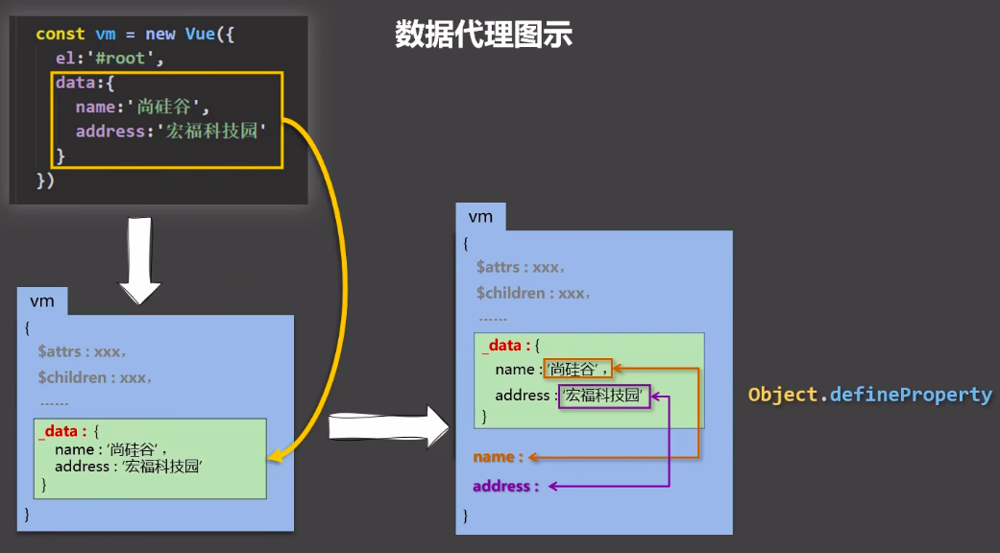
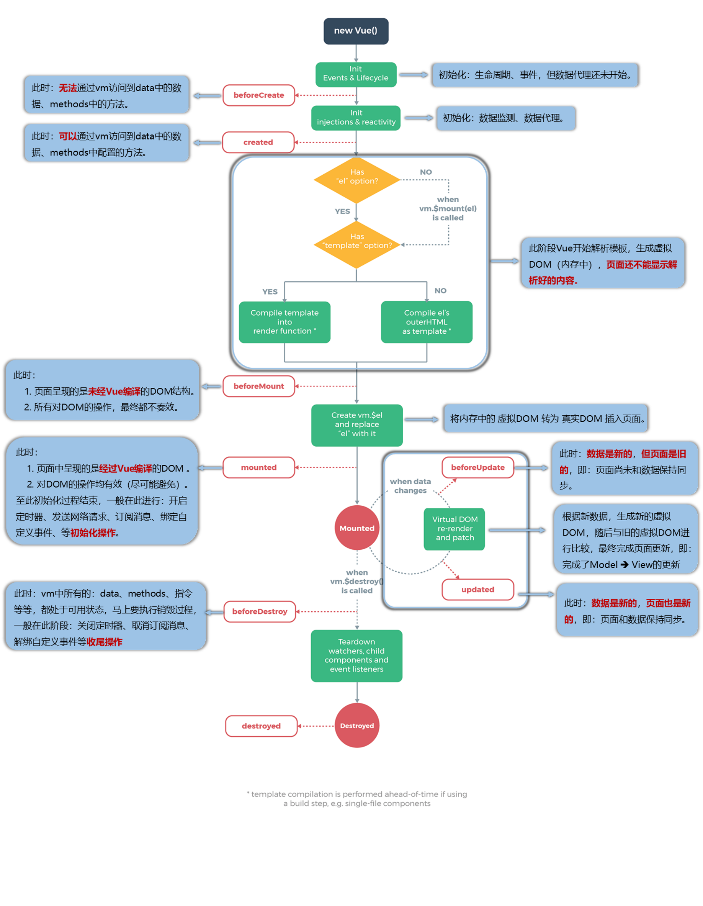
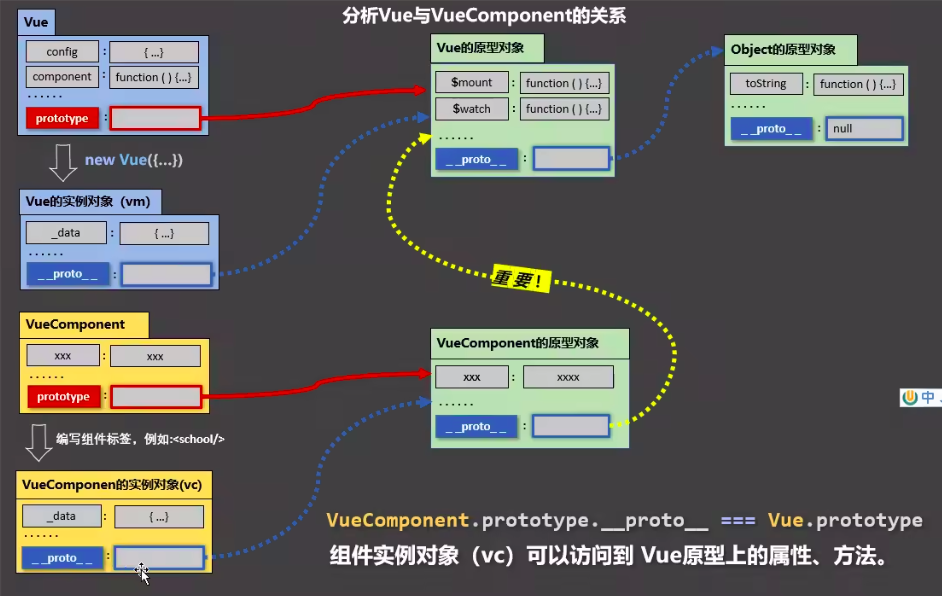
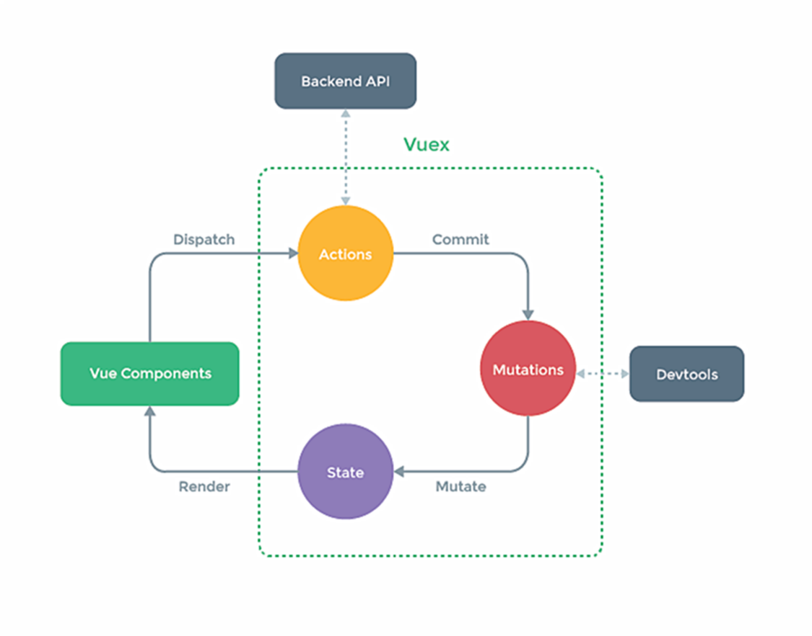

- [Vue 核心](#vue 核心)
	- [data 与 el 的 2 种写法](#data 与 el 的 2 种写法)
	- [MVVM 模型](#mvvm 模型)
	- [Vue 中的数据代理](#vue 中的数据代理)
	- [Vue 监视数据的原理](#vue 监视数据的原理)
	- [事件处理](#事件处理)
		- [事件的基本使用](#事件的基本使用)
		- [事件修饰符](#事件修饰符)
		- [键盘事件](#键盘事件)
	- [计算属性与监测属性](#计算属性与监测属性)
		- [计算属性 computed](#计算属性 computed)
	- [收集表单数据](#收集表单数据)
	- [生命周期](#生命周期)
	- [组件](#组件)
		- [几个注意点](#几个注意点)
		- [关于 VueComponent](#关于 vuecomponent)
		- [组件间数据通信](#组件间数据通信)
	- [mixin（混入）](#mixin 混入)
	- [插件](#插件)
- [Vuex](#vuex)
	- [概念](#概念)
	- [何时使用？](#何时使用)
	- [搭建 Vuex 环境](#搭建-vuex-环境)
	- [基本使用](#基本使用)
	- [getters 的使用](#getters 的使用)
	- [四个 map 方法的使用](#四个-map-方法的使用)
	- [模块化+命名空间](#模块化命名空间)
- [路由](#路由)
	- [基本使用](#基本使用-1)
	- [路由的几个注意点](#路由的几个注意点)
	- [多级路由](#多级路由)
	- [路由的 query 参数](#路由的 query 参数)
	- [命名路由](#命名路由)
	- [路由的 params 参数](#路由的-params-参数)
	- [路由的 props 配置](#路由的-props-配置)
	- [`<router-link>`的 replace 属性](#router-link 的 replace 属性)
	- [编程式路由导航](#编程式路由导航)
	- [缓存路由组件](#缓存路由组件)
	- [两个新的生命周期钩子](#两个新的生命周期钩子)
	- [路由守卫](#路由守卫)
	- [路由器的两种工作模式](#路由器的两种工作模式)
- [使用 Vue CLI](#使用 vue-cli)
	- [**关于不同版本的 Vue:**](#关于不同版本的 vue)
	- [vue.config.js 配置文件](#vueconfigjs 配置文件)
	- [总结 TodoList 案例](#总结 todolist 案例)
	- [nextTick](#nexttick)
- [注意事项](#注意事项)

# Vue 核心

## data 与 el 的 2 种写法

值得注意的是只有当实例被创建时就已经存在于 data 中的 property 才是响应式的。

1. el 有 2 种写法

   (1) new Vue 时配置 el 属性
   (2) 先创建 vue 实例，随后再通过`vm.$mount(’#root’)`指定 el 的值。

2. data 有 2 种写法

   (1)对象式
   (2)函数式。

   ```js
   data() {
     ruturn {}
   }
   ```

3. 一个重要的原则：

   由 Vue 管理的函数，一定不要写箭头函数，一旦写了箭头函数，this 就不再是 Vue 实例了。

## MVVM 模型

1.M: 模型（Model）: data 中的数据

2.V: 视图（View）: 模板代码

3.VM: 视图模型（ViewModel）: Vue 实例

## Vue 中的数据代理

```js
// 关于 Object.defineProperty() 的一个小例子

let number = 18
let person = {
 name: 'zhangsan',
 sex: 'nan',
}

Object.defineProperty(person, 'age', {
 // value: 18,
 // enumerable: true, // 控制属性是否可以被枚举，默认值为 false
 // writable: true, // 控制属性是否可以被修改，默认值是 false
 // configurable: true // 控制属性是否可以被删除，默认值是 false

 // 当有人读取 person 的 age 属性时，get 函数（getter）就会被调用，且返回值就是 age 的值
 get() {
  return number
 },

 // 当有人修改 person 的 age 属性时，set 函数（setter）就会被调用，且会收到修改的具体值
 set(value) {
  number = value
 }
});

// 输出一个数组，数组里存的是 person 对象中所有属性的属性名
// console.log(Object.keys(person));
```



1. Vue 中的数据代理

    >数据代理：通过一个对象代理另一个对象中属性的操作（读/写）

    通过 vm 对象来代理 data 对象中属性的操作（读/写）

2. Vue 中数据代理的好处

   更加方便的操作 data 中的数据

3. 基本原理

   通过`Object.defineProperty()`把 data 对象中所有属性添加到 vm 上。
   为每一个添加到 vm 上的属性，都指定一个 getter/setter。
   在 getter/setter 内部去操作（读/写）data 中对应的属性。

## Vue 监视数据的原理

1. vue 会监视 data 中所有层次的数据。

2. 如何监测对象中的数据？

    通过 setter 实现监视，且要在 new Vue 时就传入要监测的数据。

    （1）对象中后追加的属性，Vue 默认不做响应式处理。
    （2）如需给后添加的属性做响应式，请使用如下 API：
    ` Vue.set(target, propertyName/index, value) `或
    `vm.$set(target, propertyName/index, value)`

3. 如何监测数组中的数据？

    通过包裹数组更新元素的方法实现，本质就是做了两件事情：
    （1）. 调用原生对应的方法对数组进行更新。
    （2）. 重新解析模板，进而更新页面。
    数组中的每一项没有单独为其服务的 setter，所以整体修改数组中的每一项 Vue 不会监测，即`arr[0] = …`没有效果。

4. 在 Vue 修改数组中的某个元素一定要用如下方法：

    （1）. 使用这些 API：`push()`、`pop()`、`shift()`、`unshift()`、`splice()`、`sort()`、`reverse()`
    （2）.`Vue.set()` 或 `vm.$set()`

5. 特别注意 Vue.set() 和 vm.$set() 不能给 vm 或 vm 的根数据对象添加对象，也就是括号内第一个值不能是 vm。

## 事件处理

### 事件的基本使用

1. 使用 v-on:xxx 或@xxx 绑定事件。

2.methods 中配置的函数，都是被 Vue 所管理的函数，this 的指向是 vm 或 组件实例对象。

3.`@click=’demo’`和`@click=’demo($event)’`效果一致，但后者可以传参。

### 事件修饰符

1.prevent: 阻止默认事件（常用）

2.stop: 阻止事件冒泡（常用）

3.once: 事件只触发一次（常用）

4.capture: 使用事件的捕获模式

5.self: 只有 event.target 是当前操作的元素时才触发事件

6.passive: 事件的默认行为立即执行，无需等待事件回调执行完毕

### 键盘事件

1. Vue 中常用的按键别名：

    回车 =》 enter
    删除 =》 delete（捕获“删除”和“退格”键）
    退出 =》 esc
    空格 =》 space
    换行 =》 tab（特殊，必须配合 keydown 去使用）
    上 =》 up
    下 =》 down
    左 =》 left
    右 =》 right

2. Vue 未提供别名的按键，可以使用按键原始的 key 值去绑定，但注意要转为 key-case（短横线命名），如`@keyup.caps-lock=”xxx”`。

3. 系统修饰键（用法特殊）：ctrl，alt，shift，meta

    （1）配合 keyup 使用：按下修饰键的同时，再按下其他键，随后释放其他键，事件才被触发。
    （2）配合 keydown 使用：正常触发事件。

## 计算属性与监测属性

### 计算属性 computed

1. 定义：要用的属性不存在，要通过**已有属性**计算得来。

    ```js
    ...
    data() {
      return {
        firstName: 'zhang',
        lastName: 'san',
      }
    },
    computed: {
      fullName: {
        get() {
          return firstName + ' ' + lastName;
        },
        // 当 fullName 被修改时调用 set 函数
        set(value) {
          let arr = value.split(' ');
          this.firstName = arr[0];
          this.lastName = arr[1];
        }
      }
      // 计算属性的简写形式（不需要 set 时使用简写形式）
      // fullName() {
      //   return firstName + ' ' + lastName;
      // }
    }
    ...
    ```

2. 原理：底层借助了`Object.defineproperty()`方法提供的 getter 和 setter。

3. get 函数什么时候执行？

    （1）初次读取时会执行一次。
    （2）当依赖的数据发生改变时被再次调用。

4. 优点：与 methods 实现相比，内部有缓存机制（复用），效率更高，调试方便。

5. 备注：

    （1）计算属性最终会出现在 vm 上，直接读取使用即可。
    （2）如果计算属性要被修改，那必须写 set 函数去响应修改，且 set 中要引起**计算时依赖的数据**发生改变。

监视属性 watch：

1. 当被监视的属性变化时，回调函数自动调用，进行相关操作

2. 监视的属性必须存在，才能进行监视

3. 监视的两种方法：

    （1）new Vue 时传入 watch 配置

    ```js
    ...
    data(){
      return {
        title: 'demo_watch',
      }
    },
    watch: {
      title: {
        immediate: true, // 初始化时让 handler 调用一次
        handler(newValue, oldValue) {
          console.log(newValue + ' ' + oldValue);
        }
      }
    }
    ...
    ```

    （2）通过 vm.$watch 监视 (vm 是一个 Vue 实例）

    ```js
    vm.$watch('title', {
      immediate: true, // 初始化时让 handler 调用一次
      handler(newValue, oldValue) {
        console.log(newValue + ' ' + oldValue);
      }
    });
    
    // vm.$watch 的简写形式
    vm.$watch('title',function(newValue, oldValue) {
        console.log(newValue + ' ' + oldValue);
    });
    ```

**深度监视：**

（1）Vue 中的 watch 默认不监测对象内部值的改变。

（2） 配置`deep: true`可以监测对象内部值改变。

备注：Vue 自身可以监测对象内部值的改变，但 Vue 提供的 watch 默认不可以。

computed 和 watch 之间的区别：

1. computed 能完成的功能，watch 都可以完成。

2. watch 能完成的功能，computed 不一定能完成，例如：watch 可以进行异步操作。

两个重要的小原则：

1. 所被 Vue 管理的函数，最好写成普通函数，这样 this 的指向才是 vm 或 组件实例对象。

2. 所有不被 Vue 所管理的函数（定时器的回调函数，ajax 的回调函数，Promise 的回调函数），最好写成箭头函数，这样 this 的指向才是 vm 或 组件实例对象。

## 收集表单数据

若：`<input type=”text” />` ，则 v-model 收集的是 value 值，用户输入的就是 value 值。

若：`<input type=”radio” />` ，则 v-model 收集的是 value 值，且要给标签配置 value 值。

若：`<input type=”checkbox” />` ，

（1）. 没有配置 input 的 value 属性，那么收集的就是 checked（勾选 or 未勾选，是布尔值）

（2）.v-model 的初始值是数组，那么收集的就是 value 组成的数组

备注：v-model 的一些修饰符：

lazy；失去焦点再收集数据

number；输入字符串转为有效的数字

trim：输入首尾空格过滤

## 生命周期



常用的生命周期（又名生命周期回调函数、生命周期函数、生命周期钩子）：

1. mounted：发送 ajax 请求、启动定时器、绑定自定义事件、订阅消息等【初始化操作】。

2. beforeDestroy：清除定时器、绑定自定义事件、取消订阅消息等【收尾工作】。

关于销毁 Vue 实例：

1. 销毁后借助 Vue 开发者工具看不到任何消息。

2. 销毁后自定义事件会失效，但原生 DOM 事件依然有效。

3. 一般不会在 beforeDestroy 操作数据，因为即便操作数据，也不会再触发更新流程了。

## 组件

### 几个注意点

1. 关于组件名：

    一个单词组成：
    （1）. 首字母小写：school
    （2）. 首字母大写：School
    多个单词组成：
    （1）.kebab-case 命名：my-school
    （2）.CamelCase 命名：MySchool（需要 Vue 脚手架支持）
    备注：
    （1）组件名尽可能回避 HTML 中已有的元素名称，例如：h1、H2 都不行。
    （2）可以使用 name 配置项指定组件在开发者工具中呈现的名字。

2. 关于组件标签：

    第一种写法： `<school></school>`
    第二种写法： `<school />`
    不使用脚手架时，`<school />`会导致后续组件不能渲染。

3. 一个简写方式：

    `const school = Vue.extend(option)` 可简写为：`const school = options // 实际执行时 Vue 还是会在判断后执行 extend 函数`

### 关于 VueComponent

1. school 组件本质上是一个名为 VueComponent 的构造函数，且不是程序员定义的，是 Vue.extend 生成的。

2. 我们只需要写`<school />`或`<school></school>`，Vue 解析时会帮我们创建 school 组件的实例对象，即 Vue 帮我们执行的 `new VueComponent(options)`。

3. 特别注意：每次调用 Vue.extend，返回的是一个全新的名为 VueComponent 的构造函数。

4. 关于 this 指向：

    - 组件配置中：

       data 函数、methods 中的函数、watch 中的函数、computed 中的函数，它们的实例均是【VueComponent 实例对象】。

    - new Vue(options) 配置中：

       data 函数、methods 中的函数、watch 中的函数、computed 中的函数，它们的实例均是【Vue 实例对象】。



一个重要的内置关系：`VueComponent.prototype.__proto__ === Vue.prototype`

为什么要有这个关系：让组件实例对象（vc）可以访问到 Vue 原型上的属性、方法。

### 组件间数据通信

- 配置项 `props`：**父给子传递数据 或者 子给父传递数据**（若子给父传数据，要求父先给子一个函数）
。

  `props` 的作用：让组件接受外部传过来的数据。

  1. 传递数据：

      ```html
     <Demo name=”xxx”/>
     ```

  2. 接受数据：
  
     - 第一种方式（只接受）：
  
       ```js
       props: [’name’],
       ```

     - 第二种方式（限制类型）：
  
       ```js
       props: {
         name: Number
       }
       ```
  
     - 第三种方式（限制类型、限制必要性、指定默认值）：
  
       ```js
       props: {
         name: {
           type: String, // 类型`
           required: true, // 必要性`
           default: ‘老王’, // 默认值`
         }
       }
       ```
  
  >**备注**：
  >
  >props 是只读的，Vue 底层会监测你对 props 的修改，如果进行了修改，就会发出警告，若业务需求确实需要修改，可以先复制一份 props 的内容到 data 中，然后再去修改 data 中的数据。
  >
  >**props 传过来的若是对象类型的值，修改对象中的属性时 Vue 不会报错，但不推荐这样做。**

- 组件的自定义事件：**子给父传递数据**
  使用场景：A 是父组件，B 是子组件，B 想给 A 传数据，那么就要在 A 中给 B 绑定自定义事件（事件的回调在 A 中）。
  绑定自定义事件：

  1. 第一种方式，在父组件中：`<Demo @myEvent=”test” />` 或 `<Demo v-on:@myEvent=”test” />`

  2. 第二种方式，在父组件中：

     >**ref 属性**
     >
     >1. 被用来给元素或子组件注册引用信息（id 的替代者）
     >
     >2. 应用在 html 标签上获取的是真实 DOM 元素，应用在组件标签上是组件实例对象（vc）
     >
     >3. 使用方式：
     >
     >    - 打标识：`<h1 ref=”xxx”> … </h1>` 或 `<School ref=”xxx”></School>`
     >
     >    - 获取： `this.$refs.xxx`

     ```js
     <Demo ref=”demo” />
     ……
     mounted() {
       this.$ref.xxx.$on(’myEvent’, this.test)
     }
     ```
  
  3. 若想让自定义事件只能触发一次，可以使用`once`修饰符，或`$once`方法。
  
  4. 触发自定义事件：`this.$emit(’myEvent’, 数据）`
  
  5. 解绑自定义事件 `this.$off(’myEvent’)` 或 `this.$off(['e1', 'e2'])` 或 `this.$off()`
  
  6. 组件上也可以绑定原生 DOM 事件，需要使用 `native` 修饰符。

      ```html
      <Demo @click.native="handleClick">
      ```
  
  7. 注意：通过 `this.$refs.xxx.$on(’myEvent’, 回调）` 绑定自定义事件时，回调要么配置在 methods 中，要么用箭头函数，否则 this 指向会出现问题。

- 全局事件总线（GlobalEventBus）：适用于**任意组件间通信**。
  1. 安装全局事件总线：
  
     ```js
     // main.js 中
     new Vue({
       ......
       beforeCreate() {
         Vue.prototype.$bus = this; // 安装全局事件总线，$bus 就是当前应用的 vm
       },
       ......
     })
     ```
  
  2. 使用事件总线：
  
      - (1). 接受数据：A 组件想接受数据，则在 A 组件中给 `$bus` 绑定自定义事件，事件的回调留在 A 组件自身。

        ```js
        methods() {
          demo(data) { ...... }
        }
        ......
        mounted() {
          this.$bus.$on('myEvent',this.demo);
        }
        ```

      - (2). 提供数据：`this.$bus.$emit(’myEvent’, 数据）`
  
  3. **最好在 beforeDestroy 钩子中，用 $off 去解绑当前组件所用到的事件。**

      ```js
      // A 组件中
      ......
      beforeDestroy() {
        this.$bus.$off('myEvent');
      }
      ```

- 消息订阅与发布（pubsub）：适用于**任意组件间通信**

  使用步骤：
  
  1. 安装 pubsub：`npm i pubsub-js`
  
  2. 引入：`import pubsub from ‘pubsub-js’`
  
  3. 接受数据：A 组件想接受数据，则在 A 组件中订阅消息，订阅的回调留在 A 组件自身。
  
     ```js
     methods() {
      demo(data) { ...... }
     }, 
     .....
     mounted() {
      this.pid = pubsub.subscribe('xxx', this.demo) // 订阅消息
     } 
     ```
  
  4. 提供数据：`pubsub.publish(’xxx’, 数据）`
  
  5. 最好在 beforeDestroy 钩子中，用 `pubsub.unsubscribe(pid)` 去取消订阅。

- Vuex

## mixin（混入）

功能：可以把多个组件共用的配置提取成一个混入对象

使用方式：

第一步定义混合，例如：

```js
export const mix = {
  data() { … },
  methods: { … },
  …
}
```

第二步使用混入，例如：

（1）. 全局混入 (main.js 中）： Vue.mixin(xxx)

（2）. 局部混入（组件中）：mixins: [’xxx’]

## 插件

功能：用于增强 Vue

本质：包含 install 方法的一个对象，install 的第一个参数是 Vue，第二个以后的参数是插件使用者传递的数据。

定义插件：

```js
对象。install = function (Vue, options) {

//1. 添加全局过滤器

Vue.filter(…)

//2. 添加全局指令

Vue.directive(…)

//3. 配置全局混入（合）

Vue.mixin(…)

//4. 添加实例方法

Vue.prototype.$myMethod = function() {…}

Vue.prototype.$myProperty = xxx

}
```

使用插件： `Vue.use();`

# Vuex

## 概念

在 Vue 中实现集中式状态（数据）管理的一个 Vue 插件，对 Vue 应用中多个组件的共享状态进行集中式的管理（读/写），也是一种组件间通信的方式，且适用于任意组件间通信。



## 何时使用？

**多个组件需要共享数据时。**

## 搭建 Vuex 环境

1. 创建文件：`src/store/index.js`

    ```js
    // 引入 Vue
    import Vue from 'vue'
    // 引入 Vuex
    import Vuex from 'vuex'
    // 应用 Vuex 插件
    Vue.use(Vuex)
  
    // 准备 actions 对象--响应组件中用户的动作
    const actions = {}
    // 准备 mutations 对象--修改 state 中的数据
    const mutations = {}
    // 准备 state 对象--保存具体的数据
    const state = {}
  
    // 创建并暴露 store
    export default new Vuex.Store({
        actions,
        mutations,
        state
    })
  
    ```

2. 在 main.js 中创建 vm 时传入 store 配置项（ Vue 的实例对象被简称为 vm ）

    ```js
    ......
    // 引入 store
    import store from './store'
    ......
  
    // 创建 vm
    new Vue({
        el: '#app',
        render: h => h(App),
        store,
    })
    ```

## 基本使用

1. 初始化数据、配置 actions、配置 mutations，操作 store.js。

    ```js
    // 引入 Vue 核心库
    import Vue from 'vue'
    // 引入 Vuex
    import Vuex from 'vuex'
    // 应用 Vuex 插件
    Vue.use(Vuex)
  
    const actions = {
        // 响应组件中加的动作
        jia(context, value) {
            context.commit('JIA', value)
        },
    }
  
    const mutations = {
        // 执行加
        JIA(state, value) {
            state.num += value; 
        }
    }
  
    // 初始化数据
    const state = {
        sum: 0
    }
  
    // 创建并暴露 store
    export default new Vuex.Store({
        actions,
        mutations,
        state,
    })
    ```

2. 组件中读取 Vuex 中的数据：`$store.state.sum`

3. 组件中修改 Vuex 中的数据：`$store.dispatch(’actions 中的方法名’, 数据）` 或 `$store.commit(’mutations 中的方法名’, 数据）`

   >备注：若没有网络请求或其他业务逻辑，组件中也可以越过 actions，即不写 dispatch，直接编写 commit。

## getters 的使用

1. 概念：当 state 中的数据需要经过加工后再使用时，可以使用 `getters` 加工。

2. 在 `store.js` 中追加 `getters` 配置

    ```js
    ......
  
    const getters = {
        bigSum(state) {
            return state.sum * 10
        }
    }
  
    // 创建并暴露 store
    export default new Vuex.Store({
        ......
        getters
    })
    ```

3. 组件中读取数据：`$store.getters.bigSum`

## 四个 map 方法的使用

1. `mapState` 方法：用于帮助我们映射 `state` 中的数据为计算属性

    ```js
    computed: {
        // 借助 mapState 生成计算属性， sum、school、subject（对象写法）
        ...mapState({
            // 使用箭头函数
            sum: state => state.sum, 

            // 传字符串参数 'school' 等同于 `state => state.school`
            school: 'school', 

            // 为了能够使用 `this` 获取局部状态，必须使用常规函数
            subjectNum(state) {
              return state.subject + this.num;
            }
        }),
     
        // 借助 mapState 生成计算属性， sum、school、subject（数组写法）
        //        映射 this.sum 为 store.state.sum
        ...mapState([ 'sum', 'school', 'subject' ]), 
    },
    ```

2. `mapGetters` 方法：用于帮助我们映射 `getters` 中的数据为计算属性

    ```js
    computed: {
        // 借助 mapGetters 生成计算属性：bigSum（对象写法）
        //       把 `this.bigSum` 映射为 `this.$store.getters.bigSum`
        ...mapGetters({ bigSum: 'bigSum' }),
  
        // 借助 mapGetters 生成计算属性， bigSum（数组写法）
        ...mapState([ 'bigSum' ]),
    }
    ```

3. `mapActions` 方法：用于帮助我们生成与 `actions` 对话的方法，即：包含 `$store.dispatch(xxx)` 的函数

    ```js
    methods: {
        // 靠 mapActions 生成，incrementOdd、incrementWait（对象形式）
        ...mapActions({ incrementOdd: 'jiaOdd', incrementWait: 'jiaWait' }),
  
        // 靠 mapActions 生成，incrementOdd、incrementWait（数组形式）
        ...mapActinos([ 'jiaOdd', 'jiaWait' ]),
    }
    ```

4. `mapMutations` 方法：用于帮助我们生成与 `mutations` 对话的方法，即：包含 `$store.commit(xxx)` 的函数

    ```js
    methods: {
        // 靠 mapMutations 生成，increment、decrement（对象形式）
        ...mapMutations({ increment: 'JIA', decrement: 'JIAN' }),
    
        // 靠 mapMutations 生成，JIA、JIAN（数组形式）
        ...mapMutations([ 'JIA', 'JIAN' ]),
    }
    ```

    >备注：mapActions 和 mapMutations 使用时，若需要传递参数，需要在模板中绑定事件时传递好参数，否则参数是事件对象。

## 模块化+命名空间

1. 目的：让代码更好维护，让多种数据分类更加明确。

2. 修改 `store.js`

    ```js
    const countAbout = {
         namespaced: true, // 开启命名空间
         state: {
             x: 1,
         },
         actions: { ... },
         mutations: { ... },
         getters: {
             bigSum(state) {
                 return state.sum * 10;
             }
         },
    }
  
    const personAbout = {
        namespaced: true, // 开启命名空间
        state: { ... },
        actions: { ... },
        mutations: { ... },
        getters: { ... },
    }
  
    const store = new Vuex.Store({
        modules: {
            countAbout,
            personAbout
        }
    })
    ```

    >当模块带有命名空间后，它的所有 getters、actions 和 mutations 都会自动根据模块注册的路径调整命名。所以开启命名空间的模块中的 getters、actions 和 mutations 的使用方式都会改变；但是开启命名空间和不开启命名空间的模块中的 state 的使用方式不会改变，格式依然是 `store.state. 模块名。状态名`。

3. 开启命名空间后，组件中读取 state 数据：

   ```js
   // 方式一：自己直接读取
   this.$store.state.personAbout.list
   // 方式二：借助 mapState 读取
   //   将模块的空间名称字符串作为第一个参传递给辅助函数，这所有的绑定都会自动将该模块作为上下文
   ...mapState('countAbout', ['sum', 'school', 'subject']),
   ```

4. 开启命名空间后，组件中读取 getters 数据：

    ```js
    // 方式一：自己直接读取
    this.$store.getters['personAbout/firstPersonName']
    // 方式二：借助 mapGetters 读取
    ...mapGetters('countAbout', ['bigSum']),
    ```

5. 开启命名空间后，组件中调用 dispatch：

    ```js
    // 方式一：自己直接调用 dispatch
    this.$store.dispatch('personAbout/firstPersonName', person)
    // 方式二：借助 mapActions
    ...mapActions('countAbout', {incrementOdd: 'jiaOdd', incrementWait: 'jiaWait'})
    ```

6. 开启命名空间后，组件中调用 commit：

    ```js
    // 方式一：自己直接调用 commit
    this.$store.commit('personAbout/ADD_PERSON', person)
    // 方式二：借助 mapMutations
    ...mapMutations('countAbout', {increment: 'JIA', decrement: 'JIAN'})
    ```

# 路由

理解：一个路由（route）就是一组映射关系（key-value），多个路由需要路由器（router）进行管理。

前端路由：key 就是路径，value 就是组件。

## 基本使用

  1. 安装 vue-router，命令：`npm i vue-router`
  2. 应用插件：`Vue.use(VueRouter)`
  3. 编写 router 配置项：

     ```js
     import Vue from 'vue'
     // 引入 VueRouter
     import VueRouter from 'vue-router'
     // 使用 VueRouter
     Vue.use(VueRouter)
     
     // 引入路由组件
     import About from '../components/About'
     import Home from '../components/Home'
     
     // 创建 router 实例对象，去管理一组一组的路由规则
     const router = new VueRouter({
         routers: [
             {
                 path: '/about',
                 component: About,
             },
             {
                 path: '/home',
                 component: Home,
             }
       ]
     })
     
     // 暴露 router
     export default router
     ```

  4. 实现切换（active-class 可配置高亮样式）

     ```html
     <router-link active-class="active" to="/about">About</router-link>
     ```

  5. 指定展示位置
  
     ```html
     <router-view></router-view>
     ```

## 路由的几个注意点

  1. 路由组件通常存放在`pages`文件夹，一般组件通常存放在`components`文件夹。
  
  2. 通过切换，“隐藏”了的路由组件，默认是被销毁掉的，需要的时候再去挂载。
  
  3. 每个组件都有自己的`$route`属性，里面存储着自己的路由信息。
  
  4. 整个应用只有一个 router ，可以通过组件的`$router`属性获取到。

## 多级路由

  1. 配置路由规则，使用 children 配置项：
  
     ```js
     routers: [
         {
             path: '/about',
             component: About,
         },
         {
             path: '/home',
             component: Home,
             children: [ // 通过 children 配置子级路由
                 {
                     path: 'news', // 此处不要写：/news
                     component: News,
                 },
                 {
                     path: 'message', // 此处不要写：/message
                     component: Message,
                 },
             ]
         }
     ]
     ```
  
  2. 跳转（要写完整路径）
  
     ```html
     <router-link to="/home/news">News</router-link>
     ```

## 路由的 query 参数

  1. 传递参数
  
     ```html
     <!-- 跳转并携带 query 参数，to 的字符串写法 -->
     <router-link to="/home/message/detail?id=666&title=你好">跳转</router-link>
  
     <!-- 跳转并携带 query 参数，to 的对象写法 -->
     <router-link 
         :to="{
             path:'/home/message/detail',
             query: {
                 id: 666,
                 title: '你好'
             }
         }"
     >跳转</router-link>
     ```
  
  2. 接受参数
  
     ```js
     $route.query.id
     $route.query.title
     ```

## 命名路由

  1. 作用：可以简化路由的跳转
  
  2. 如何使用

     1. 给路由命名

         ```js
         {
          path: '/demo',
          component: Demo,
          children: [ 
           {
            path: 'test',
            component: Test,
            children: [
             {
              name: 'hello',
              path: 'welcome',
              component: Hello,
             }
            ]
           }
          ]
         }
         ```

     2. 简化跳转：

         ```html
         <!-- 简化前，需要写完整的路径 -->
         <router-link to="/demo/test/welcome">跳转</router-link>
     
         <!-- 简化后，直接通过名字跳转 -->
         <router-link :to="{name:'hello'}">跳转</router-link>
     
         <!-- 简化写法配合传递参数 -->
         <router-link 
          :to="{
           name:'hello',
           query: {
            id: 666,
            title: '你好'
           }
          }"
         >跳转</router-link>
         ```

## 路由的 params 参数

  1. 配置路由，声明接受 params 参数
  
     ```js
     {
      path: '/home',
      component: Home,
      children: [ 
       {
        path: 'news', 
        component: News,
       },
       {
        path: 'message', 
        component: Message,
        children: [
         {
          name: 'xiangqing',
          path: 'detail/:id?/:title?', // 使用占位符声明接受 params 参数。添加？，可指定 params 参数可传可不传
          component: Detail
         }
        ]
       },
      ]
     }
     ```
  
  2. 传递参数
  
     ```html
     <!-- 跳转并携带 params 参数，to 的字符串写法 -->
     <router-link to="/home/message/detail/666/你好">跳转</router-link>
     
     <!-- 跳转并携带 params 参数，to 的对象写法 -->
     <router-link 
      :to="{
       name:'xiangqing',
       params: {
        id: 666,
        title: '你好'
       }
      }"
     >跳转</router-link>
     ```

     **特别注意：路由携带`params`参数时，若使用`to`的对象写法，则不能使用`path`配置项，必须使用`name`配置！**
  
  3. 接受参数
  
     ```js
     $route.params.id
     $route.params.title
     ```
  
     params 和 query 的区别
        - params 参数：属于路径当中的一部分，在配置路由的时候，需要占位
        - query 参数：不属于路径当中的一部分，类似于 ajax 中的 queryString，不需要占位

## 路由的 props 配置

作用：让路由组件更方便的收到参数

```js
{
 name; 'xiangqing',
 path: 'detail/id',
 componnet: Detail,
 
 // 第一种写法：props 值为对象，该对象中所有的 key-value 的组合最终都会通过 props 传给 Detail 组件
 // props: {a: 900}

 // 第二种写法：props 值为布尔值，布尔值为 true，则把路由收到的所有 params 参数通过 props 传给 Detail 组件
 // props: true
 
 // 第三种写法；props 值为函数，该函数返回的对象中每一组 key-value 都会通过 props 传给 Detail 组件
 props($route) {
  return {
   id: $route.query.id,
   title: $route.query.title
  }
 }
}
```

```js
// 组件中接受参数

props: ['id', 'title'],
```

## `<router-link>`的 replace 属性

  1. 作用：控制路由跳转时操作浏览器历史记录的模式。

  2. 浏览器的历史记录有两种写入方式：分别为`push`和`replace`，`push`是追加历史记录，`replace`是替换当前记录，路由跳转时候默认为`push`。

  3. 开启`replace`模式：`<router-link replace … >News</router-link>`

## 编程式路由导航

  1. 作用：不借助`<router-link>`实现路由跳转，让路由跳转更加灵活。
  
  2. 具体编码：
  
     ```js
     // $router 的两个 API
     //    字符串形式
     this.$router.push("/xiangqing/666/你好")
     //    对象形式
     this.$router.push({
      name:'xiangqing',
      params: {
       id: 666,
       title: '你好'
      }
     })
  
     this.$router.replace({
      name:'xiangqing',
      params: {
       id: 666,
       title: '你好'
      }
     })
  
     this.$router.forward() // 前进
     this.$router.back() // 后退
     this.$router.go(3) // 前进 3 步
     ```

## 缓存路由组件

  1. 作用：让不展示的路由组件保持挂载，不被销毁。
  
  2. 具体编码：
  
     ```html
     <keep-alive include="News">  <!-- News 为组件名 -->
         <router-view></router-view>
     </keep-alive>
     ```

## 两个新的生命周期钩子

  1. 作用：路由组件所独有的两个钩子，用于捕获路由组件的激活状态。
  
  2. 具体名字：
  
     1. `activated`路由组件被激活时触发。
  
     2. `deactivated`路由组件未激活时触发。

## 导航守卫

  1. 作用：对路由进行权限控制。
  
  2. 分类：全局守卫、路由独享的守卫、组件内的守卫
  
  3. 全局守卫
  
     ```js
     // 全局前置守卫，初始化时执行，每次路由切换前执行
     router.beforeEach((to,from,next) => {
      if(to.meta.isAuth) { // 判断当前路由是否需要进行权限控制
       if(localStorage.getItem('school') === 'atguigu') {
        next(); // 放行
       } else {
        alert('暂无权限查看')
       }
      } else {
       next()
      }
     })
  
     // 全局后置守卫，初始化时执行，每次路由切换后执行
     router.afterEach((to,from) => {
      if(to.meta.title) {
       document.title = to.meta.title;
      } else {
       document.title = 'demo';
      }
     })
     ```
  
  4. 路由独享的守卫
  
     ```js
     children:[
      {
       name: 'xinwen',
       path： 'news',
       component: News,
       meta: {isAuth:true,title:'新闻'},
       beforeEnter(to,from,next) {
        if(to.meta.isAuth) { // 判断当前路由是否需要进行权限控制
         if(localStorage.getItem('school') === 'atguigu') {
          next(); // 放行
         } else {
          alert('暂无权限查看')
         }
        } else {
         next()
        }
       }
      }
     ]
     ```
  
  5. 组件内守卫
  
     ```js
     methods: {
      // 进入守卫，通过路由规则，进入该组件时被调用
      beforeRouteEnter(to,from,next) {
       if(to.meta.isAuth) { // 判断当前路由是否需要进行权限控制
        if(localStorage.getItem('school') === 'atguigu') {
         next(); // 放行
        } else {
         alert('暂无权限查看')
        }
       } else {
        next()
       }
      },
      // 离开守卫，通过路由规则，离开该组件时被调用
      beforeRouteLeave(to,from,next) {
       next()
      },
     }
     ```

## 路由器的两种工作模式

  1. 对于一个 url 来说，什么是 hash 值？  **#及其后面的内容就是 hash 值**。
  
  2. hash 值不会包含在 HTTP 请求中，即：hash 值不会带给服务器。
  
  3. hash 模式：
  
     1. 地址中永远带着#号，不美观。
  
     2. 若以后将地址通过第三方手机 app 分享，若 app 校验严格，则地址会被标记为不合法。
  
     3. 兼容性较好。
  
  4. history 模式：
  
     1. 地址干净，美观。
  
     2. 兼容性和 hash 模式相比略差。
  
     3. 应用部署上线时需要后端人员支持，解决刷新页面服务器 404 的问题。

# 使用 Vue CLI

## **关于不同版本的 Vue:**

1. vue.js 与 vue.runtime.xxx.js 的区别：

    （1）.vue.js 是完整版的 Vue，包含：核心功能+模板解析器
    （2）.vue.runtime.xxx.js 是运行版的 Vue，只包含：核心功能；没有模板解析器。

2. 因为 vue.runtime.xxx.js 没有模板解析器，所以不能使用 template 配置项，需要使用 render 函数接收到的 createElement 函数去指定具体内容。

## vue.config.js 配置文件

1. 使用`vue inspect > output.js`可以查看到 Vue 脚手架的默认配置。

2. 使用 vue.config.js 可以对脚手架进行个性化定制。

## 总结 TodoList 案例

1. 组件化编码流程：

    1. 拆分静态组件：组件要按照功能点拆分，命名不要与 html 元素冲突。
    2. 实现动态组件：考虑好数据的存放位置，数据是一个组件在用，还是一些组件在用：
        - （1）一个组件在用：放在组件自身即可。
        - （2）一些组件在用：放在他们共同的父组件上（状态提升）。
    3. 实现交互：从绑定事件开始。

2. 使用 v-model 时要切记：v-model 绑定的值不能是 props 传过来的值，因为 props 是不可以修改的。

## nextTick

1. 语法：`this.$nextTick（回调函数）`

2. 作用：在下一次 DOM 更新结束后执行其指定的回调

3. 什么时候用：当改变数据后，要基于更新后的新 DOM 进行某些操作时，要在 nextTick 所指定的回调函数中执行。

# 注意事项

|  | vuex（默认版本 4) | vue-router（默认版本 4) |
| --- | --- | --- |
| vue2 | 3 | 3 |
| vue3 | 4 | 4 |
