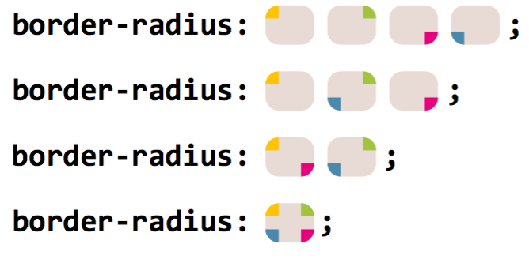

[[TOC]]

## 一、css 的语法

css 的语法：

`选择器 {`
 `声明块`
`}`

其中声明块形式为：`属性：属性值`。

> 块内元素和内联元素
>
> 块内元素：所谓的块内元素就是会独占一行的元素，无论它的内容有多少，它都会独占一整行。
> 常见的如：div、p、h1、h2、h3 ......
>
> 内联元素（行内元素）：所谓的内联元素，指的是只占自身大小的元素，不会占用一行。
> 常见的如：span、a、img、frame

## 二、选择器

| 选择器名称 | 选择的内容 | 示例 |
| --------- | -------- | ------ |
| 元素选择器（也称作标签或类型选择器） | 所有指定 （该） 类型的 HTML 元素                               | `p`<br />选择 `<p>`                                          |
| ID 选择器                            | 具有特定 ID 的元素（单一 HTML 页面中，每个 ID 只对应一个元素，一个元素只对应一个 ID） | `#my-id`<br />选择 `<p id="my-id">` 或 `<a id="my-id">`      |
| 类选择器                             | 具有特定类的元素（单一页面中，一个类可以有多个实例）         | `.my-class` <br />选择 `<p class="my-class">` 和 `<a class="my-class">` |
| 属性选择器                           | 拥有特定属性的元素                                           | `img[attr]`：<br />选择 `` 而不是 ``。<br />`img[attr=”val“]`：<br />选择有 attr 属性且 attr 属性值为”val“的 img 元素。<br />`img[attr*=”val“]`：<br />选择有 attr 属性且 attr 属性值含有”val“的的 img 元素。<br/>`img[attr^=”val“]`：<br />选择有 attr 属性且 attr 属性值以”val“开头的的 img 元素。<br/>`img[attr$=”val“]`：<br />选择有 attr 属性且 attr 属性值以”val“结尾的 img 元素。 |
| 伪（Pseudo）类选择器                 | 特定状态下的特定元素（比如鼠标指针悬停）                     | `a:hover`<br/>仅在鼠标指针悬停在链接上时选择 `<a>`。<br />`E：first-child` <br/>E 元素的所有兄弟元素中的第一个元素。<br />`E：last-child` <br/>E 元素的所有兄弟元素中的最后一个子元素 E。<br />`E：nth-child(n)` <br/>E 元素的所有兄弟元素中的第 n 个元素。<br />`E：first-of-type` <br/>指定类型的第一个 E 元素。<br />`E：last-of-type` <br/>指定类型的最后一个 E 元素。<br />`E：nth-of-type(n)` <br/>指定类型的第 n 个 E 元素。（n 可以是正数字、关键字（even：偶数；odd：奇数）、表达式（如 -n+3，表示选中前 3 个【n 从 0 开始】）） |
| 伪元素选择器 | 修改被选择元素的特定部分 | `::first-ine`<br />选中元素中的第一行文字。<br/>`::first-letter`<br/>选中元素中的第一个文字。<br/>`::selection`<br/>选中被鼠标选中的内容。<br/>`::placeholder`<br/>选中输入框的提示文字。<br/>`::before`<br/>在元素最开始的位置，创建一个子元素（必须用 content 属性指定内容）。<br/>`::after`<br/>在元素最后的位置，创建一个子元素（必须用 content 属性指定内容）。|
| 后代选择器                           | 指定元素的指定后代元素                                       | `div span`<br />选择`div`的后代元素中的`span`                |
| 子代选择器                           | 指定父元素的指定子元素                                       | `div > span`<br />选择`div`的子元素中的`span`                |
| 相邻兄弟选择器                       | 指定元素后紧挨着的指定兄弟元素                               | `div + span`<br />选择`div`后紧挨着的兄弟元素`span`          |
| 通用兄弟选择器                       | 指定元素后紧挨着的所有指定兄弟元素                           | `div ～ span`<br />选择`div`后紧挨着的所有兄弟元素`span`     |

> 元素之间的关系
>
> ​ 父元素：直接包含子元素的元素。
>
> ​ 子元素：直接被父元素包含的元素。
>
> ​ 祖先元素：直接或间接包含后代元素的元素，父元素也是祖先元素。
>
> ​ 后代元素：直接或间接被祖先元素包含的元素，子元素也是后代元素。
>
> ​ 兄弟元素：拥有相同父元素的元素叫做兄弟元素。

## 三、CSS 属性

### 字体属性

- `font`：同时设置字体相关的所有样式。

  斜体、加粗、大小等没有顺序要求，但要求字体的大小和字体必须写，而且**字体必须是最后一个样式，大小必须是倒数第二个样式。**

- `color`：设置字体的颜色

- `font-family`：设置字体系列（多个字体样式用逗号隔开）。

  当采用某种字体时，如果浏览器支持则使用该字体，如果字体不支持，则使用默认字体。

  当采用多个字体时，浏览器会优先使用前边的字体，如果前边没有再尝试下一个。

  浏览器使用的字体默认就是计算机中的字体，如果计算机中有，则使用；如果没有，则不使用。

- `font-size`：设置字体的大小，浏览器中一般默认的文字大小都是 16px。

  font-size 设置的并不是文字本身的大小。在页面中，每个文字都是处在一个看不见的框中。**font-size 实际上是设置格的高度，并不是字体的大小**。一般情况下文字都要比这个格要小一些，有时会比这个格大。根据字体的不同，显示效果也不同。

- `font-weight`：设置字体的粗细。

  属性值：

  - normal：默认值。定义标准的字符。
  - bold：粗体。
  - 100、200、300、400、500、600、700、800、900：400 等同于 normal，700 等同于 bold。

- `font-style`：设置字体的风格。

  属性值：

  - normal：默认值。浏览器显示一个标准的字体样式。
  - italic：斜体。
  - oblique：倾斜。
  - inherit：从父元素继承字体样式。

- `font-variant`：设置小型大写字母。（小型大写字母是指，所有的字母都以大写形式显示，但小写字母的大写要比大写字母的大小要小一些。）

  属性值：

  - normal：默认值。文字正常显示。
  - small-caps：文本以小型大写字母显示。

### 文本属性

- `text-align`：设置文本的对齐方式。

  属性值：

  - left：左对齐。
  - right：右对齐。
  - justify：两边对齐。
  - center：居中对齐。

- `vertical-align`：垂直对齐方式。

- `line-height`：设置行高。

  通过设置行高来间接设置行间距，行高越大，行间距越大。

  **网页中的文字默认在行高中垂直居中显示。**

  ```css
  /*
   在 font 属性中也可以指定行高。
   在字体大小后添加 /行高 , 该值是可选的，如果不指定则使用默认值。
  */
  font: 20px "微软雅黑";
  ```

  属性值：

  - 直接指定一个大小。
  - 指定一个百分比，则参考自身 font-size 的百分比。
  - 指定一个数值，则参考自身 font-size 的倍数。

- `text-decoration`：设置文本的各种修饰。

  属性值：

  - none：默认值。正常显示。
  - underline：为文本添加下划线。
  - overline：为文本添加上划线。
  - line-through：为文本添加删除线。

- `text-indent`：设置首行的缩进。

  该样式需要指定一个长度，一般使用 em，并且只对第一行生效。

  所给值为正值时，向右侧缩进；所给值为负值时，向左侧缩进；

- `text-transform`：设置文本的大小写。

  属性值：

  - none：默认值。正常显示。
  - capitalize：单词的首字母大写，通过空格来识别单词。
  - uppercase：所有的字母都大写。
  - lowercase：所有的字母都小写。

- `text-shadow`：文本阴影效果。

- `letter-spacing`：设置字符之间的间距。

  可以直接指定一个长度或者百分数作为值，正数代表增加距离，负数代表减少距离。

- `word-spacing`：设置单词之间的间距。

  可以直接指定一个长度或者百分数作为值，正数代表增加距离，负数代表减少距离。

### 背景属性

- `background`：在一个声明中设置所有的背景属性。

  没有顺序要求，也没有数量要求，不写的样式使用默认值。

- `background-color`：设置元素的背景颜色。

- `background-image`：设置元素的背景图片。

  `background-image: url（相对路径）`

  如果背景图片大于元素，默认会显示图片的左上角。

  如果背景图片等于元素，则会将背景图片全部显示。

  如果背景图片小于元素，则会默认将背景图片平铺以充满元素。

- `background-repeat`：设置是否以及如何重复背景图像。

  属性值：

  - repeat：在 x 轴、y 轴均平铺
  - no-repeat：不平铺
  - repeat-x：在 x 轴平铺
  - repeat-y：在 y 轴平铺

- `background-attachment`：设置背景图像是否固定或者随着页面的其余部分滚动。

  属性值：

  - scroll：默认值。背景图片随着窗口滚动。
  - fixed：背景图片会固定在某一个位置，不随着页面滚动。

- `background-position`：设置背景的开始位置。

  属性值：

  - top bottom left right center 中的任意两个值：如果只给一个值，则第二值默认是 center。示例：`background-position: top left;` 默认值：`0% 0%`。

  - x% y%：第一个值是水平位置，第二个值是垂直位置。

    如果只给一个值，另一个值将是 50%。

  - xpos ypos：第一个值是水平位置，第二个值是垂直位置。

    左上角是`0 0`。单位是像素（0px 0px）或者任何其他的 CSS 单位。

    如果只给一个值，另一个值将是 50%。

    可以混合使用%和 position 值。

### 列表属性

列表相关的属性，可以作用在 ul 、 ol 、 li 元素上。

- `list-style-type`：设置列表符号。
   常用值如下：
  - none ：不显示前面的标识（很常用！）
  - square ：实心方块
  - disc ：圆形
  - decimal ：数字
  - lower-roman ：小写罗马字
  - upper-roman ：大写罗马字
  - lower-alpha ：小写字母
  - upper-alpha ：大写字母
- `list-style-position`：设置列表符号的位置。
  - inside ：在 li 的里面。
  - outside ：在 li 的外边
- `list-style-image`：自定义列表符号。属性值为：url(图片地址)。
- `list-style`：复合属性。没有数量、顺序的要求。

### CSS3 新属性

- 2D 转换：`transform`属性

  2D 转换综合写法

  - 格式：`transform: translate() rotate() scale();`
  - 其顺序会影响转换的效果。（先旋转会改变坐标轴的方向）
  - 同时有位移和其他属性的时候，记得将位移放到最前。

  相关属性值：

  - translate(x,y)  | translate(n) | translate(y)：移动

    特点：

    - **不会影响其他元素的位置**
    - 对行内元素无效

    ```css
    /*
    transform: translate(10px,10px); // 从原位置 向右移动 50px 向下移动 100px
    transform: translate(50%,50%); //translate 中的百分比单位是相对于自身元素的
    transform: translateX(10px);
    transform: translateY(10px);
    */
    ```

  - scale(x,y)：缩放

    特点：

    - 默认缩放的中心点是元素的中心点，而且**不会影响其他元素的位置**。
    - 可以用`transform-origin`属性设置元素转换的中心点（这个要写到改变的元素身上，而不写到 hover 中）

    ```css
    /*
    transform: scale(2, 2); // 宽和高都放大为原来的 2 倍
    transform: scale(0.5); // 宽和高都缩小为原来的一半
    */
    ```

  - rotate（度数）：旋转

    特点：

    - 默认旋转的中心点是元素的中心点，而且**不会影响其他元素的位置**
    - 可以用`transform-origin`属性设置元素转换的中心点（这个要写到改变的元素身上，而不写到 hover 中）

    ```css
    /*
    transform: rotate(45deg); // 顺时针旋转 45 度，deg 是度数的单位
    transform: rotate(-45deg); // 逆时针旋转 45 度
    */
    ```

- 2D 转换中心点：`transform-origin`属性，可以设置元素转换的中心点。

  `transform-origin: x y;`

  特点：

  - x y 默认转换的中心点是元素的中心点（50% 50%）
  - 可以给 x y 设置 **像素** 或 **方位名词**（top bottom left right center）

- 3D 转换：`transform`属性

  三维坐标系：**x 轴（水平向右为正）**，**y 轴（垂直向下为正）**，**z 轴（垂直屏幕往外为正）**

  相关属性值：

  - translate3d(x, y, z)：3D 位移

    ```css
    /*
    transform: translateX(10px); // 从原位置 在 x 轴上向正方向移动 10px
    transform: translateY(10px); // 从原位置 在 y 轴上向正方向移动 10px
    transform: translateZ(10px); // 从原位置 在 z 轴上向正方向移动 10px（一般 translateZ() 用 px 单位）
    transform: translate3d(10px,10px,10px); // 从原位置 分别在 x、y、z 轴上向正方向移动 10px（translate3d(x,y,z) 的第一个参数不能省略，如果没有就写 0）
    */
    ```

  - rotate3d(x, y, z, 度数）：3D 旋转

    ```css
    /* 可以用左手法则判断元素旋转的方向。
    transform: rotateX(45deg); // 沿着 x 轴正方向旋转 45 度
    transform: rotateY(45deg); // 沿着 y 轴正方向旋转 45 度
    transform: rotateZ(45deg); // 沿着 z 轴正方向旋转 45 度
    transform: rotate3d(x, y, z, deg); // 沿着自定义轴旋转 deg
    */
    ```

  - perspective：透视

    `perspective: 10px;`

    透视的单位是像素。

    如果想要在网页产生 3D 效果需要透视。

    **透视写在被观察元素的祖先盒子上面。**

  - transform-style：3D 呈现

    - 控制子元素是否开启三维立体环境。
    - `transform-style: flat;` 子元素不开启 3D 立体空间 默认的
    - `transform-style: perserve-3d;`子元素开启立体空间

- 动画：

  - 制作动画分为两步：

    1. 先定义动画

       ```css
       @keyframe 动画名称 {
           0%{
               width: 100px;
           }
           100%{
               width: 200px;
           }
       }
       ```

       > 动画序列
       >
       > - 0%是动画的开始，100%是动画的完成。这样的规则就是动画序列。
       > - 在@keyframes 中规定某项 CSS 样式，就能创建由当前样式逐渐改为新样式的动画效果。
       > - 动画是使元素从一种样式逐渐变化为另一种样式的效果。可以改变任意多的样式任意多的次数。
       > - 使用百分比来规定变化发生的时间，或用关键字“from"和"to"，等同于 0%和 100%。

    2. 再使用动画

       ```css
       .demo {
           /* 调用动画 */
           animation-name: 动画名称；
           /* 持续时间 */
           animation-duration: 持续时间；
           /* 添加多个动画，用逗号隔开*/
           /*
           animation: 动画名称 1 持续时间，动画名称 2 持续时间；
           */
       }
       ```

  - 动画常用属性

    | 属性                      | 描述                                                         |
    | ------------------------- | ------------------------------------------------------------ |
    | @keyframes                | 规定动画                                                     |
    | animation                 | 所有的动画属性的简写属性，除了 animation-play-state 属性。animation-name 和 animation-duration 必须要写。 |
    | animation-name            | 规定@keyframes 动画的名称。（必须的）                         |
    | animation-duration        | 规定动画完成一个周期所花费的秒或者毫秒，默认是 0。（必须的）  |
    | animation-timing-function | 规定动画速度曲线，默认是 ease，开始结束慢，中间快。           |
    | animation-delay           | 规定动画何时开始。默认是 0。                                  |
    | animotion-iteration-count | 规定动画被播放的次数，默认是 1，还有 infinite。                |
    | animation-direction       | 规定动画是否在下一周期逆向播放，默认是 normal。alternate，逆播放。 |
    | animation-play-state      | 规定动画是否正在运行或暂停。默认是 running。还有 paused。      |
    | animation-fill-mode       | 规定动画结束后状态，默认是 forwards，原始位置。backwards，当前位置。 |

- 过渡：`transition：all（要过渡的属性） 2s（过渡时间） linear（速度方式） 1s（开始延迟时间）`

  谁过渡给谁加。

  - `transition-property`：定义哪个属性需要过渡，只有在该属性中定义的属性（比如宽、高、颜色等）才会以有过渡效果。
    - `none`：不过渡任何属性。
    - `all`：过渡所有能过渡的属性。
    - 具体某个属性名 ，例如： width 、 heigth ，若有多个以逗号分隔。
  - `transition-duration`：设置过渡的持续时间。
    - `0`：没有任何过渡时间 —— 默认值。
    - `s` 或 `ms`：秒或毫秒。
    - `列表`：
      - 如果想让所有属性都持续一个时间，那就写一个值。
      - 如果想让每个属性持续不同的时间那就写一个时间的列表。
  - `transition-delay`：指定开始过渡的延迟时间，单位：`s` 或 `ms`
  - `transition-timing-function`：设置过渡的类型。
     常用属性：
    - ease ： 平滑过渡 —— 默认值
    - linear ： 线性过渡
    - ease-in ： 慢 → 快
    - ease-out ： 快 → 慢
    - ease-in-out ： 慢 → 快 → 慢
    - step-start ： 等同于 steps(1, start)
    - step-end ： 等同于 steps(1, end)
    - steps( integer,?) ： 接受两个参数的步进函数。第一个参数必须为正整数，指定函数的步数。第二个参数取值可以是 start 或 end ，指定每一步的值发生变化的时间点。第二个参数默认值为 end 。
    - cubic-bezie ( number, number, number, number)： 特定的贝塞尔曲线类型。
      > 在线制作贝赛尔曲线：https://cubic-bezier.com

- 其他属性：

  - `border-radius`：设置圆角。同时 border-radius 接受水平和垂直方向不同值，使用斜杠 (/) 来分隔它们，如：`border-radius: 50% / 50%;`。

    分别指定了 4，3，2 或 1 个值的 border-radius 属性（用空格分隔）对应的图如下。（注意椭圆的半径，斜杠前后都可以达到四个值，它们指的都是相同的角，斜杠前的是水平半径，斜杠后的是垂直半径）。
    

### 单位

#### 长度

- 像素 px

  一个像素相当于我们屏幕中的一个小点。

- 百分比%

  也可以使用一个百分数来表示一个大小，百分比是相对于父元素来说的，如果父元素使用的大小是 16px，则 100%就是 16px，200%就是 32px。

- em

  em 和百分比类似，它是相对于当前元素的字体大小来计算的，1em = 1font-size。如果当前行内文本的字体尺寸未被人为设置，则相对于浏览器的默认字体尺寸（默认 16px)。当设置字体相关样式时，经常会使用 em。

- rem

  rem 是 CSS3 新增的一个相对单位，相对于根元素（html 元素）的 font-size 的倍数。作用：利用 rem 可以实现简单的响应式布局，可以利用 html 元素中字体的大小与屏幕间的比值来设置 font-size 的值，以此实现当屏幕分辨率变化时让元素也随之变化。

- vw/vh/vmin/vmax

  - vw：相对于视窗的宽度，1vw = 1/100 视口宽度；

  - vh：相对于视窗的高度，1vh = 1/100 视口高度；

  - vmin：vw 和 vh 中的较小值；

  - vmax：vw 和 vh 中的较大值。

#### 颜色

- 颜色名：直接使用颜色对应的英文单词。

  ```css
  color: red;
  ```

- rgb 或 rgba：使用 红、黄、蓝 这三种光的三原色进行组合。

   ```css
   color: rgb(255, 0, 0);/* 红色 */
   color: rgba(255, 0, 0, 0.5); /* 半透明的红色，rgb（红色，绿色，蓝色，透明度）*/
   color: rgb(100%, 0%, 0%);/* 红色 */
   color: rgba(100%, 0%, 0%,50%);/* 半透明的红色 */
   ```

   > 1. 若三种颜色值相同，呈现的是灰色，值越大，灰色越浅。
   > 2. rgb(0, 0, 0) 是黑色， rgb(255, 255,255) 是白色。

- HEX 或 HEXA：HEX 的原理同与 rgb 一样，依然是通过：红、绿、蓝色 进行组合，只不过要用 6位（分成3组） 来表达。

   ```css
   color: #ff0000;/* 红色 */
   color: #00ff00;/* 绿色 */
   color: #0000ff;/* 蓝色 */
   color: #000000;/* 黑色 */
   color: #ffffff;/* 白色 */
   /* 如果每种颜色的两位都是相同的，就可以简写*/
   color: #ff9988;/* 可简为：#f98 */
   /* 但要注意前三位简写了，那么透明度就也要简写 */
   color: #ff998866;/* 可简为：#f986 */
   ```

- HSL 或 HSLA：HSL 是通过【色相、饱和度、亮度】来表示一个颜色的，格式为：`hsl(色相,饱和度,亮度)`
   HSLA 其实就是在 HSL 的基础上，添加了透明度。
  - 色相：取值范围是 0~360 度（deg）。
      0 - 60 - 120 - 180 - 240 - 300 - 0
      red - yellow - green - cyan - blue - magenta - red
  - 饱和度：取值范围是 0%~100% 。（向色相中对应颜色中添加灰色， 0% 全灰， 100% 没有灰）
  - 亮度：取值范围是 0%~100% 。（ 0% 亮度没了，所以就是黑色。 100% 亮度太强，所以就是白色了）

#### 字体

> 在网页中将字体分为 5 大类：
>
> serif（衬线字体）
>
> sans-serif（非衬线字体）
>
> monospace（等宽字体）
>
> cursive（草书字体）
>
> fantasy（虚幻字体）

## 四、CSS 特性

1. 继承性

   特性：子元素有默认继承父元素样式的特点。

   可以继承的常见属性（文字控制属性都可以继承）：
   - color
   - font-style、font-weight、font-size、font-family
   - text-indent、text-align
   - line-height

   不可以继承的常见属性：
   - border
   - padding
   - margin
   - width、height
   - overflow

   > 一个规律：能继承的属性，都是不影响布局的，简单说：都是和盒子模型没关系的。

2. 层叠性

   特性：
   - 给同一个标签设置不同的样式，此时样式会层叠叠加，会共同作用到标签上。
   - 给同一个标签设置相同的样式，此时样式会层叠覆盖，最终写在最后的样式会生效。

     当样式冲突时，只有当前选择器优先级相同时，才能通过层叠性判断结果。

3. 优先级

   每一个选择器都能计算出一个【权重值】，格式为：（a,b,c）。
   - a 表示：一个选择器中【ID】选择器的个数。
   - b 表示：一个选择器中【类、伪类、属性】选择器的个数。
   - c 表示：一个选择器中【元素、伪元素】选择器的个数。
   - 通配* 的权重值为（0,0,0）。

   ```css
   /* 权重值为（0,1,3) */
   div.earthy>ul>li {
    color: blue;
   }
   ```

   > 权重是有 3 组数学组成，但是不会有进位。
   > 按照从左到右的顺序，依次比较大小，当前位胜出后，后面的不再对比。
   >
   > 计算权重时需要注意：**并集选择器的每一个部分是分开算的**！
   >
   > **简单描述：!important > 行内样式 > ID选择器 > 类选择器 > 元素选择器 > 通配选择器。**
   >
   > 如果选择器的优先级一样，则使用靠后的样式。
   >
   > 样式表的来源不同时，优先级顺序为：内联样式 > 内部样式 > 外部样式 > 浏览器用户自定义样式 > 浏览器默认样式。

## 五、元素类型转换及显示/隐藏

- 元素类型转换
  - 转换为块级元素（默认宽度为父元素宽度，可设置宽高，换行显示。）-- `display：block`
  - 转换为行内元素（默认宽度为内容宽度，不可设置宽高，同行显示。）-- `display： inline`
  - 转换为行内块元素（默认宽度为内容宽度，可以设置宽高，同行显示（有间隙）。）-- `display：inline-block`
  - 转换为列表元素（像块类型元素一样显示，并添加样式列表标记。）-- `display：list-item`
  - 转换为表格元素（此元素会作为块级表格来显示。）--`display：table`

    - `display: inline-table` -- 相当于把元素的行为变成行内元素版的`<table></table>`
    - `display: table-header-group` -- 相当于把元素的行为变成`<thead></thead>`
    - `display: table-row-group` -- 相当于把元素的行为变成`<tbody></tbody>`
    - `display: table-footer-group` -- 相当于把元素的行为变成`<tfoot></tfoot>`
    - `display: table-row` -- 相当于把元素的行为变成`<tr></tr>`
    - `display: table-cell` -- 相当于把元素的行为变成`<td></td>或<th></th>`

- 元素的显示与隐藏
  1. display：隐藏后不再占有原来的位置
     - `display：none;` 隐藏。display:none 是非继承属性，子孙节点会随着父节点从渲染树消失，通过修改子孙节点的属性也无法显示。
     - `display：block;` 显示
  2. visibility：隐藏后继续占有原来的位置
     - `visibility：hidden;` 隐藏。visibility:hidden 是继承属性，子孙节点消失是由于继承了 hidden，通过设置 visibility:visible 可以让子孙节点显示。
     - `visibility：visible;` 显示
  3. overflow：超出部分可以设置显示与隐藏
     - `overflow：visible;` 不剪切内容也不添加滚动条
     - `overflow：hidden;` 隐藏超出部分
     - `overflow：scroll;` 不管是否超出，都显示滚动条
     - `overflow：auto;` 超出部分自动显示滚动条，不超出不显示滚动条
  4. `opacity: 0;`：将元素的透明度设置为 0，以此来实现元素的隐藏。元素在页面中仍然占据空间。
  5. `position: absolute;`：通过使用绝对定位将元素移除可视区域内，以此来实现元素的隐藏。
  6. `z-index: 负值；`：使其他元素遮盖住该元素，以此来实现隐藏。
  7. `transform: scale(0,0);`：将元素缩放为 0，来实现元素的隐藏。这种方法下，元素仍在页面中占据位置。

## 六、布局

**网页布局的核心本质：利用 CSS 摆盒子。**

传统网页布局的三种方式：**文档流**、**浮动**和**定位**。

### 盒子模型

盒子模型：

- 内容：content

- 内边距：padding

  如果盒子本身没有指定 width / height 属性，则此时 padding 不会撑开盒子大小。

- 边框：border

  - border-width：边框粗细：单位 px
  - border-style：边框样式：solid（实线）、dashed（虚线）、dotted（点线）
  - border-color：边框颜色（实际上，border 属性是由三角形组成的，所以边框颜色可以设置四个值，分别表示上下左右的颜色）

- 外边距：margin

> 元素的 margin / padding 百分比是相对父元素 width。
>
> ```css
> // 例子：实现一个宽高自适应的正方形
> .square {
>   width: 20%;
>   height: 0;
>   padding-top: 20%;
>   background: orange;
> }
> ```

> - 垂直外边距的重叠
>   - 在网页中相邻的垂直方向的外边距会发生外边距的重叠。
>     - 兄弟元素之间的外边距重叠
>       - 计算原则：
>         - 如果两者都是正数，那么就取最大者。
>         - 如果是一正一负，就取正值减去负值的绝对值。
>         - 两个都是负值时，用 0 减去两个中绝对值大的那个。
>       - 解决方案：
>         - 底部元素变为行内盒子：`display: inline-block;`
>         - 底部元素设置浮动：float。
>         - 底部元素的 position 的值为 absolute/fixed。
>     - 如果父子元素的垂直外边距相邻了，则子元素的上、下外边距会设置给父元素。
>       - 解决方案：
>         - 父元素加入：`overflow: hidden;`
>         - 给父元素设置不为 0 的 padding 。
>         - 给父元素设置宽度不为 0 的 border ，如添加一个透明边框：`border:1px solid transparent;`
>         - 子元素变为行内盒子：`display: inline-block;`
>         - 子元素加入浮动属性或定位。
>
>         ```html
>         <html>
>             <head>
>                 <style>
>                     .box1{
>                         width: 300px;
>                         height: 300px;
>                         background-color: #bfa;
>                         padding-top: 1px;
>                     }
>                     .box2{
>                         width: 200px;
>                         height: 200px;
>                         background-color: yellow;
>                         margin-top: 100px;
>                     }
>                     .box1::before{
>                         // 使用空的 table 标签可以隔离父子元素的外边距，阻止外边距的重叠。
>                         content: "";
>                         display: table; // 将一个元素设置为表格显示
>                     }
>                 </style>
>             </head>
>             <body>
>                 <div class="box1">
>                     <div class="box2"></div>
>                 </div>
>             </body>
>         </html>
>         ```

两种盒模型：

- `box-sizing：content-box;` 即为标准盒子模型。width=content。

- `box-sizing：border-box;` 即为 IE 盒子模型。width=content+padding+border。

#### 块元素（block）的盒模型

- 又称：块级元素。
- 能设置 width 和 height。
- 默认宽度：撑满父元素。
- 默认高度：由内容撑开。
- 可以设置内边距，会影响页面的布局。
- 可以设置边框，会影响页面的布局。
- 可以设置外边距，会影响页面的布局。

#### 行内元素（inline）的盒模型

- 又称：内联元素。
- 不能设置 width 和 height。
- 默认宽度：由内容撑开。
- 默认高度：由内容撑开。
- 可以设置内边距。垂直方向的内边距不会影响页面的布局，但水平方向的会。
- 可以设置边框，但垂直方向的边框不会影响页面的布局，但水平方向的会。
- 支持水平方向的外边距，不支持垂直方向的外边距。水平方向的外边距会影响页面的布局。同时，水平方向的相邻外边距不会重叠，而是求和。

#### 行内块元素（inline-block）的盒模型

- 又称：内联块元素。
- 能设置 width 和 height。
- 在页面中不独占一行，一行中不能容纳下的行内元素，会在下一行继续从左到右排列。
- 默认宽度：由内容撑开。
- 默认高度：由内容撑开。

#### 常见元素的显示模式

- 块元素（block）
  1. 主体结构标签：\<html> 、\<body>
  2. 排版标签： \<h1> ~ \<h6> 、\<hr> 、\<p> 、\<pre> 、\<div>
  3. 列表标签： \<ul> 、 \<ol> 、 \<li> 、 \<dl> 、 \<dt> 、 \<dd>
  4. 表格相关标签： \<table> 、 \<tbody> 、 \<thead> 、 \<tfoot> 、 \<tr> 、\<caption>
  5. \<form> 与 \<option>
- 行内元素（inline）
  1. 文本标签： \<br> 、 \<em> 、 \<strong> 、 \<sup> 、 \<sub> 、 \<del> 、 \<ins>
  2. \<a> 与 \<label>
- 行内块元素（inline-block）
  1. 图片： \
  2. 单元格： \<td> 、 \<th>
  3. 表单控件： \<input> 、 \<textarea> 、 \<select> 、 \<button>
  4. 框架标签： \<iframe>

### 文档流

元素在文档流中的特点

- 块元素
  - 块元素在文档流中会独占一行，块元素会自上向下排列；
  - 块元素在文档流中默认宽度是父元素的 100%；
  - 块元素在文档流中的高度默认被内容撑开。
- 内联元素
  - 内联元素在文档流中只占自身的大小，会默认从左到右排列；
    如果一行中不足以容纳所有的内联元素，则换到下一行，继续从左到右。
  - 在文档流中，内联元素的宽度和高度默认都被内容撑开。

### 浮动

#### 浮动

块元素在文档流中默认垂直排列。如果希望块元素在页面中水平排列，可以使块元素脱离文档流。使用 float 属性可以使元素浮动，从而脱离文档流。

当为一个元素设置浮动（float 设为 left 或 right）以后：

- 元素会立即脱离文档流，元素脱离文档流以后，它下边的元素会立即向上移动；
- 元素浮动以后，会尽量向页面的左上或右上漂浮，直到遇到父元素的边框或者其他的浮动元素；
- 如果浮动元素上边是一个没有浮动的块元素，则浮动元素不会超过块元素；
- 浮动的元素不会超过它上边的兄弟元素，最多一边齐。

> 块元素脱离文档流之后，高度和宽度都被内容撑开。
>
> 内联元素脱离文档流之后，可以设置宽度和高度。
>
> 浮动的元素不会覆盖文字，文字会自动环绕在浮动元素的周围。

#### 清除浮动

- 为什么要清除浮动？

  由于父级盒子很多情况下，不方便给高度，但是盒子浮动又不占有位置，最后父级盒子高度为 0 时，就会影响下面的标准流盒子。

- 清除浮动的本质

  - 清除浮动的本质是清除浮动元素造成的影响。

  - 如果父盒子有高度，则不需要清除浮动。

  - 清除浮动之后，父盒子会根据浮动的儿子来自动检测高度，从而不会影响后面的标准流。

  - clear 属性可以用来清除掉其他元素浮动对当前元素产生的影响。

    可选值：

    - none：默认值，不清楚浮动。
    - left：清除左侧浮动元素对当前元素的影响。
    - right：清除右侧浮动元素对当前元素的影响。
    - both：清除两侧元素对当前元素的影响。其实是清除对它影响最大的那个元素的浮动。

- 由浮动引出的**高度塌陷问题**。

  在文档流中，父元素的高度默认时被子元素撑开的。也就是说子元素多高，父元素就多高。但是当为子元素设置浮动以后，子元素会完全脱离文档流，此时将会导致子元素无法撑起父元素的高度，导致父元素的高度塌陷。由于父元素的高度塌陷了，则父元素下的所有元素都会向上移动，这样将会导致页面布局混乱。

  **解决方案**：

  1. 将父元素的高度写死，以避免塌陷的问题出现。

     **缺点**：但是一旦写死，父元素的高度将不能自动适应子元素的高度。

  2. 为父元素添加`overflow: hidden;`。

     > 根据 W3C 的标准，在页面中的元素都有一个隐含的属性，叫做 Block Formatting Context（块格式化上下文），简称 BFC，该属性可以设置打开或者关闭，默认是关闭的。
     >
     >BFC 区域的子元素不受外面的影响，外面的也不受 BFC 区域里面的影响。
     >
     > 当开启元素的 BFC 以后，元素将会有以下的特性：
     >
     > 1. 父元素的垂直外边距不会和子元素重叠；
     > 2. 开启 BFC 的元素不会被浮动元素所覆盖；
     > 3. 开启 BFC 的元素可以包含浮动的子元素。
     >
     > 如何开启 BFC：
     >
     > 1. 设置元素浮动。
     >    使用这种方式开启，虽然可以撑开父元素，但是会导致父元素的宽度丢失，而且使用这种方式也会导致下边的元素上移。
     > 2. 设置元素为绝对定位或固定定位。
     > 3. 设置元素为 inline-block：`display: inline-block;`
     >    使用这种方式也会导致父元素的宽度丢失。
     > 4. 将元素的 overflow 设置为一个非 visible 的值。
     >
     > 推荐开启方式：将 overflow 设置为 hidden 是副作用最小的开启 BFC 的方式。

  3. **可以直接在高度塌陷的父元素的最后，添加一个空白的 div**。由于这个 div 没有浮动，所以它是可以撑开父元素的高度的。然后再对其进行清除浮动，这样就可以通过这个空白的 div 来撑开父元素的高度。

     缺点：使用这种方式可以解决问题，但是会在页面中添加多余的结构。

     ```html
     <html>
         <head>
             <style>
                 .clear {
                     clear: both;
                 }
             </style>
         </head>
         <body>
             <div class="box1">
                 <div class="box2"></div>
                 <div class="clear"></div>
             </div>
         </body>
     </html>
     ```

  4. **通过 after 伪类向元素的最后添加一个空白的块元素，然后对其清除浮动**。这样做的原理和添加一个 div 的原理一样，可以达到相同的效果，而且不会在页面中添加多余的 div。这种解决方案几乎没有副作用。

     ```html
     <html>
         <head>
             <style>
                 .clearfix::after {
                     content: "";    // 添加一个内容
                     display: block; // 转换为一个块元素。或者设置为 table 也可以解决问题。
                     clear: both;    // 清除两侧的浮动
                 }
             </style>
         </head>
         <body>
             <div class="box1 clearfix">
                 <div class="box2"></div>
             </div>
         </body>
     </html>
     ```

### 定位

定位是指将指定的元素摆放到页面的任意位置。

可以通过`position`属性来设置元素的定位。

- static：默认值，元素没有开启定位。

- relative：开启元素的相对定位。

  1. 当开启了元素的相对定位以后，而不设置偏移量时，元素不会发生任何变化。
  2. 元素位置的变化，只是视觉效果上的变化，不会对其他元素产生任何影响。
  3. 相对定位是相对于元素在文档流中原来的位置进行定位。
  4. 相对定位的元素不会脱离文档流，所以说相对定位不会改变元素的性质，块还是块，内联还是内联。
  5. 相对定位会使元素提升一个层级。

  > 当开启了元素的定位（position 属性值是一个非 static 的值）时，可以通过以下四个属性来设置元素的偏移量：
  >
  > - `left`：元素相对于其定位位置的左侧偏移量。
  > - `right`：元素相对于其定位位置的右侧偏移量。
  > - `top`：元素相对于其定位位置的上边的偏移量。
  > - `bottom`：元素相对于其定位位置的下边的偏移量。
  >
  > 层级关系：
  >
  > 1. 定位元素的显示层级比普通元素高，无论什么定位，显示层级都是一样的。
  > 2. 如果定位元素的层级一样，则下边的元素会盖住上边的。
  > 3. 层级越高，越优先显示。
  >
  >    可以通过`z-index`属性来设置元素的层级。（**对于没有开启定位的元素不能使用`z-index`。不过弹性盒子支持 z-index。**）
  >
  > 4. 父元素的层级再高，也不会盖住子元素。

- absolute：开启元素的绝对定位。

  1. 开启绝对定位，会使元素脱离文档流，会对后面的兄弟元素、父元素有影响。。
  2. 开启绝对定位以后，如果不设置偏移量，则元素的位置不会发生变化。
  3. 绝对定位、浮动不能同时设置，如果同时设置，浮动失效，以定位为主。
  4. 绝对定位是相对于**离它最近的开启了定位的祖先元素**进行定位的。
     如果所有的祖先元素都没有开启定位，则会相对于浏览器窗口进行定位。
  5. 绝对定位会使元素提升一个层次。
  6. 绝对定位会改变元素的性质。
     改变之后的元素其宽度和高度默认都被内容撑开，且能自由设置宽高。

- fixed：开启元素的固定定位（也是绝对定位的一种）。

  固定定位的大部分特点和绝对定位一样，不同的是：

  1. 固定定位永远都会相对于浏览器窗口进行定位。
  2. 固定定位会固定在浏览器窗口某个位置，不会随滚动条滚动。

- sticky：粘性定位，基于用户的滚动位置来定位。
   1. 可以使用 left 、 right 、 top 、 bottom 四个属性调整位置，不过最常用的是 top 值。
   2. 粘性定位的参考点在，离它最近的一个拥有“滚动机制”（也就是说设置了滚动相关属性）的祖先元素，即便这个祖先不是最近的真实可滚动（即有滚动机制但不可以滚动）祖先。
   3. 不会脱离文档流，它是一种专门用于窗口滚动时的新的定位方式。
   4. 粘性定位和相对定位的特点基本一致，不同的是：粘性定位可以在元素到达某个位置时将其固定。

- inherit：规定从父元素继承position属性的值。

### Flex 布局<sup><a href="https://www.ruanyifeng.com/blog/2015/07/flex-grammar.html">1</a></sup><sup><a href="https://www.zhangxinxu.com/wordpress/2018/10/display-flex-css3-css/">2</a></sup>

Flex 是 Flexible Box 的缩写，意为"弹性布局“，用来为盒状模型提供最大的灵活性。

任何一个容器都可以指定为 Flex 布局，`display: flex;`。行内元素也可以使用 Flex 布局，`display: inline-flex`。

需要注意的是，**设为 Flex 布局以后，子元素的 float、clear 和 vertical-align 属性将失效。**


采用 Flex 布局的元素，称为 Flex 容器（flex container），简称"容器"。它的所有子元素自动成为容器成员（孙子元素、重孙子元素等后代，不是伸缩项目），称为 Flex 项目（flex item），简称"项目"。

容器默认存在两根轴：水平的主轴（main axis）和垂直的交叉轴（cross axis）。主轴的开始位置（与边框的交叉点）叫做 main start，结束位置叫做 main end；交叉轴的开始位置叫做 cross start，结束位置叫做 cross end。
项目默认沿主轴排列。单个项目占据的主轴空间叫做 main size，占据的交叉轴空间叫做 cross size。

Flex 布局常用属性：
| 作用在 flex 容器上 | 作用在 flex 子项上 |
| --- | --- |
| flex-direction | order |
| flex-wrap | flex-grow |
| flex-flow | flex-shrink |
| justify-content | flex-basis |
| align-items | flex |
| align-content | align-self |
