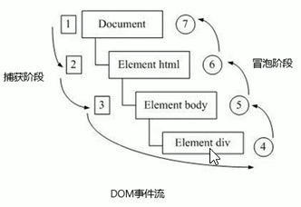

[[TOC]]

## 1. 简介

DOM（Document Object Model），文档对象模型，提供访问和操作网页内容的方法和接口。DOM 由两个模块组成：

> DOM 核心（DOM Core）和 DOM HTML

其中，DOM 核心规定的是如何映射基于 XML 的文本结构，以便简化对文档中任意部分的访问和操作。DOM HTML 模块是在 DOM 核心的基础上加以拓展，添加了针对 HTML 的对象和方法。

文档树：

- 文档：一个页面就是一个文档，DOM 中使用 document 表示。
- 元素：页面中的所有标签都是元素，DOM 中使用 element 表示。
- 节点：网页中的所有内容（标签、属性、文本、注释等）都是节点，DOM 中使用 node 表示。
- DOM 把文档树里的内容都看作是对象。

## 2. 获取元素

```javascript
// 根据 id 获取元素
var element1 = document.getElementById('id');
// 根据标签名获取元素
var element2 = document.getElementsByTagName('标签名');

// 通过 HTML5 新增的方法获取元素
var element3 = document.getElementsByClassName('类名'); // 根据类名返回元素对象集合
var element4 = document.querySelector('选择器'); // 根据指定选择器返回第一个元素对象
var element5 = document.querySelectorAll('选择器'); // 根据指定选择器返回

// 获取特殊元素（body，html）
var element6 = document.body; // 返回 body 元素对象
var element7 = document.documentElement; // 返回 html 元素对象
```

## 3. 事件基础

事件由三部分组成：事件源、事件类型和事件处理程序。

- 事件源：事件被触发的对象。
- 事件类型：什么事件。
- 事件处理程序：一个函数。

1. 注册事件（绑定事件）

   给元素添加事件，称为注册事件。注册事件有两种方式：传统注册方式和方法监听注册方法。

   传统注册方式：
   - 利用 on 开头的事件，如 onclick。
   - `<button onclick="alert('123')"></button>`
   - `btn.onclick = function() {};`
   - **同一个元素同一个事件只能设置一个处理函数，最后注册的处理函数将会覆盖前面注册的处理函数**

   方法监听注册方式：
   - w3c 标准
   - `addEventListener()`是一个方法
     - `eventTarget.addEventListener(type, listener[, useCapture]);`
     - type：事件类型字符串，比如 click、mouseover，这里不用带 on。
     - listener：事件处理函数。
     - userCapture：可选参数，是一个布尔值，默认是 false。userCapture 为 true 时，表示事件捕获阶段调用事件处理程序；为 false 或省略时，表示事件冒泡阶段调用事件处理程序。
   - IE9 之前的 IE 不支持此方法，可使用 `attachEvent()` 代替。
   - **同一个元素同一个事件可以注册多个监听器。**
   - **按注册顺序依次执行。**

2. 删除事件（解绑事件）

   - 传统注册方式
     `eventTarget.onclick = null;`
   - 方法监听注册方式
     - `eventTarget.removeEventListener(type, listener[, useCapture]);`
     - `eventTarget.detachEvent(eventNameWithOn, callback);`

3. DOM 事件流

   事件发生时会在元素节点之间按照特定的顺序传播，这个传播过程即 DOM 事件流。
   DOM 事件流分为三个阶段：

   1. 捕获阶段。从外到里【若子和父都有点击事件，那么点击父亲，只会执行父亲的回调，若点击儿子，先会执行父亲的，再执行儿子的】。
   2. 当前目标阶段。
   3. 冒泡阶段。从里到外【若子和父都有点击事件，若点击父亲的，只会执行父亲的，若点击儿子的，会先执行儿子的，后执行父亲的】。

      

      JS 代码中只能执行捕获或冒泡其中的一个阶段。
      onclick 只能得到冒泡阶段。有些事件没有冒泡，如 onblur、onfocus、onmouseenter、onmouseleave。
      > 标准事件对象具有可用的名为 stopPropagation() 的函数，当在事件对象上调用该函数时，它只会让当前事件处理程序运行，但事件不会在冒泡链上进一步扩大，因此将不会有更多事件处理器被运行 （不会向上冒泡）。
      >
      >```js
      > video.onclick = function(e) {
      >      e.stopPropagation();
      >      video.play();
      > };
      >```

4. 事件对象

   ```javascript
   eventTarget.onclick = funcition(event) {};
   eventTarget.addEventListener('click', funcitno(event) {});
   ```

   event 对象代表事件的状态，比如键盘按键的状态、鼠标的位置、鼠标按钮的状态。其实就是事件发生后，跟事件相关的一系列信息数据的集合都放到这个对象里面，这个对象是事件对象 event，它有很多属性和方法。

   事件对象的常见属性和方法

   | 事件对象属性方法    | 说明                                                         |
   | ------------------- | ------------------------------------------------------------ |
   | e.target            | 返回触发事件的对象       标准                                |
   | e.srcElement        | 返回触发事件的对象       非标准 ie6-8 使用                    |
   | e.type              | 返回事件的类型  比如 click mouseover 不带 on                   |
   | e.cancelBubble      | 该属性阻止冒泡 非标准 ie6-8 使用                              |
   | e.returnValue       | 该属性阻止默认事件（默认行为） 非标准 ie6-8 使用 比如不让链接跳转 |
   | e.preventDefault()  | 该属性阻止默认事件（默认行为） 标准  比如不让链接跳转        |
   | e.stopPropagation() | 阻止冒泡 标准                                                |

5. 阻止事件冒泡

   `e.stopPropagation();`

6. 事件委托

   不是每个子节点单独设置事件监听器，而是事件监听器设置在其父节点上，然后利用冒泡原理设置每个子节点。
   这样，我们只操作了一次 DOM，提高了程序的性能。

## 4. 操作元素

1. 改变元素内容

   - `element.innerText`：innerText 不是 W3C 标准。从起始位置到终止位置的内容，但它去除 html 标签，同时空格和换行也会去掉。

   - `element.innerHTML`：innerHTML 是 W3C 标准。从起始位置到终止位置的全部内容，包括 html 标签，同时保留空格和换行。

2. 常用元素的属性操作：`src、href、id、alt、title`
3. 表单元素的属性操作：`type、value、checked、selected、disabled`
4. 样式属性操作

    ​`element.style 行内样式操作` 如：`element.style.backgroud = "skyblue";`

    **JS 里面的样式采取驼峰命名法，如 fontSize、backgroudColor。
    JS 修改 style 样式操作，产生的是行内样式，CSS 权重比较高。**

    `element.className 类名样式操作`

    **class 因为是个保留字，因此使用 className 来操作元素类名属性。className 会直接更改元素的类名，会覆盖原来的类名。可以用多类名选择器保留原来的类名：element.className="classNew classOld"。**

5. 自定义属性的操作

   - （1）获取属性值
     - `element. 属性` 获取内置属性值（元素本身自带的属性）。
     - `element.getAttribute('属性');`         主要获得自定义的属性。

   - （2）设置属性值
     - `element. 属性 = '值';`  设置内置属性值
     - `element.setAttribute('属性', '值');`  主要设置自定义的属性。

   - （3）移除属性
     - `element.removeAttribute('属性');`

6. H5 自定义属性
   - （1）设置 H5 自定义属性
     H5 规定自定义属性 data 开头作为属性名并且赋值。
     如，`<div data-index="2"></div>`或者`setAttribute('data-index', 2);`
   - （2）获取 H5 自定义属性
     - 1）兼容性获取：`element.getAttribute('data-index')`
     - 2）H5 新增`element.dataset.index`或者`element.dataset['index']`

## 5. 节点操作

1. 节点概述
   一般的节点至少拥有 nodeType（节点类型）、nodeName（节点名称）和 nodeValue（节点值）这三个基本属性。

   - 元素节点 nodeType 为 1
   - 属性节点 nodeType 为 2
   - 文本节点 nodeType 为 3 （文本节点包括文字、空格、换行等）

2. 节点层级
   利用 DOM 树可以把节点划分为不同的层级关系，常见的是父子兄关系。

   - 父级节点
     `node.parentNode`

   - 子节点

     - 1）`parentNode.childNodes`（标准）
       parentNode.childNodes 返回包含指定节点的子节点的集合，该集合为即时更新的集合。

     - 2）`parentNode.children`（非标准，但得到了各个浏览器的支持，因此可以放心使用）
       parentNode.children 是一个只读属性，返回所有的子元素节点，它只返回子元素节点，其余节点不返回。

     - 3）`parentNode.firstChild`

       firstChild 返回第一个子节点，找不到则返回 null。

     - 4）`parentNode.lastChild`

       lastChild 返回最后一个子节点，找不到则返回 null。

     - 5）`parentNode.firstElementChild`      （IE9 以上才支持）
       firstElementChild 返回第一个子元素节点，找不到则返回 null。

     - 6）`parentNode.lastElementChild`        （IE9 以上才支持）
       lastElementChild 返回最后一个子元素节点，找不到则返回 null。

   - 兄弟节点

     - 1）`node.nextSibling`

       nextSibling 返回当前元素的下一个兄弟节点，找不到则返回 null。

     - 2）`node.previousSibling`
       previousSibling 返回当前元素的上一个兄弟节点，找不到则返回 null。

     - 3）`node.nextElementSibling`               （IE9 以上才支持）
       nextElementSibling 返回当前元素的下一个兄弟元素节点，找不到则返回 null。

     - 2）`node.previousElementSibling`       （IE9 以上才支持）
       previousElementSibling 返回当前元素的上一个兄弟元素节点，找不到则返回 null。

3. 创建节点
   `document.createElement('tagName');`

4. 添加节点

   - 1）`node.appendChild(child)`
     appendChild() 方法将一个节点添加到指定父节点的子节点列表末尾。类似于 CSS 里面的 after 伪元素。
   - 2）`node.insertBefore(child, 指定元素）`
     insertBefore() 方法将一个节点添加到指定父节点的指定子节点前面。类似于 CSS 里面的 before 伪元素。

5. 删除节点
   `node.removeChild(child); // node 是父节点，child 是 node 的子节点`
   removeChild() 方法从 DOM 中删除一个子节点，返回删除的节点。

6. 复制节点
   `node.cloneNode()`
   node.cloneNode() 方法返回调用该方法的节点的一个副本。
   如果括号参数为空或者为 false，则是浅拷贝，即只克隆复制节点本身，不克隆里面的子节点。
   如果括号参数为 true，则是深拷贝，会复制节点本身及里面的所有子节点。

## 6.DOM 重点核心

关于 dom 操作，主要看对于元素的操作。主要有创建、增、删、改、查、属性操作、事件操作。

1. 创建

   - `document.write('xxx')`          它会导致页面全部重绘。
   - `element.innerHTML`                   创建多个元素效率更高
   - `document.createElement('tageName')`              创建多个元素效率稍微低一点点

2. 增

   - `node.appendChild(child)`
   - `node.insertBefore(child, 指定元素）`

3. 删

   - `node.removeChild(child)`

4. 改

   - 修改元素的属性：src、href、title 等
   - 修改普通元素内容：innerHTML、innerText
   - 修改表单元素：value、type、disabled 等
   - 修改元素样式：style、className

5. 查

   - DOM 提供的 API 方法：getElementById、getElementByTagName
   - H5 提供的新方法：querySelector、querySelectorAll
   - 利用节点操作获取元素：父（node.parentNode）、子（parentNode.children）、兄（node.nextElementSibling、node.previousElementSibling）

6. 属性操作
   主要针对于自定义属性。

   - setAttribute：设置 Dom 的属性值。
   - getAttribute：获取 Dom 的属性值
   - removeAttribute：移除属性

7. 事件操作

   | 常用键盘事件 | 触发条件                                                     |
   | ------------ | ------------------------------------------------------------ |
   | onkeyup      | 某个键盘按键被松开时触发  不区分字母大小写                   |
   | onkeydown    | 某个键盘按键被按下时触发  不区分字母大小写                   |
   | onkeypress   | 某个键盘按键被按下时触发  区分字母大小写  但是它不识别功能键 比如 ctrl shift 箭头等 |

   | 常用鼠标事件      | 触发条件                                                     |
   | ------------- | ------------------------------------------------------------ |
   | onclick       | 鼠标点击左键                                                 |
   | oncontextmenu | 鼠标点击右键<br/>document.addEventListener('contextmenu', function(e) {// 实现禁止鼠标右键菜单<br/>e.preventDefault();<br/>})|
   | onmouseover   | 鼠标经过<br />mouseenter 鼠标事件：当鼠标移动到元素上就会触发 mouseenter 事件；mouseover 鼠标经过自身盒子会触发，经过子盒子也会触发；mouseenter 只会经过自身盒子才会触发，因为 mouseover 有冒泡，mouseenter 没有冒泡 |
   | onmouseout    | 鼠标离开<br />mouseleave 鼠标事件：当鼠标离开到元素上就会触发 mouseleave 事件；mouseout 鼠标离开自身盒子会触发，离开子盒子也会触发；mouseleave 只会离开自身盒子才会触发，因为 mouseout 有冒泡，mouseleave 没有冒泡 |
   | onfocus       | 获得鼠标焦点                                                 |
   | onblur        | 失去鼠标焦点                                                 |
   | onmousemove   | 鼠标移动                                                     |
   | onmouseup     | 鼠标弹起                                                     |
   | onmousedown   | 鼠标按下                                                     |
   | selectstart   | 鼠标开始一个新的选择                                         |

   | 鼠标事件对象 | 说明                                        |
   | ------------ | ------------------------------------------- |
   | e.clientX    | 返回鼠标相对于浏览器窗口可视区的 X 坐标       |
   | e.clientY    | 返回鼠标相对于浏览器窗口可视区的 Y 坐标       |
   | e.pageX      | 返回鼠标相对于文档页面的 X 坐标      IE9+支持 |
   | e.pageY      | 返回鼠标相对于文档页面的 Y 坐标      IE9+支持 |
   | e.screenX    | 返回鼠标相对于电脑屏幕的 X 坐标               |
   | e.screenY    | 返回鼠标相对于电脑屏幕的 Y 坐标               |
