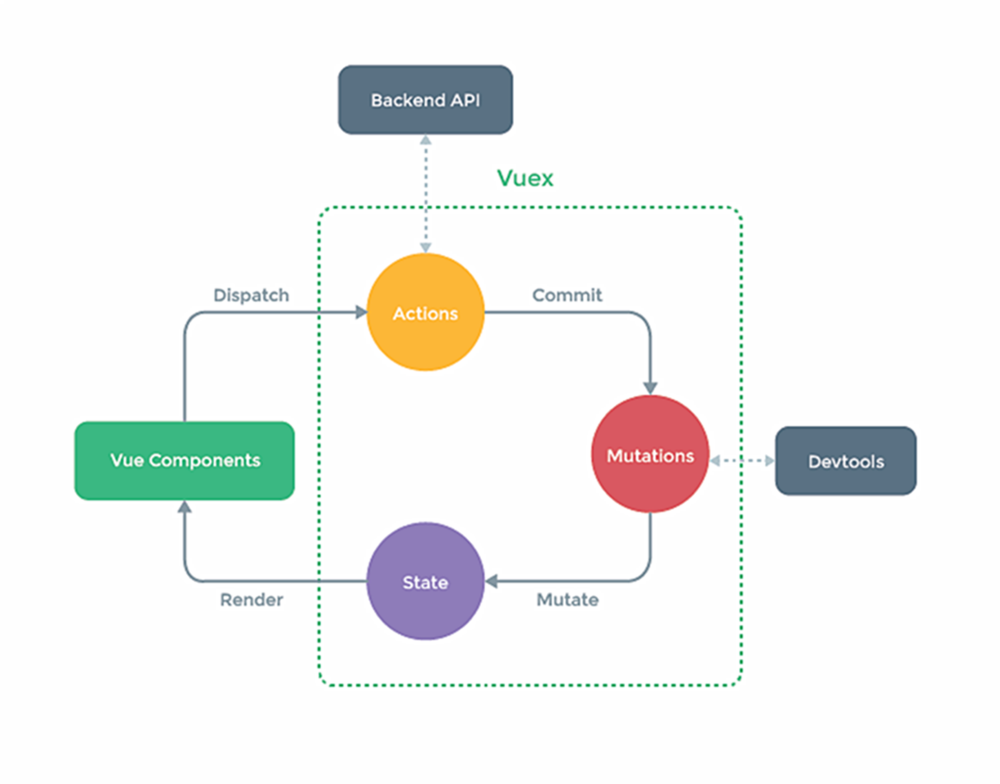

[[TOC]]

## Vuex

### 概念

在 Vue 中实现集中式状态（数据）管理的一个 Vue 插件，对 Vue 应用中多个组件的共享状态进行集中式的管理（读/写），也是一种组件间通信的方式，且适用于任意组件间通信。



### 何时使用？

**多个组件需要共享数据时。**

### 搭建 Vuex 环境

1. 创建文件：`src/store/index.js`

    ```js
    // 引入 Vue
    import Vue from 'vue'
    // 引入 Vuex
    import Vuex from 'vuex'
    // 应用 Vuex 插件
    Vue.use(Vuex)
  
    // 准备 actions 对象--响应组件中用户的动作
    const actions = {}
    // 准备 mutations 对象--修改 state 中的数据
    const mutations = {}
    // 准备 state 对象--保存具体的数据
    const state = {}
  
    // 创建并暴露 store
    export default new Vuex.Store({
        actions,
        mutations,
        state
    })
  
    ```

2. 在 main.js 中创建 vm 时传入 store 配置项（ Vue 的实例对象被简称为 vm ）

    ```js
    ......
    // 引入 store
    import store from './store'
    ......
  
    // 创建 vm
    new Vue({
        el: '#app',
        render: h => h(App),
        store,
    })
    ```

### 基本使用

1. 初始化数据、配置 actions、配置 mutations，操作 store.js。

    ```js
    // 引入 Vue 核心库
    import Vue from 'vue'
    // 引入 Vuex
    import Vuex from 'vuex'
    // 应用 Vuex 插件
    Vue.use(Vuex)
  
    const actions = {
        // 响应组件中加的动作
        jia(context, value) {
            context.commit('JIA', value)
        },
    }
  
    const mutations = {
        // 执行加
        JIA(state, value) {
            state.num += value; 
        }
    }
  
    // 初始化数据
    const state = {
        sum: 0
    }
  
    // 创建并暴露 store
    export default new Vuex.Store({
        actions,
        mutations,
        state,
    })
    ```

2. 组件中读取 Vuex 中的数据：`$store.state.sum`

3. 组件中修改 Vuex 中的数据：`$store.dispatch(’actions 中的方法名’, 数据）` 或 `$store.commit(’mutations 中的方法名’, 数据）`

   >备注：若没有网络请求或其他业务逻辑，组件中也可以越过 actions，即不写 dispatch，直接编写 commit。

### getters 的使用

1. 概念：当 state 中的数据需要经过加工后再使用时，可以使用 `getters` 加工。

2. 在 `store.js` 中追加 `getters` 配置

    ```js
    ......
  
    const getters = {
        bigSum(state) {
            return state.sum * 10
        }
    }
  
    // 创建并暴露 store
    export default new Vuex.Store({
        ......
        getters
    })
    ```

3. 组件中读取数据：`$store.getters.bigSum`

### 四个 map 方法的使用

1. `mapState` 方法：用于帮助我们映射 `state` 中的数据为计算属性

    ```js
    computed: {
        // 借助 mapState 生成计算属性， sum、school、subject（对象写法）
        ...mapState({
            // 使用箭头函数
            sum: state => state.sum, 

            // 传字符串参数 'school' 等同于 `state => state.school`
            school: 'school', 

            // 为了能够使用 `this` 获取局部状态，必须使用常规函数
            subjectNum(state) {
              return state.subject + this.num;
            }
        }),
     
        // 借助 mapState 生成计算属性， sum、school、subject（数组写法）
        //        映射 this.sum 为 store.state.sum
        ...mapState([ 'sum', 'school', 'subject' ]), 
    },
    ```

2. `mapGetters` 方法：用于帮助我们映射 `getters` 中的数据为计算属性

    ```js
    computed: {
        // 借助 mapGetters 生成计算属性：bigSum（对象写法）
        //       把 `this.bigSum` 映射为 `this.$store.getters.bigSum`
        ...mapGetters({ bigSum: 'bigSum' }),
  
        // 借助 mapGetters 生成计算属性， bigSum（数组写法）
        ...mapState([ 'bigSum' ]),
    }
    ```

3. `mapActions` 方法：用于帮助我们生成与 `actions` 对话的方法，即：包含 `$store.dispatch(xxx)` 的函数

    ```js
    methods: {
        // 靠 mapActions 生成，incrementOdd、incrementWait（对象形式）
        ...mapActions({ incrementOdd: 'jiaOdd', incrementWait: 'jiaWait' }),
  
        // 靠 mapActions 生成，incrementOdd、incrementWait（数组形式）
        ...mapActinos([ 'jiaOdd', 'jiaWait' ]),
    }
    ```

4. `mapMutations` 方法：用于帮助我们生成与 `mutations` 对话的方法，即：包含 `$store.commit(xxx)` 的函数

    ```js
    methods: {
        // 靠 mapMutations 生成，increment、decrement（对象形式）
        ...mapMutations({ increment: 'JIA', decrement: 'JIAN' }),
    
        // 靠 mapMutations 生成，JIA、JIAN（数组形式）
        ...mapMutations([ 'JIA', 'JIAN' ]),
    }
    ```

    >备注：mapActions 和 mapMutations 使用时，若需要传递参数，需要在模板中绑定事件时传递好参数，否则参数是事件对象。

### 模块化+命名空间

1. 目的：让代码更好维护，让多种数据分类更加明确。

2. 修改 `store.js`

    ```js
    const countAbout = {
         namespaced: true, // 开启命名空间
         state: {
             x: 1,
         },
         actions: { ... },
         mutations: { ... },
         getters: {
             bigSum(state) {
                 return state.sum * 10;
             }
         },
    }
  
    const personAbout = {
        namespaced: true, // 开启命名空间
        state: { ... },
        actions: { ... },
        mutations: { ... },
        getters: { ... },
    }
  
    const store = new Vuex.Store({
        modules: {
            countAbout,
            personAbout
        }
    })
    ```

    >当模块带有命名空间后，它的所有 getters、actions 和 mutations 都会自动根据模块注册的路径调整命名。所以开启命名空间的模块中的 getters、actions 和 mutations 的使用方式都会改变；但是开启命名空间和不开启命名空间的模块中的 state 的使用方式不会改变，格式依然是 `store.state. 模块名。状态名`。

3. 开启命名空间后，组件中读取 state 数据：

   ```js
   // 方式一：自己直接读取
   this.$store.state.personAbout.list
   // 方式二：借助 mapState 读取
   //   将模块的空间名称字符串作为第一个参传递给辅助函数，这所有的绑定都会自动将该模块作为上下文
   ...mapState('countAbout', ['sum', 'school', 'subject']),
   ```

4. 开启命名空间后，组件中读取 getters 数据：

    ```js
    // 方式一：自己直接读取
    this.$store.getters['personAbout/firstPersonName']
    // 方式二：借助 mapGetters 读取
    ...mapGetters('countAbout', ['bigSum']),
    ```

5. 开启命名空间后，组件中调用 dispatch：

    ```js
    // 方式一：自己直接调用 dispatch
    this.$store.dispatch('personAbout/firstPersonName', person)
    // 方式二：借助 mapActions
    ...mapActions('countAbout', {incrementOdd: 'jiaOdd', incrementWait: 'jiaWait'})
    ```

6. 开启命名空间后，组件中调用 commit：

    ```js
    // 方式一：自己直接调用 commit
    this.$store.commit('personAbout/ADD_PERSON', person)
    // 方式二：借助 mapMutations
    ...mapMutations('countAbout', {increment: 'JIA', decrement: 'JIAN'})
    ```
