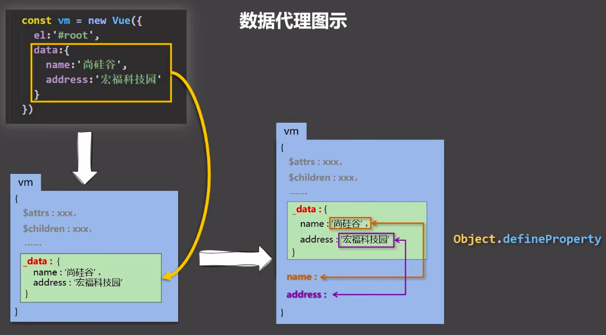
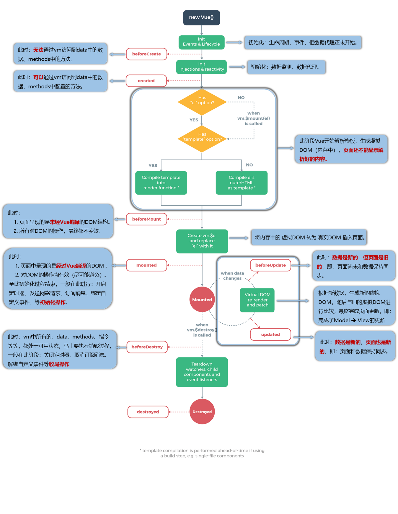
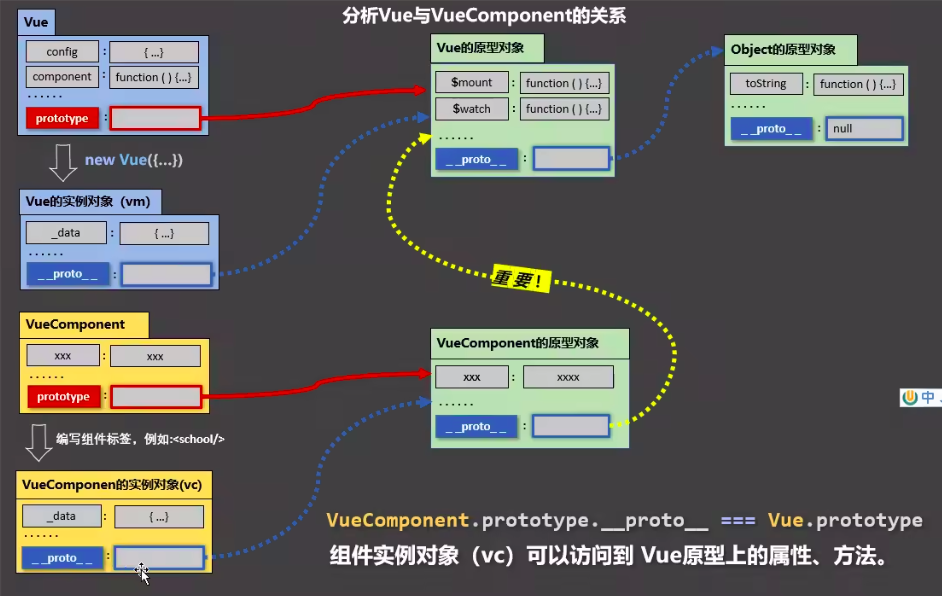

[[TOC]]

## Vue 基础

### data 与 el 的 2 种写法

值得注意的是只有当实例被创建时就已经存在于 data 中的 property 才是响应式的。

1. el 有 2 种写法

   （1）new Vue 时配置 el 属性。

   （2）先创建 vue 实例，随后再通过 `vm.$mount(’#root’)` 指定 el 的值。

2. data 有 2 种写法

   （1）对象式。

   （2）函数式。

   ```js
   data() {
     ruturn {}
   }
   ```

3. 一个重要的原则：

   由 Vue 管理的函数，一定不要写箭头函数，一旦写了箭头函数，this 就不再是 Vue 实例了。

### MVVM 模型

1. M: 模型（Model）: data 中的数据。

2. V: 视图（View）: 模板代码。

3. VM: 视图模型（ViewModel）: Vue 实例。

### Vue 中的数据代理

```js
// 关于 Object.defineProperty() 的一个小例子

let number = 18
let person = {
 name: 'zhangsan',
 sex: 'nan',
}

Object.defineProperty(person, 'age', {
 // value: 18,
 // enumerable: true, // 控制属性是否可以被枚举，默认值为 false
 // writable: true, // 控制属性是否可以被修改，默认值是 false
 // configurable: true // 控制属性是否可以被删除，默认值是 false

 // 当有人读取 person 的 age 属性时，get 函数（getter）就会被调用，且返回值就是 age 的值
 get() {
  return number
 },

 // 当有人修改 person 的 age 属性时，set 函数（setter）就会被调用，且会收到修改的具体值
 set(value) {
  number = value
 }
});

// 输出一个数组，数组里存的是 person 对象中所有属性的属性名
// console.log(Object.keys(person));
```



1. Vue 中的数据代理

    >数据代理：通过一个对象代理另一个对象中属性的操作（读/写）。

    通过 vm 对象来代理 data 对象中属性的操作（读/写）。

2. Vue 中数据代理的好处

   更加方便的操作 data 中的数据。

3. 基本原理

   通过`Object.defineProperty()`把 data 对象中所有属性添加到 vm 上。
   为每一个添加到 vm 上的属性，都指定一个 getter/setter。
   在 getter/setter 内部去操作（读/写）data 中对应的属性。

### Vue 监视数据的原理

1. vue 会监视 data 中所有层次的数据。

2. 如何监测对象中的数据？

    通过 setter 实现监视，且要在 new Vue 时就传入要监测的数据：

    （1）对象中后追加的属性，Vue 默认不做响应式处理。

    （2）如需给后添加的属性做响应式，请使用如下 API：` Vue.set(target, propertyName/index, value) ` 或 `vm.$set(target, propertyName/index, value)`。

3. 如何监测数组中的数据？

    通过包裹数组更新元素的方法实现，本质就是做了两件事情：

    （1） 调用原生对应的方法对数组进行更新。

    （2） 重新解析模板，进而更新页面。
    数组中的每一项没有单独为其服务的 setter，所以整体修改数组中的每一项 Vue 不会监测，即`arr[0] = …`没有效果。

4. 在 Vue 修改数组中的某个元素一定要用如下方法：

    （1）. 使用这些 API：`push()`、`pop()`、`shift()`、`unshift()`、`splice()`、`sort()`、`reverse()`

    （2）.`Vue.set()` 或 `vm.$set()`

5. 特别注意 Vue.set() 和 vm.$set() 不能给 vm 或 vm 的根数据对象添加对象，也就是括号内第一个值不能是 vm。

### 事件处理

#### 事件的基本使用

1. 使用 `v-on:xxx` 或 `@xxx` 绑定事件。

2. methods 中配置的函数，都是被 Vue 所管理的函数，this 的指向是 vm 或 组件实例对象。

3. `@click=’demo’`和`@click=’demo($event)’`效果一致，但后者可以传参。

#### 事件修饰符

1. prevent: 阻止默认事件（常用）

2. stop: 阻止事件冒泡（常用）

3. once: 事件只触发一次（常用）

4. capture: 使用事件的捕获模式

5. self: 只有 event.target 是当前操作的元素时才触发事件

6. passive: 事件的默认行为立即执行，无需等待事件回调执行完毕

7. native：把当前元素作为原生标签看待

#### 键盘事件

1. Vue 中常用的按键别名：

    回车 =》 enter

    删除 =》 delete（捕获“删除”和“退格”键）

    退出 =》 esc

    空格 =》 space

    换行 =》 tab（特殊，必须配合 keydown 去使用）

    上 =》 up

    下 =》 down

    左 =》 left

    右 =》 right

2. Vue 未提供别名的按键，可以使用按键原始的 key 值去绑定，但注意要转为 key-case（短横线命名），如`@keyup.caps-lock=”xxx”`。

3. 系统修饰键（用法特殊）：ctrl，alt，shift，meta。

    （1）配合 keyup 使用：按下修饰键的同时，再按下其他键，随后释放其他键，事件才被触发。

    （2）配合 keydown 使用：正常触发事件。

### 计算属性与监测属性

#### 计算属性 computed

1. 定义：要用的属性不存在，要通过**已有属性**计算得来。

    ```js
    ...
    data() {
      return {
        firstName: 'zhang',
        lastName: 'san',
      }
    },
    computed: {
      fullName: {
        get() {
          return firstName + ' ' + lastName;
        },
        // 当 fullName 被修改时调用 set 函数
        set(value) {
          let arr = value.split(' ');
          this.firstName = arr[0];
          this.lastName = arr[1];
        }
      }
      // 计算属性的简写形式（不需要 set 时使用简写形式）
      // fullName() {
      //   return firstName + ' ' + lastName;
      // }
    }
    ...
    ```

2. 原理：底层借助了`Object.defineproperty()`方法提供的 getter 和 setter。

3. get 函数什么时候执行？

    （1）初次读取时会执行一次。

    （2）当依赖的数据发生改变时被再次调用。

4. 优点：与 methods 实现相比，内部有缓存机制（复用），效率更高，调试方便。

5. 备注：

    （1）计算属性最终会出现在 vm 上，直接读取使用即可。

    （2）如果计算属性要被修改，那必须写 set 函数去响应修改，且 set 中要引起**计算时依赖的数据**发生改变。

监视属性 watch：

1. 当被监视的属性变化时，回调函数自动调用，进行相关操作。

2. 监视的属性必须存在，才能进行监视。

3. 监视的两种方法：

    （1）new Vue 时传入 watch 配置：

    ```js
    ...
    data(){
      return {
        title: 'demo_watch',
      }
    },
    watch: {
      title: {
        immediate: true, // 初始化时让 handler 调用一次
        handler(newValue, oldValue) {
          console.log(newValue + ' ' + oldValue);
        }
      }
    }
    ...
    ```

    （2）通过 vm.$watch 监视（vm 是一个 Vue 实例）：

    ```js
    vm.$watch('title', {
      immediate: true, // 初始化时让 handler 调用一次
      handler(newValue, oldValue) {
        console.log(newValue + ' ' + oldValue);
      }
    });
    
    // vm.$watch 的简写形式
    vm.$watch('title',function(newValue, oldValue) {
        console.log(newValue + ' ' + oldValue);
    });
    ```

**深度监视：**

（1）Vue 中的 watch 默认不监测对象内部值的改变。

（2） 配置`deep: true`可以监测对象内部值改变。

备注：Vue 自身可以监测对象内部值的改变，但 Vue 提供的 watch 默认不可以。

computed 和 watch 之间的区别：

1. computed 能完成的功能，watch 都可以完成。

2. watch 能完成的功能，computed 不一定能完成，例如：watch 可以进行异步操作。

两个重要的小原则：

1. 所被 Vue 管理的函数，最好写成普通函数，这样 this 的指向才是 vm 或 组件实例对象。

2. 所有不被 Vue 所管理的函数（定时器的回调函数，ajax 的回调函数，Promise 的回调函数），最好写成箭头函数，这样 this 的指向才是 vm 或 组件实例对象。

### 收集表单数据

若：`<input type=”text” />` ，则 v-model 收集的是 value 值，用户输入的就是 value 值。

若：`<input type=”radio” />` ，则 v-model 收集的是 value 值，且要给标签配置 value 值。

若：`<input type=”checkbox” />` ，

（1）没有配置 input 的 value 属性，那么收集的就是 checked（勾选 or 未勾选，是布尔值），

（2）v-model 的初始值是数组，那么收集的就是 value 组成的数组。

> v-model 的一些修饰符：
>
> - lazy；失去焦点再收集数据。
> - number；输入字符串转为有效的数字。
> - trim：输入首尾空格过滤。

### 生命周期



常用的生命周期（又名生命周期回调函数、生命周期函数、生命周期钩子）：

1. mounted：发送 ajax 请求、启动定时器、绑定自定义事件、订阅消息等【初始化操作】。

2. beforeDestroy：清除定时器、绑定自定义事件、取消订阅消息等【收尾工作】。

关于销毁 Vue 实例：

1. 销毁后借助 Vue 开发者工具看不到任何消息。

2. 销毁后自定义事件会失效，但原生 DOM 事件依然有效。

3. 一般不会在 beforeDestroy 操作数据，因为即便操作数据，也不会再触发更新流程了。

### 组件

#### 几个注意点

1. 关于组件名：

    一个单词组成：

    （1）首字母小写：school。

    （2）首字母大写：School。

    多个单词组成：

    （1）kebab-case 命名：my-school。

    （2）CamelCase 命名：MySchool（需要 Vue 脚手架支持）。

    备注：

    （1）组件名尽可能回避 HTML 中已有的元素名称，例如：h1、H2 都不行。

    （2）可以使用 name 配置项指定组件在开发者工具中呈现的名字。

2. 关于组件标签：

    第一种写法： `<school></school>`。

    第二种写法： `<school />`。

    不使用脚手架时，`<school />`会导致后续组件不能渲染。

3. 一个简写方式：

    `const school = Vue.extend(option)` 可简写为：`const school = options // 实际执行时 Vue 还是会在判断后执行 extend 函数`。

#### 关于 VueComponent

1. school 组件本质上是一个名为 VueComponent 的构造函数，且不是程序员定义的，是 Vue.extend 生成的。

2. 我们只需要写`<school />`或`<school></school>`，Vue 解析时会帮我们创建 school 组件的实例对象，即 Vue 帮我们执行的 `new VueComponent(options)`。

3. 特别注意：每次调用 Vue.extend，返回的是一个全新的名为 VueComponent 的构造函数。

4. 关于 this 指向：

    - 组件配置中：

       data 函数、methods 中的函数、watch 中的函数、computed 中的函数，它们的实例均是【VueComponent 实例对象】。

    - new Vue(options) 配置中：

       data 函数、methods 中的函数、watch 中的函数、computed 中的函数，它们的实例均是【Vue 实例对象】。



一个重要的内置关系：`VueComponent.prototype.__proto__ === Vue.prototype`

为什么要有这个关系：让组件实例对象（vc）可以访问到 Vue 原型上的属性、方法。

#### 组件间数据通信

- 配置项 `props`：**父给子传递数据 或者 子给父传递数据**（若子给父传数据，要求父先给子一个函数）
。

  `props` 的作用：让组件接受外部传过来的数据。

  1. 传递数据：

      ```html
     <Demo name=”xxx”/>
     ```

  2. 接受数据：
  
     - 第一种方式（只接受）：
  
       ```js
       props: [’name’],
       ```

     - 第二种方式（限制类型）：
  
       ```js
       props: {
         name: Number
       }
       ```
  
     - 第三种方式（限制类型、限制必要性、指定默认值）：
  
       ```js
       props: {
         name: {
           type: String, // 类型`
           required: true, // 必要性`
           default: ‘老王’, // 默认值`
         }
       }
       ```
  
  >**备注**：
  >
  >props 是只读的，Vue 底层会监测你对 props 的修改，如果进行了修改，就会发出警告，若业务需求确实需要修改，可以先复制一份 props 的内容到 data 中，然后再去修改 data 中的数据。
  >
  >**props 传过来的若是对象类型的值，修改对象中的属性时 Vue 不会报错，但不推荐这样做。**

- 组件的自定义事件：**子给父传递数据**
  使用场景：A 是父组件，B 是子组件，B 想给 A 传数据，那么就要在 A 中给 B 绑定自定义事件（事件的回调在 A 中）。
  绑定自定义事件：

  1. 第一种方式，在父组件中：`<Demo @myEvent=”test” />` 或 `<Demo v-on:@myEvent=”test” />`

  2. 第二种方式，在父组件中：

     >**ref 属性**
     >
     >1. 被用来给元素或子组件注册引用信息（id 的替代者）
     >
     >2. 应用在 html 标签上获取的是真实 DOM 元素，应用在组件标签上是组件实例对象（vc）
     >
     >3. 使用方式：
     >
     >    - 打标识：`<h1 ref=”xxx”> … </h1>` 或 `<School ref=”xxx”></School>`
     >
     >    - 获取： `this.$refs.xxx`

     ```js
     <Demo ref=”demo” />
     ……
     mounted() {
       this.$ref.xxx.$on(’myEvent’, this.test)
     }
     ```
  
  3. 若想让自定义事件只能触发一次，可以使用`once`修饰符，或`$once`方法。
  
  4. 触发自定义事件：`this.$emit(’myEvent’, 数据）`
  
  5. 解绑自定义事件 `this.$off(’myEvent’)` 或 `this.$off(['e1', 'e2'])` 或 `this.$off()`
  
  6. 组件上也可以绑定原生 DOM 事件，需要使用 `native` 修饰符。

      ```html
      <Demo @click.native="handleClick">
      ```
  
  7. 注意：通过 `this.$refs.xxx.$on(’myEvent’, 回调）` 绑定自定义事件时，回调要么配置在 methods 中，要么用箭头函数，否则 this 指向会出现问题。

- 全局事件总线（GlobalEventBus）：适用于**任意组件间通信**。
  1. 安装全局事件总线：
  
     ```js
     // main.js 中
     new Vue({
       ......
       beforeCreate() {
         Vue.prototype.$bus = this; // 安装全局事件总线，$bus 就是当前应用的 vm
       },
       ......
     })
     ```
  
  2. 使用事件总线：
  
      （1）接受数据：A 组件想接受数据，则在 A 组件中给 `$bus` 绑定自定义事件，事件的回调留在 A 组件自身。

        ```js
        methods() {
          demo(data) { ...... }
        }
        ......
        mounted() {
          this.$bus.$on('myEvent',this.demo);
        }
        ```

      （2）提供数据：`this.$bus.$emit(’myEvent’, 数据）`
  
  3. **最好在 beforeDestroy 钩子中，用 $off 去解绑当前组件所用到的事件：**

      ```js
      // A 组件中
      ......
      beforeDestroy() {
        this.$bus.$off('myEvent');
      }
      ```

- 消息订阅与发布（pubsub）：适用于**任意组件间通信**。

  使用步骤：
  
  1. 安装 pubsub：`npm i pubsub-js`
  
  2. 引入：`import pubsub from ‘pubsub-js’`
  
  3. 接受数据：A 组件想接受数据，则在 A 组件中订阅消息，订阅的回调留在 A 组件自身：
  
     ```js
     methods() {
      demo(data) { ...... }
     }, 
     .....
     mounted() {
      this.pid = pubsub.subscribe('xxx', this.demo) // 订阅消息
     } 
     ```
  
  4. 提供数据：`pubsub.publish(’xxx’, 数据）`
  
  5. 最好在 beforeDestroy 钩子中，用 `pubsub.unsubscribe(pid)` 去取消订阅。

- Vuex

### mixin（混入）

功能：可以把多个组件共用的配置提取成一个混入对象。

使用方式：

第一步定义混合，例如：

```js
export const mix = {
  data() { … },
  methods: { … },
  …
}
```

第二步使用混入，例如：

（1）全局混入（main.js 中）： `Vue.mixin(xxx)`

（2）局部混入（组件中）：`mixins: [’xxx’]`

### 插件

功能：用于增强 Vue。

本质：包含 install 方法的一个对象，install 的第一个参数是 Vue，第二个以后的参数是插件使用者传递的数据。

定义插件：

```js
对象。install = function (Vue, options) {

//1. 添加全局过滤器

Vue.filter(…)

//2. 添加全局指令

Vue.directive(…)

//3. 配置全局混入（合）

Vue.mixin(…)

//4. 添加实例方法

Vue.prototype.$myMethod = function() {…}

Vue.prototype.$myProperty = xxx

}
```

使用插件： `Vue.use();`
