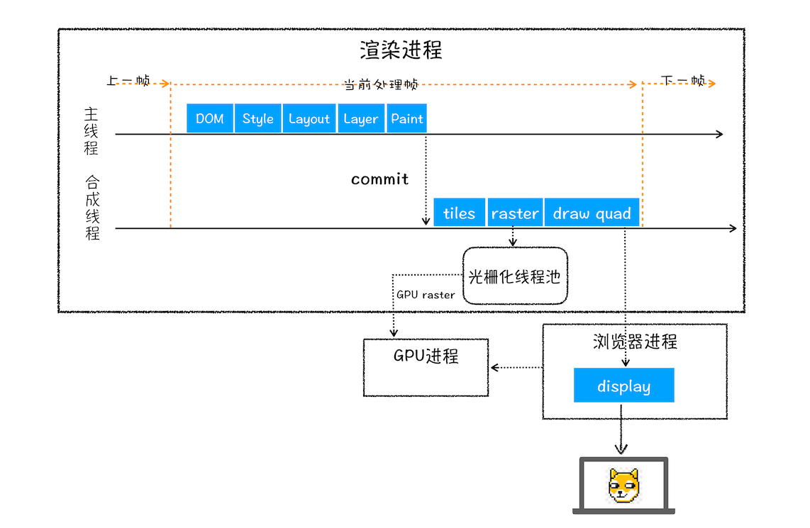

[[TOC]]

## 浏览器的组成

### 常见的浏览器内核

所谓浏览器内核就是指浏览器中最重要或者说最核心的部分“Rendering Engine"，译为“渲染引擎”。

| 浏览器内核 | 概述 |
| --- | --- |
| Trident | 这种浏览器内核是 IE 浏览器用的内核，因为在早期 IE 占有大量的市场份额，所以这种内核比较流行，以前有很多网页也是根据这个内核的标准来编写的，但是实际上这个内核对真正的网页标准支持不是很好。但是由于 IE 的高市场占有率，微软也很长时间没有更新 Trident 内核，就导致了 Trident 内核和 W3C 标准脱节。还有就是 Trident 内核的大量 Bug 等安全问题没有得到解决，加上一些专家学者公开自己认为 IE 浏览器不安全的观点，使很多用户开始转向其他浏览器。|
| Geoko | 这是 Firefox 和 Flock 所采用的内核，这个内核的优点就是功能强大、丰富，可以支持很多复杂网页效果和浏览器扩展接口，但是代价是也显而易见就是要消耗很多的资源，比如内存。|
| Webkit | Webkit 是 Safari 采用的内核，它的优点就是网页浏览速度较快，虽然不及 Presto 但是也胜于 Gecko 和 Trident，缺点是对于网页代码的容错性不高，也就是说对网页代码的兼容性较低，会使一些编写不标准的网页无法正确显示。WebKit 前身是 KDE 小组的 KHTML 引擎，可以说 WebKit 是 KHTML 的一个开源的分支。|
| Blink |谷歌在 Chromium Blog 上发表博客，称将与苹果的开源浏览器核心 Webkit 分道扬镳，在 Chromium 项目中研发 Blink 渲染引擎（即浏览器核心），内置于 Chrome 浏览器之中。其实 Blink 引擎就是 Webkit 的一个分支，就像 Webkit 是 KHTML 的分支一样。Blink 引擎现在是谷歌公司与 Opera Software 共同研发，Opera 弃用了自己的 Presto 内核，加入 Google 阵营，跟随谷歌一起研发  |
| Presto | Opera 曾经采用的就是 Presto 内核，Presto 内核被称为公认的浏览网页速度最快的内核，这得益于它在开发时的天生优势，在处理 JS 脚本等脚本语言时，会比其他的内核快 3 倍左右，缺点就是为了达到很快的速度而丢掉了一部分网页兼容性。|

### 常见浏览器使用的内核

| 浏览器 | 使用的内核 |
| --- | --- |
| IE | Trident |
| Chrome | 统称为 Chromium 内核或 Chrome 内核，以前是 Webkit 内核，现在是 Blink 内核 |
| Safari | Webkit |
| Firefox | Gecko |
| Opera | 初是自己的 Presto 内核，后来加入谷歌大军，从 Webkit 又到了 Blink 内核 |

## 浏览器的渲染



一个完整的渲染流程大致如下：

1. **构建 DOM 树**：渲染进程将 HTML 内容转换为能够读懂的 DOM 树结构。

2. **计算样式**：渲染引擎将 CSS 样式表转化为浏览器可以理解的 styleSheets，计算出 DOM 节点的样式。

3. **布局**：创建布局树，并计算元素的布局信息。

4. **分层**：对布局树进行分层，并生成分层树。

5. **图层绘制**：为每个图层生成绘制列表，并将其提交到合成线程。

6. **栅格化（raster）操作**：合成线程将图层分成图块，并在光栅化线程池中将图块转换成位图。

7. **合成和显示**：合成线程发送绘制图块命令 DrawQuad 给浏览器进程。浏览器进程根据 DrawQuad 消息生成页面，并显示到显示器上。

### 渲染流程相关的几个概念

#### 1. 更新了元素的几何属性（重排）


从上图可以看出，如果你通过 JavaScript 或者 CSS 修改元素的几何位置属性，例如改变元素的宽度、高度等，那么浏览器会触发重新布局，解析之后的一系列子阶段，这个过程就叫重排。无疑，重排需要更新完整的渲染流水线，所以开销也是最大的。

#### 2. 更新元素的绘制属性（重绘）


从上图可以看出，如果修改了元素的背景颜色，那么布局阶段将不会被执行，因为并没有引起几何位置的变换，所以就直接进入了绘制阶段，然后执行之后的一系列子阶段，这个过程就叫重绘。相较于重排操作，重绘省去了布局和分层阶段，所以执行效率会比重排操作要高一些。

#### 3. 直接合成阶段


在上图中，我们使用了 CSS 的 transform 来实现动画效果，这可以避开重排和重绘阶段，直接在非主线程上执行合成动画操作。这样的效率是最高的，因为是在非主线程上合成，并没有占用主线程的资源，另外也避开了布局和绘制两个子阶段，所以相对于重绘和重排，合成能大大提升绘制效率。

## 浏览器本地存储

### 浏览器本地存储的三种方式

#### 1. Cookie

Cookie 是最早被提出来的本地存储方式，在此之前，服务端是无法判断网络中的两个请求是否是同一用户发起的，为解决这个问题，Cookie 就出现了。Cookie 的大小只有 4kb，它是一种纯文本文件，每次发起 HTTP 请求都会携带 Cookie。

特性：

- Cookie 一旦创建成功，名称就无法修改。

- Cookie 是无法跨域名的，也就是说 a 域名和 b 域名下的 cookie 是无法共享的，这也是由 Cookie 的隐私安全性决定的，这样就能够阻止非法获取其他网站的 Cookie。

- 每个域名下 Cookie 的数量不能超过 20 个，每个 Cookie 的大小不能超过 4kb。

- 有安全问题，如果 Cookie 被拦截了，那就可获得 session 的所有信息，即使加密也于事无补，无需知道 cookie 的意义，只要转发 cookie 就能达到目的。

- Cookie 在请求一个新的页面的时候都会被发送过去。

使用场景：

- 最常见的使用场景就是 Cookie 和 session 结合使用，我们将 sessionId 存储到 Cookie 中，每次发请求都会携带这个 sessionId，这样服务端就知道是谁发起的请求，从而响应相应的信息。（cookie 与 session 都可用于身份认证）。

- 用来统计页面的点击次数。

#### 2. LocalStorage

LocalStorage 是 HTML5 新引入的特性，由于有的时候我们存储的信息较大，Cookie 就不能满足我们的需求，这时候 LocalStorage 就派上用场了。永久存储，不会随着刷新页面或者关闭页面而消失。

优点：

- LocalStorage 的大小一般为 5MB。

- LocalStorage 是持久储存，并不会随着页面的关闭而消失，除非主动清理，不然会永久存在。

- 仅储存在本地，不像 Cookie 那样每次 HTTP 请求都会被携带。

缺点：

- 如果浏览器设置为隐私模式，那我们将无法读取到 LocalStorage。

- LocalStorage 受到同源策略的限制，即端口、协议、主机地址有任何一个不相同，都不会访问。

常用 API：

```js
// 保存数据到 LocalStorage
localStorage.setItem('key', 'value');

// 从 LocalStorage 获取数据
let data = localStorage.getItem('key');

// 从 LocalStorage 删除保存的数据
localStorage.removeItem('key');

// 从 LocalStorage 删除所有保存的数据
localStorage.clear();

// 获取某个索引的 key
localStorage.key(index);
```

使用场景：

- 有些网站有换肤的功能，这时候就可以将换肤的信息存储在本地的 LocalStorage 中，当需要换肤的时候，直接操作 LocalStorage 即可。

- 在网站中的用户浏览信息也会存储在 LocalStorage 中，还有网站的一些不常变动的个人信息等也可以存储在本地的 LocalStorage 中。

#### 3. SessionStorage

SessionStorage 和 LocalStorage 都是在 HTML5 才提出来的存储方案，SessionStorage 主要用于临时保存同一窗口（或标签页）的数据，刷新页面时不会删除，关闭窗口或标签页之后将会删除这些数据。

SessionStorage 与 LocalStorage 对比：

- SessionStorage 和 LocalStorage 都在本地进行数据存储；

- SessionStorage 也有同源策略的限制，但是 SessionStorage 有一条更加严格的限制，SessionStorage 只有在同一浏览器的同一窗口下才能够共享；

- LocalStorage 和 SessionStorage 都不能被爬虫爬取。

常用 API：

```js
// 保存数据到 SessionStorage
sessionStorage.setItem('key', 'value');

// 从 SessionStorage 获取数据
let data = sessionStorage.getItem('key');

// 从 SessionStorage 删除保存的数据
sessionStorage.removeItem('key');

// 从 SessionStorage 删除所有保存的数据
sessionStorage.clear();

// 获取某个索引的 key
sessionStorage.key(index);
```

使用场景：

- 由于 SessionStorage 具有时效性，所以可以用来存储一些网站的游客登录的信息，还有临时的浏览记录的信息。当关闭网站之后，这些信息也就随之消除了。

## 浏览器缓存

### 浏览器的缓存机制

1. 浏览器第一次加载资源，服务器返回 200，浏览器从服务器下载资源文件，并缓存资源文件与 response header，以供下次加载时对比使用。

2. 下一次加载资源时，由于强缓存优先级较高，先比较当前时间与上一次返回 200 时的时间差，如果没有超过 cache-control 设置的 max-age，则没有过期，并命中强缓存，直接从本地读取资源。如果浏览器不支持 HTTP1.1，则使用 expires 头判断是否过期。

3. 如果资源已过期，则表明强制缓存没有被命中，则开始协商缓存，向服务器发送带有 If-None-Match 和 If-Modified-Since 的请求。

4. 服务器收到请求后，优先根据 Etag 的值判断被请求的文件有没有做修改，Etag 值一致则没有修改，命中协商缓存，返回 304；如果不一致则有改动，直接返回新的资源文件带上新的 Etag 值并返回 200。

5. 如果服务器收到的请求没有 Etag 值，则将 If-Modified-Since 和被请求文件的最后修改时间做比对，一致则命中协商缓存，返回 304；不一致则返回新的 last-modified 和文件并返回 200。

> **强缓存**
>
> 使用强缓存策略时，如果缓存资源有效，则直接使用缓存资源，不必再向服务器发起请求。
>
> **协商缓存**
>
> 如果命中强缓存，我们无需发起新的请求，直接使用缓存内容，如果没有命中强缓存，如果设置了协商缓存，这个时候协商缓存就会发挥作用了。命中协商缓存的条件有两个：max-age=xxx 过期了；值为 no-cache。使用协商缓存策略时，会先向服务器发送一个请求，如果资源没有发生修改，则返回一个 304 状态，让浏览器使用本地的缓存副本。如果资源发生了修改，则返回修改后的资源。
>
> > - no-cache 是指先要和服务器确认是否有资源更新，在进行判断。也就是说没有强缓存，但是会有协商缓存。
> > - no-store 是指不使用任何缓存，每次请求都直接从服务器获取资源。

## 浏览器同源策略

同源指的是：协议、端口号、域名必须一致。同源策略：protocol（协议）、domain（域名）、port（端口）三者必须一致。同源政策的目的主要是为了保证用户的信息安全，它只是对 js 脚本的一种限制，并不是对浏览器的限制，对于 WebSocket / script / img / iframe / audio / video 标签的 src 属性的请求都不会有跨域的限制，这是因为这些操作都不会通过响应结果来进行可能出现安全问题的操作。同源政策主要限制了三个方面：

- 当前域下的 js 脚本不能够访问其他域下的 cookie、LocalStorage、SessionStorage 和 indexDB。

- 当前域下的 js 脚本不能够操作访问操作其他域下的 DOM。

- 当前域下 ajax 无法发送跨域请求。

### 解决跨域问题

- CORS

  跨域资源共享 (CORS) 是一种机制，它使用额外的 HTTP 头来告诉浏览器  让运行在一个 origin (domain) 上的 Web 应用被准许访问来自不同源服务器上的指定的资源。当一个资源从与该资源本身所在的服务器不同的域、协议或端口请求一个资源时，资源会发起一个跨域 HTTP 请求。CORS 需要浏览器和服务器同时支持，整个 CORS 过程都是浏览器完成的，无需用户参与。因此实现 CORS 的关键就是服务器，只要服务器实现了 CORS 请求，就可以跨源通信了。

- JSONP

  jsonp 的原理就是利用 script 标签没有跨域限制，通过 script 标签 src 属性，发送带有 callback 参数的 GET 请求，服务端将接口返回数据拼凑到 callback 函数中，返回给浏览器，浏览器解析执行，从而前端拿到 callback 函数返回的数据。

  缺点：

  - 具有局限性， 仅支持 get 方法。

  - 不安全，可能会遭受 XSS 攻击。

- WebSocket 协议跨域
