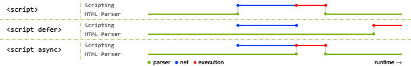

## HTML

### 1. src 和 href 的区别

   src 用于替换当前元素，href 用于在当前文档和引用资源之间确立联系。

### 2. 对 HTML 语义化的理解

   语义化是指根据内容的结构化（内容语义化），选择合适的标签（代码语义化）。通俗来讲就是用正确的标签做正确的事情。这样便于开发者阅读和写出更优雅的代码的同时让浏览器的爬虫和机器很好地解析。

### 3. DOCTYPE（⽂档类型） 的作用

   DOCTYPE 是文档类型声明，指示 web 浏览器关于页面使用哪个 HTML 版本进行编写的指令。

   它的目的是告诉浏览器（解析器）应该以什么样（html 或 xhtml）的模式来渲染文档。它必须声明在 HTML⽂档的第⼀⾏。

### 4. script 标签中 defer 和 async 的区别



如果没有 defer 或 async 属性，浏览器会立即加载并执行相应的脚本。它不会等待后续加载的文档元素，读取到就会开始加载和执行，这样就阻塞了后续文档的加载。使用 defer 和 async 都会使得解析 HTML 的同时进行 js 脚本的异步下载，不会阻碍文档的解析。

defer 与 async 之间的区别：

- async 在下载完 js 脚本之后立即执行 js，有可能会阻碍文档的解析，且多个标记 async 的 js 脚本可能不会按照顺序执行；
- 使用 defer 会在 html 解析完成之后再执行 js 脚本文件，而且多个 defer 的脚本会按照顺序执行。

### 5. HTML5 有哪些更新

   1. 语义化标签

      header、nav、artical、section、aside、footer

   2. 媒体标签

      - audio

         ```html
         <audio src='' controls autoplay loop='true'></audio>
         ```

      - video

         ```html
          <video src='' poster='imgs/aa.jpg' controls></video>
          ```

         因为浏览器对视频格式支持程度不一样，为了能够兼容不同的浏览器，可以通过 source 来指定视频源。

   3. 表单

      - 表单类型

         tel、search、number、email、url、date、time、month、week、color

      - 表单属性

         required、autofocus、autocomplate、multiple、pattern、form

      - 表单事件

         - oninput：每当 input 里的输入框内容发生变化都会触发此事件。
         - oninvalid：当验证不通过时触发此事件。

   4. 进度条、度量器

      - 进度条：progress 标签：用来表示任务的进度（IE、Safari 不支持），max 用来表示任务的进度，value 表示已完成多少
      - 度量器：
         - meter 属性：用来显示剩余容量或剩余库存（IE、Safari 不支持）
         - high/low：规定被视作高/低的范围
         - max/min：规定最大/小值
         - value：规定当前度量值
         - 设置规则：min < low < high < max

   5. DOM 查询操作

      - `document.querySelector("")`
      - `document.querySelectorAll("")`

   6. Web 存储

      - sessionStorage：针对一个 session 的数据存储（会话存储：关闭页面会消失）
      - localStorage：没有时间限制的数据存储（本地存储：关闭页面不会消失）

   7. history API

      - `history.go(num)`（前进或后退，可正可负）
      - `history.forward(num)`（前进）
      - `history.back(num)`（后退）
      - `history.pushState(state, title[, url])`

   8. 其他

      - 拖放：``
      - 画布（canvas ）：canvas 元素使用 JavaScript 在网页上绘制图像。画布是一个矩形区域，可以控制其每一像素。canvas 拥有多种绘制路径、矩形、圆形、字符以及添加图像的方法。          `<canvas id="myCanvas" width="200" height="100"></canvas>`
      - SVG：SVG 指可伸缩矢量图形，用于定义用于网络的基于矢量的图形，使用 XML 格式定义图形，图像在放大或改变尺寸的情况下其图形质量不会有损失，它是万维网联盟的标准
      - 地理定位：Geolocation（地理定位）用于定位用户的位置。

### 6. 行内元素有哪些？块级元素有哪些？ 空 (void) 元素有那些？

- 块级元素：div、h1~h6、p、ul、li、ol、dl、dt、dd、header、nav、artical、section、aside、footer
- 行内元素：span、a、img、input、strong、em、del、ins
- 空元素（即没有内容的 HTML 元素。空元素没有闭合标签）：img、input、br、hr、link、meta

### 7. html 与 XML

- html（Hypertext Markup Language）是超文本标记语言，是一种描述性语言，用 html 可以创建能在互联网上传输的信息页，是构成网页文档的主要内容，由很多标签组成
- XML 可扩展标记语言，是互联网环境中跨平台、基于内容的技术，是当前处理结构类文档信息的强有力的工具，适合作为各种存储与共享的通用平台，是对 html 的补充

### 8. 常⽤的 meta 标签有哪些

meta 标签由 name 和 content 属性定义，用来描述网页文档的属性，比如网页的作者，网页描述，关键词等

### 9. 对 web worker 的理解

JavaScript 语言采用的是单线程模型，Web Worker 的作用，就是为 JavaScript 创造多线程环境，允许主线程创建 Worker 线程，将一些任务分配给后者运行。

JavaScript 语言采用的是单线程模型，也就是说，所有任务只能在一个线程上完成，一次只能做一件事。前面的任务没做完，后面的任务只能等着。随着电脑计算能力的增强，尤其是多核 CPU 的出现，单线程带来很大的不便，无法充分发挥计算机的计算能力。Web Worker 的作用，就是为 JavaScript 创造多线程环境，允许主线程创建 Worker 线程，将一些任务分配给后者运行。在主线程运行的同时，Worker 线程在后台运行，两者互不干扰。等到 Worker 线程完成计算任务，再把结果返回给主线程。这样的好处是，一些计算密集型或高延迟的任务，被 Worker 线程负担了，主线程（通常负责 UI 交互）就会很流畅，不会被阻塞或拖慢。

Worker 线程一旦新建成功，就会始终运行，不会被主线程上的活动（比如用户点击按钮、提交表单）打断。这样有利于随时响应主线程的通信。但是，这也造成了 Worker 比较耗费资源，不应该过度使用，而且一旦使用完毕，就应该关闭。

如何创建 web worker：

1. 检测浏览器对于 web worker 的支持性
2. 创建 web worker 文件（js，回传函数等）
3. 创建 web worker 对象

### 10. title 与 h1 的区别、b 与 strong 的区别、i 与 em 的区别？

- title 属性没有明确意义只表示是个标题，h1 则表示层次明确的标题，对页面信息的抓取有很大的影响。
- strong 标签有语义，是起到加重语气的效果，而 b 标签是没有的，b 标签只是一个简单加粗标签。b 标签之间的字符都设为粗体，strong 标签加强字符的语气都是通过粗体来实现的，而搜索引擎更侧重 strong 标签。
- i 内容展示为斜体，em 表示强调的文本。

### 11. Canvas 和 SVG 的区别

- Canvas
  - Canvas 是画布，通过 Javascript 来绘制 2D 图形，是逐像素进行渲染的。其位置发生改变，就会重新进行绘制。
  - 其特点如下：
    - 依赖分辨率
    - 不支持事件处理器
    - 弱的文本渲染能力
    - 能够以 .png 或 .jpg 格式保存结果图像
    - 最适合图像密集型的游戏，其中的许多对象会被频繁重绘
- SVG
  - SVG 可缩放矢量图形（Scalable Vector Graphics）是基于可扩展标记语言 XML 描述的 2D 图形的语言，SVG 基于 XML 就意味着 SVG DOM 中的每个元素都是可用的，可以为某个元素附加 Javascript 事件处理器。在 SVG 中，每个被绘制的图形均被视为对象。如果 SVG 对象的属性发生变化，那么浏览器能够自动重现图形。
  - 其特点如下：
    - 不依赖分辨率
    - 支持事件处理器
    - 最适合带有大型渲染区域的应用程序（比如谷歌地图）
    - 复杂度高会减慢渲染速度（任何过度使用 DOM 的应用都不快）
    - 不适合游戏应用

### 12. head 标签有什么作用，其中什么标签必不可少？

1. 作用：\<head> 标签用于定义文档的头部，它是所有头部元素的容器。\<head> 中的元素可以引用脚本、指示浏览器在哪里找到样式表、提供元信息等。文档的头部描述了文档的各种属性和信息，包括文档的标题、在 Web 中的位置以及和其他文档的关系等。绝大多数文档头部包含的数据都不会真正作为内容显示给读者。
2. 可包含的标签：下面这些标签可用在 head 部分：\<base>, \<link>, \<meta>, \<script>, \<style>, \<title>。 其中只有 title 是必须的。

### 13. img 的 srcset 属性的作用？

响应式页面中经常用到根据屏幕密度设置不同的图片。这时就用到了 img 标签的 srcset 属性。srcset 属性用于设置不同屏幕密度下，img 会自动加载不同的图片。

``使用上面的代码，就能实现在屏幕密度为 1x 的情况下加载 image-128.png, 屏幕密度为 2x 时加载 image-256.png。

### 14. HTML5 的离线储存怎么使用，它的工作原理是什么

离线存储指的是：在用户没有与因特网连接时，可以正常访问站点或应用，在用户与因特网连接时，更新用户机器上的缓存文件。

原理：HTML5 的离线存储是基于一个新建的 .appcache 文件的缓存机制（不是存储技术），通过这个文件上的解析清单离线存储资源，这些资源就会像 cookie 一样被存储了下来。之后当网络在处于离线状态下时，浏览器会通过被离线存储的数据进行页面展示。

使用方法：

1. 创建一个和 html 同名的 manifest 文件，然后在页面头部加入 manifest 属性：`<html lang="en" manifest="index.manifest">`。
2. 在 cache.manifest 文件中编写需要离线存储的资源：

    ```html
    CACHE MANIFEST
        #v0.11
        CACHE:
        js/app.js
        css/style.css
        NETWORK:
        resourse/logo.png
        FALLBACK:
        / /offline.html
    ```

   - CACHE：表示需要离线存储的资源列表，由于包含 manifest 文件的页面将被自动离线存储，所以不需要把页面自身也列出来。
   - NETWORK：表示在它下面列出来的资源只有在在线的情况下才能访问，他们不会被离线存储，所以在离线情况下无法使用这些资源。不过，如果在 CACHE 和 NETWORK 中有一个相同的资源，那么这个资源还是会被离线存储，也就是说 CACHE 的优先级更高。
   - FALLBACK：表示如果访问第一个资源失败，那么就使用第二个资源来替换他，比如上面这个文件表示的就是如果访问根目录下任何一个资源失败了，那么就去访问 offline.html 。
3. 在离线状态时，操作 window.applicationCache 进行离线缓存的操作。
    - 如何更新缓存：
       1. 更新 manifest 文件
       2. 通过 javascript 操作
       3. 清除浏览器缓存
    - 注意事项：
       - 浏览器对缓存数据的容量限制可能不太一样（某些浏览器设置的限制是每个站点 5MB）。
       - 如果 manifest 文件，或者内部列举的某一个文件不能正常下载，整个更新过程都将失败，浏览器继续全部使用老的缓存。
       - 引用 manifest 的 html 必须与 manifest 文件同源，在同一个域下。
       - FALLBACK 中的资源必须和 manifest 文件同源。
       - 当一个资源被缓存后，该浏览器直接请求这个绝对路径也会访问缓存中的资源。
       - 站点中的其他页面即使没有设置 manifest 属性，请求的资源如果在缓存中也从缓存中访问。
       - 当 manifest 文件发生改变时，资源请求本身也会触发更新。

### 15. 浏览器是如何对 HTML5 的离线储存资源进行管理和加载？

1. 在线情况下：浏览器发现 html 头部有 manifest 属性，它会请求 manifest 文件。第一次访问页面，会根据 manidest 内容下载相应资源并存储，不是第一次根据离线资源加载页面，并对比新旧 manifest，未改变不做修改，改变了下载新的资源并进行存储。
2. 离线情况下：加载离线资源

### 16. label 的作用是什么？如何使用？

1. 作用：label 标签来定义表单控件的关系：当用户选择 label 标签时，浏览器会自动将焦点转到和 label 标签相关的表单控件上。

2. 使用方法：

   ```html
   <label for="mobile">Number:</label>
   <input type="text" id="mobile"/>
   ```

### 17. 文档声明（Doctype）和 <!Doctype html> 有何作用？严格模式与混杂模式如何区分？它们有何意义？

文档声明和 `<!Doctype html>` 的作用：

- 文档声明的作用：文档声明是为了告诉浏览器，当前 HTML 文档使用什么版本的 HTML 来写的，这样浏览器才能按照声明的版本来正确的解析。
- `<!Doctype html>`的作用：让浏览器进入标准模式（Standards Mode），使用最新的 HTML5 标准来解析渲染页面；如果不写文档声明，浏览器就会进入混杂模式（Quirks Mode），混杂模式解析网页时会产生一些不可预期的行为，我们需要避免此类情况发生。

严格模式与混杂模式的区分：

- 严格模式： 又称为标准模式，指浏览器按照 W3C 标准解析代码。
- 混杂模式： 又称怪异模式、兼容模式，是指浏览器用自己的方式解析代码。混杂模式通常模拟老式浏览器的行为，以防止老站点无法工作。

区分：网页中的 DTD（Document Type Definition），直接影响到使用的是严格模式还是浏览模式，可以说 DTD 的使用与这两种方式的区别息息相关。

- 如果文档包含严格的 DOCTYPE，那么它一般以严格模式呈现（严格 DTD —— 严格模式）；
- 包含过渡 DTD 和 URI 的 DOCTYPE ，也以严格模式呈现，但有过渡 DTD 而没有 URI （统一资源标识符，就是声明最后的地址）会导致页面以混杂模式呈现（有 URI 的过渡 DTD —— 严格模式；没有 URI 的过渡 DTD —— 混杂模式）；
- DOCTYPE 不存在或形式不正确会导致文档以混杂模式呈现（DTD不存在或者格式不正确 —— 混杂模式）；
- HTML5 没有 DTD ，因此也就没有严格模式与混杂模式的区别，HTML5 有相对宽松的语法，实现时，已经尽可能大的实现了向后兼容（HTML5 没有严格和混杂之分）。

总之，严格模式让各个浏览器统一执行一套规范兼容模式保证了旧网站的正常运行。

### 18. 渐进增强和优雅降级之间的区别？

- 渐进增强：主要是针对低版本的浏览器进行页面重构，保证基本的功能情况下，再针对高级浏览器进行效果、交互等方面的改进和追加功能，以达到更好的用户体验。
- 优雅降级：一开始就构建完整的功能，然后再针对低版本的浏览器进行兼容。

### 19. iframe 标签 有那些优点和缺点？

iframe 作用：iframe 元素会创建包含另外一个文档的内联框架（即行内框架）。

- 优点：

  - 用来加载速度较慢的内容（如广告）
  - 可以使脚本可以并行下载
  - 可以实现跨子域通信

- 缺点：

  - iframe 会阻塞主页面的 onload 事件
  - 无法被一些搜索引擎索识别
  - 会产生很多页面，不容易管理

### 20. 浏览器乱码的原因是什么？如何解决？

- 产生乱码的原因：

  **根本原因是编码和解码采用的字符集不同。**

  - 网页源代码是 gbk 的编码，而内容中的中文字是 utf-8 编码的，这样浏览器打开即会出现 html 乱码，反之也会出现乱码；
  - html 网页编码是 gbk，而程序从数据库中调出呈现是 utf-8 编码的内容也会造成编码乱码；
  - 浏览器不能自动检测网页编码，造成网页乱码。

- 解决方式：

  - 使用软件编辑 HTML 网页内容；
  - 如果网页设置编码是 gbk，而数据库储存数据编码格式是 UTF-8，此时需要程序查询数据库数据显示数据前进行程序转码；
  - 如果浏览器浏览时候出现网页乱码，在浏览器中找到转换编码的菜单进行转换。

### 21. 说一下 HTML5 drag API （拖放）

- dragstart：事件主体是被拖放元素，在开始拖放被拖放元素时触发。
- drag：事件主体是被拖放元素，在正在拖放被拖放元素时触发。
- dragenter：事件主体是目标元素，在被拖放元素进入某元素时触发。
- dragover：事件主体是目标元素，在被拖放在某元素内移动时触发。
- dragleave：事件主体是目标元素，在被拖放元素移出目标元素是触发。
- drop：事件主体是目标元素，在目标元素完全接受被拖放元素时触发。在一个拖动过程中，释放鼠标键时触发此事件
- dragend：事件主体是被拖放元素，在整个拖放操作结束时触发。
