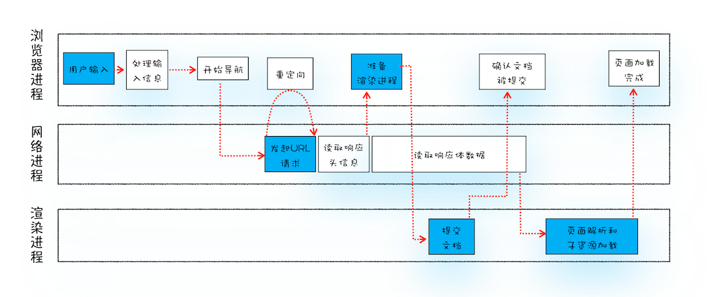

#

## HTTP 相关

### 1. GET 和 POST 的请求的区别

| | GET | POST | |
| - | - | - | - |
| 后退按钮/刷新 | 无害 | 数据会被重新提交 |
| 书签 | 可收藏为书签 | 不可收藏为书签 |
| 缓存 | 能被缓存 | 不能缓存 |
| 历史 | 参数保留在浏览器历史中 | 参数不会保留在浏览器历史中 |
| 对数据长度的限制 | GET 方法向 URL 添加数据，URL 的长度是受限制的。（URL 的最大长度是 2048 个字符。 | 无限制 | 其实 HTTP 协议本身倒并没有 Body 和 URL 的长度限制，对 URL 限制的大多是浏览器和服务器端自己限制的。 服务器是因为处理长 URL 要消耗比较多的资源，为了性能和安全（防止恶意构造长 URL 来攻击）考虑，会给 URL 长度加限制。|
| 对数据类型的限制 | 只允许 ASCII 字符 | 没有限制 |
| 安全性（从地址栏的角度看） | 与 POST 相比，GET 的安全性较差，因为所发送的数据是 URL 的一部分。 | POST 比 GET 更安全，因为参数不会保存在浏览器历史或者 web 服务器日志中。 | 从传输的角度来说，他们都是不安全的，因为 HTTP 在网络上是明文传输，只要在网络节点上抓包，就能完整地获取数据报文。 要想安全传输，就只有加密，也就是 HTTPS。
| 可见性 | 数据在 URL 中对所有人是可见的。 | 数据不显示在 URL 中。|

> 注：在约定中，GET 方法的参数应该放在 url 中，POST 方法参数应该放在 body 中。如果我不按规范来也是可以的。我们可以在 URL 上写参数，然后方法使用 POST；也可以在 Body 写参数，然后方法使用 GET。当然，这需要服务端支持。

### 2. POST 和 PUT 请求的区别

PUT 请求是向服务器端发送数据，从而修改数据的内容，但是不会增加数据的种类等，也就是说无论进行多少次 PUT 操作，其结果并没有不同。（可以理解为时更新数据）。

POST 请求是向服务器端发送数据，该请求会改变数据的种类等资源，它会创建新的内容。（可以理解为是创建数据）。

为什么 post 请求会发送两次请求？

1. 第一次请求为 options 预检请求，状态码为：204

   - 作用：

     - 作用 1: 询问服务器是否支持修改的请求头，如果服务器支持，则在第二次中发送真正的请求
     - 作用 2: 检测服务器是否为同源请求，是否支持跨域

2. 第二次为真正的 post 请求

### 3. HTTP 状态码 304 是多好还是少好

**为什么会有 304**

服务器为了提高网站访问速度，对之前访问的部分页面指定缓存机制，当客户端在此对这些页面进行请求，服务器会根据缓存内容判断页面与之前是否相同，若相同便直接返回 304，此时客户端调用缓存内容，不必进行二次下载。

状态码 304 不应该认为是一种错误，而是对客户端有缓存情况下服务端的一种响应。

搜索引擎蜘蛛会更加青睐内容源更新频繁的网站。通过特定时间内对网站抓取返回的状态码来调节对该网站的抓取频次。若网站在一定时间内一直处于 304 的状态，那么蜘蛛可能会降低对网站的抓取次数。相反，若网站变化的频率非常之快，每次抓取都能获取新内容，那么日积月累的回访率也会提高。

**产生较多 304 状态码的原因：**

- 页面更新周期长或不更新
- 纯静态页面或强制生成静态 html

**304 状态码出现过多会造成以下问题：**

- 网站快照停止；
- 收录减少；
- 权重下降。

### 4. 同样是重定向，307，303，302 的区别？

302 是 http1.0 的协议状态码，在 http1.1 版本的时候为了细化 302 状态码⼜出来了两个 303 和 307。 303 明确表示客户端应当采⽤get⽅法获取资源，他会把 POST 请求变为 GET 请求进⾏重定向。 307 会遵照浏览器标准，不会从 post 变为 get。

## 5. 地址栏输入 URL 敲下回车后发生了什么

- 1，解析 URL

  首先会对 URL 进行解析，分析所需要使用的传输协议和请求的资源的路径。
  
  - 如果输入的 URL 中的协议或者主机名不合法，将会把地址栏中输入的内容传递给浏览器默认的搜索引擎。

  - 如果没有问题，浏览器会检查 URL 中是否出现了非法字符，如果存在非法字符，则对非法字符进行转义后再进行下一过程。

- 2，缓存判断

  浏览器会判断所请求的资源是否在缓存里，如果请求的资源在缓存里并且没有失效，那么就直接使用，否则向服务器发起新的请求。

- 3，DNS 解析

  下一步首先需要获取的是输入的 URL 中的域名的 IP 地址，首先会判断本地是否有该域名的 IP 地址的缓存，如果有则使用，如果没有则向本地 DNS 服务器发起请求。本地 DNS 服务器也会先检查是否存在缓存，如果没有就会先向根域名服务器发起请求，获得负责的顶级域名服务器的地址后，再向顶级域名服务器请求，然后获得负责的权威域名服务器的地址后，再向权威域名服务器发起请求，最终获得域名的 IP 地址后，本地 DNS 服务器再将这个 IP 地址返回给请求的用户。用户向本地 DNS 服务器发起请求属于递归请求，本地 DNS 服务器向各级域名服务器发起请求属于迭代请求。

- 4，获取 MAC 地址

  当浏览器得到 IP 地址后，数据传输还需要知道目的主机 MAC 地址，因为应用层下发数据给传输层，TCP 协议会指定源端口号和目的端口号，然后下发给网络层。网络层会将本机地址作为源地址，获取的 IP 地址作为目的地址。然后将下发给数据链路层，数据链路层的发送需要加入通信双方的 MAC 地址，本机的 MAC 地址作为源 MAC 地址，目的 MAC 地址需要分情况处理。通过将 IP 地址与本机的子网掩码相与，可以判断是否与请求主机在同一个子网里，如果在同一个子网里，可以使用 APR 协议获取到目的主机的 MAC 地址，如果不在一个子网里，那么请求应该转发给网关，由它代为转发，此时同样可以通过 ARP 协议来获取网关的 MAC 地址，此时目的主机的 MAC 地址应该为网关的地址。

- 5，TCP 三次握手

  下面是 TCP 建立连接的三次握手的过程，首先客户端向服务器发送一个 SYN 连接请求报文段和一个随机序号，服务端接收到请求后向服务器端发送一个 SYN ACK 报文段，确认连接请求，并且也向客户端发送一个随机序号。客户端接收服务器的确认应答后，进入连接建立的状态，同时向服务器也发送一个 ACK 确认报文段，服务器端接收到确认后，也进入连接建立状态，此时双方的连接就建立起来了。

- 6，HTTPS 握手

  如果使用的是 HTTPS 协议，在通信前还存在 TLS 的一个四次握手的过程。首先由客户端向服务器端发送使用的协议的版本号、一个随机数和可以使用的加密方法。服务器端收到后，确认加密的方法，也向客户端发送一个随机数和自己的数字证书。客户端收到后，首先检查数字证书是否有效，如果有效，则再生成一个随机数，并使用证书中的公钥对随机数加密，然后发送给服务器端，并且还会提供一个前面所有内容的 hash 值供服务器端检验。服务器端接收后，使用自己的私钥对数据解密，同时向客户端发送一个前面所有内容的 hash 值供客户端检验。这个时候双方都有了三个随机数，按照之前所约定的加密方法，使用这三个随机数生成一把秘钥，以后双方通信前，就使用这个秘钥对数据进行加密后再传输。

- 7，返回数据

  当页面请求发送到服务器端后，服务器端会返回一个 html 文件作为响应，浏览器接收到响应后，开始对 html 文件进行解析，开始页面的渲染过程。

- 8，页面渲染

  浏览器首先会根据 html 文件构建 DOM 树，根据解析到的 css 文件构建 CSSOM 树，如果遇到 script 标签，则判端是否含有 defer 或者 async 属性，要不然 script 的加载和执行会造成页面的渲染的阻塞。当 DOM 树和 CSSOM 树建立好后，根据它们来构建渲染树。渲染树构建好后，会根据渲染树来进行布局。布局完成后，最后使用浏览器的 UI 接口对页面进行绘制。这个时候整个页面就显示出来了。

- 9，TCP 四次挥手

  最后一步是 TCP 断开连接的四次挥手过程。若客户端认为数据发送完成，则它需要向服务端发送连接释放请求。服务端收到连接释放请求后，会告诉应用层要释放 TCP 链接。然后会发送 ACK 包，并进入 CLOSE_WAIT 状态，此时表明客户端到服务端的连接已经释放，不再接收客户端发的数据了。但是因为 TCP 连接是双向的，所以服务端仍旧可以发送数据给客户端。服务端如果此时还有没发完的数据会继续发送，完毕后会向客户端发送连接释放请求，然后服务端便进入 LAST-ACK 状态。客户端收到释放请求后，向服务端发送确认应答，此时客户端进入 TIME-WAIT 状态。该状态会持续 2MSL（最大段生存期，指报文段在网络中生存的时间，超时会被抛弃） 时间，若该时间段内没有服务端的重发请求的话，就进入 CLOSED 状态。当服务端收到确认应答后，也便进入 CLOSED 状态。

参考资料：[在浏览器输入 URL 回车之后发生了什么（超详细版）](https://zhuanlan.zhihu.com/p/80551769)
